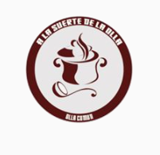

#### FOLIO: CER02
# A LA SUERTE DE LA OLLA

[instagram](https://www.instagram.com/alasuertedelaolla_cerrillos/)
[facebook]()
[twitter]()
<correo@correo.cl>
---

### Representantes
#### (Nombres o emails de voceros o representantes).
### llarelyvanesa@gmail.com (gmail de transferencias y acopio)
---
### Interacciones frecuentes
#### (listar otras organizaciones que habitualmente)
* Cultura en resistencia
* Colectivo 18 de octubre cerillos
* Mosacat Chile
* Del otro lado de la capucha (medio de difusión/información)

### Redes sociales
#### ¿Para qué se utiliza la red social?
| Instagram | Facebook | Twitter | Otra 
|---|---|---|---|
|0|0|0| 0|

### **Instagram**
| seguidores | seguidos | publicaciones | hashtag 
|---|---|---|---|
|278|100|21| 0

---

* **Actividad:**   

* Primera Publicación IG: 18 de Julio (pero es una iniciativa que surge del colectivo/medio de difusión "cultura en resistencia Cerillos", medio que inició actividad Octubre 2019)

---
### Frecuencia de publicación.

Publicaciones: Julio (semanales), Agosto mensual (2 publicaciones), Septiembre mensual, Octubre semanal más actividad.

Actividades: Olla común, entrega de donaciones, gestión de donaciones, acopio y rifas

---
### Ubicación
* Sector de la comununa/ciudad: Club sede San Martín, 14 de octubre 1241, Cerillos

---
### Describir temas de interés y/o trabajo
Apoyo mutuo, organización territorial, red de abastecimiento, poder de pobladores. 
---
### Describir la imagen ideal por la cual se trabaja.
#### (El horizonte hacia el cual se quiere avanzar.)
Se trabaja en pos de la resistencia y el cuidado entre vecinos y por vecinos: "Ollita común resistencia y consecuencia". 
---
### ¿Que se hace?
#### (Manifestaciones, marchas, intervenciones, actividades culturales, conversatorios, intercambio de saberes, actividades solidarias o de apoyo mutuo, abastecimiento, contra información, emplazamiento a autoridades etc.)
* Actividad solidaria: Olla común
* Red de abastecimiento autogestionada
* Gestión de donaciones (gas, comida)
* Rifas
* Acopio 
* Jornadas de construcción de rucos para personas en situación de calle 
* Festival de cine y arte

### Describir y distinguir demandas más reivindicativas de espacios sin relación con lo contencioso o con lo político mas prefigurativo
#### (lo contencioso; demanda al Estado, a alguna autoridad, privados, etc), (prefigurativo, transformación desde lo cotidiano, etc.).
Se dirige a las y los pobladores, no hay emplazamiento directo (escrito, relatos, declaraciones, afiches) al estado y/o privados o autoridad, pero en algunas publicaciones utilizan #renunciapiñera.

---
### Tipo de organización interna.
#### (Vocerías, asambleísmo, horizontalidad, etc.; *se entiende que esta dimensión es más difícil de captar vía análisis de redes sociales, pero quizás se puede vislumbrar a través de roles/cargos*)

---
### Describir los temas / imágenes- iconos / conceptos mas habitualmente presentes en sus publicaciones. Describir cambios/ transformaciones en los contenidos desde Octubre.

**Iconos:**

 

**Banderas:**

**Diseño estético:**

> Párrafo tipo cita 

---
### Percepciones que se tiene del Estado
#### (Aparato burocrático)
> resumen de lo encontrado

| Declaraciones | infografía | 
|---|---|
|Anotar los comunicados |  |

---
### Percepciones que se tiene de las Fuerzas de Orden
#### (Aparato represivo)
> resumen de lo encontrado

| Declaraciones | infografía | 
|---|---|
|Anotar los comunicados |  |

---
### Incorporar aca notas, citas textuales, links, etc. extra a los ya incorporados, que sean de interés para comprender tanto la forma como los contenidos asociados a la organización