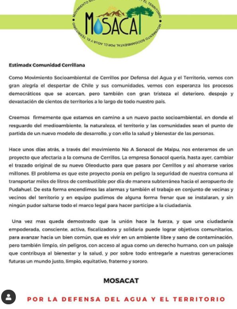
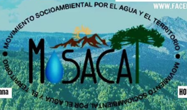

#### FOLIO: CER04
# MOVIMIENTO SOCIOAMBIENTAL CERRILLOS - MOSACAT

[instagram](https://www.instagram.com/mosacatchile/)
[facebook](https://www.facebook.com/mosacatchile/)
[twitter](https://twitter.com/mosacatchile)
<correo@correo.cl>
---

### Representantes
#### (Nombres o emails de voceros o representantes).
Escribir dm de instagram o twitter.
---
### Interacciones frecuentes
#### (listar otras organizaciones que habitualmente)
* Asamblea General Cerrillos 
* Coordinadora Gabriela Paz
* Del otro lado de la capucha
* Cabildo Gabriela Mistral 
* Revolución Cerrillos 
* Cultura en Resistencia
* Modatima Santiago
* A la suerte de la Olla

### Redes sociales
#### ¿Para qué se utiliza la red social?
| Instagram | Facebook | Twitter | Otra 
|---|---|---|---|
|Difusión de actividades, difusión de información, emplazamiento autoridades y gobierno|Ídem Ig|Ídem Ig| 0|

### **Instagram**
| seguidores | seguidos | publicaciones | hashtag 
|---|---|---|---|
|1,650|1,960|183| 0

---

* **Actividad:**   

* Primera Publicación IG: 13 Octubre 2019 (se reactiva 3 Diciembre 2019)

---
### Frecuencia de publicación.

Publicaciones: Semanales (2, 3 a veces)

Actividades: Semanales 

---
### Ubicación
* Sector de la comununa/ciudad: Cerrillos

---
### Describir temas de interés y/o trabajo
Defensa del medioambiente, defensa y derechos constitucionales del agua, ecología, emplazamiento a autoridades en proyectos de daño medioambiental (Data Center Google y Sonacol - Oleoducto de Maipú), huertas comunitarias, agroecología, soberanía alimentaria. Proceso constituyente. 

---
### Describir la imagen ideal por la cual se trabaja.
#### (El horizonte hacia el cual se quiere avanzar.)
>"Por la defensa del agua y el territorio". "Cerrillos activo y combativo por el medio ambiente". "No al data center (google)" "Con un huerto en cada casa, en cada barrio lograremos la autonomía alimentaria!"

> Crear un nuevo pacto socioambiental, donde el resguardo del medioambiente, la naturaleza y el territorio y las comunidades sean el punto de partida de un nuevo modelo de desarrollo, salud y bienestar de las personas. Y Firma del tratado de Escazú. 
 
---
### ¿Que se hace?
#### (Manifestaciones, marchas, intervenciones, actividades culturales, conversatorios, intercambio de saberes, actividades solidarias o de apoyo mutuo, abastecimiento, contra información, emplazamiento a autoridades etc.)
* Activismo medioambiental
* Charlas
* Emplazamiento a autoridades (carta para la firma de Escazú)
* Recuperación de espacios: creación de "Plaza de la dignidad cerrillos" 
* Festival por  la defensa del agua y el territorio 
* Actividades solidarias: acopio, cajas (covid)
* Conmemoraciones a activistas asesinados por el estado/empresa (Macarena Valdés por ej.)
---
### Describir y distinguir demandas más reivindicativas de espacios sin relación con lo contencioso o con lo político mas prefigurativo
#### (lo contencioso; demanda al Estado, a alguna autoridad, privados, etc), (prefigurativo, transformación desde lo cotidiano, etc.).
Se dirige a "cerillanos/as" a defender el medioambiente pero también empleza a autoridades y a gobierno, al SEA, y a privados (Google por el data center). LLevan bandera de lucha de Firma del tratado de Escazú. #Piñerafirmaescazú
---
### Tipo de organización interna.
#### (Vocerías, asambleísmo, horizontalidad, etc.; *se entiende que esta dimensión es más difícil de captar vía análisis de redes sociales, pero quizás se puede vislumbrar a través de roles/cargos*)
Asambleísmo/horizontalidad
---
### Describir los temas / imágenes- iconos / conceptos mas habitualmente presentes en sus publicaciones. Describir cambios/ transformaciones en los contenidos desde Octubre.
Medio ambiente, agua, comunidad,  territorio, defensa. El contenido se ha mantenido en el tiempo con una línea editorial clara. A raíz de la pandemia y la escacez de alimentos y carencia se levanta la temática de alimentos transgénicos. Cercano a conmemoración 11 septiembre y 18 Octubre las publicaciones se enfocane en temáticas de DDHH, ejecutados y desaparecidos políticos. 

**Iconos:**

**Banderas:**

**Diseño estético:**

> Párrafo tipo cita 

---
### Percepciones que se tiene del Estado
#### (Aparato burocrático)
> El estado permite devastar territorios a través de permisos e instituciones negligentes con el medioambiente. Se critica fuertemente al SEA; servicio estudio ambiental, del MMA. 

| Declaraciones | infografía | 
|---|---|
|"Como Movimiento Social nos oponemos a que este tipo de proyectos pasen "groseramente" a través de servicios e instituciones del Estado tan ligeramente, y se les otorguen permisos para devastar aun mas los territorios, comunidades y ecosistemas. | [Comunicado sonbre invalidcación administrativa](https://www.instagram.com/p/B-uz7bEp80H/) |

---
### Percepciones que se tiene de las Fuerzas de Orden
#### (Aparato represivo)
> resumen de lo encontrado

| Declaraciones | infografía | 
|---|---|
|Anotar los comunicados |  |

---
### Incorporar aca notas, citas textuales, links, etc. extra a los ya incorporados, que sean de interés para comprender tanto la forma como los contenidos asociados a la organización
Declaración día Mundial del Agua: https://www.instagram.com/p/B-DoP6-pkUJ/ 
>"En Cerrillos defendemos nuestra agua y territorio.
Y decimos no a Google Data Center, que consume mucha mas agua que la comunidad completa Cerrillana."