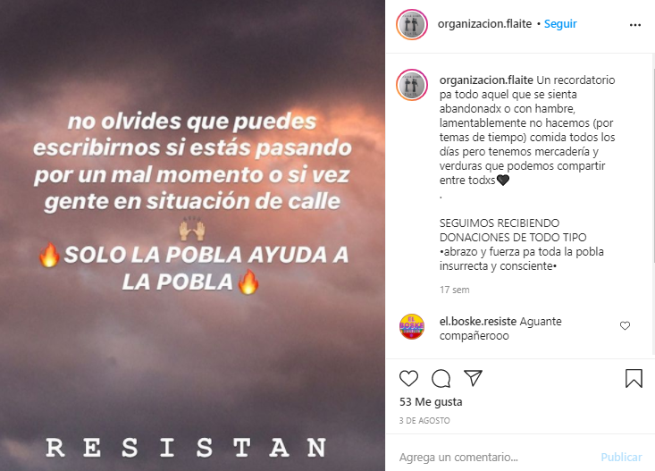
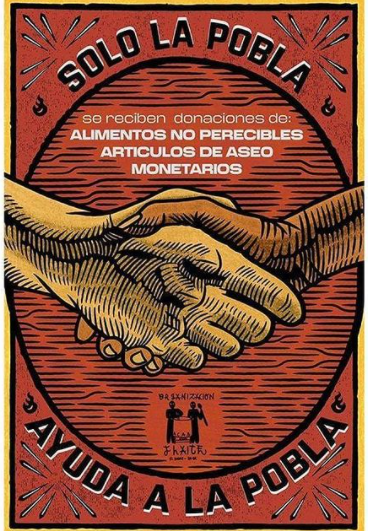
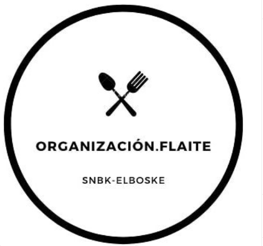
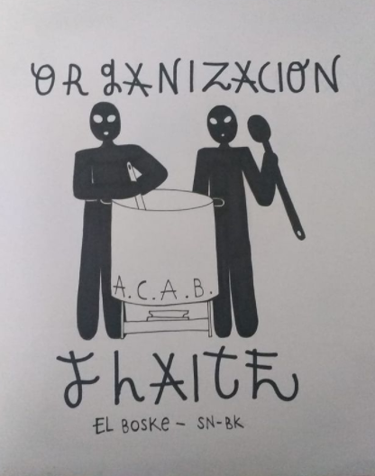
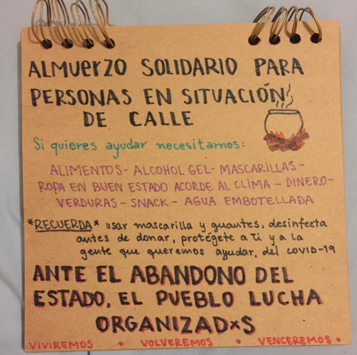
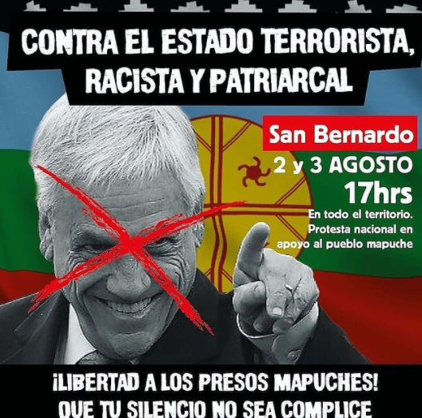

#### FOLIO: ELB01
# Los Morros El Bosque San Beca "organización flaite"

[instagram](https://www.instagram.com/organizacion.flaite/?hl=es-la)
[facebook]()
[twitter]()
<correo@correo.cl>
---

### Representantes
#### (Nombres o emails de voceros o representantes).
* Dm al Ig 

---
### Interacciones frecuentes
#### (listar otras organizaciones que habitualmente)
* Colectiva Feminista San Bernardo 
* El Bosque Resiste
* Coordinadora de Ollas Populares 
* Info Lambi - prensa zona sur
* Cordón vecinal quimey (San Beca)
* [**Resistencia zona sur**:  Puente alto- La Florida- San Bernardo -La Pintana- El Bosque -La Granja- San Ramón- La Cisterna](https://www.instagram.com/resistencia_zona_sur_/)
* 
### Redes sociales
#### ¿Para qué se utiliza la red social?
| Instagram | Facebook | Twitter | Otra 
|---|---|---|---|
|Difusión de información y activdades|No aplica|No aplica| No aplica|

### **Instagram**
| seguidores | seguidos | publicaciones | hashtag 
|---|---|---|---|
|2,290|665|88| 0

---

* **Actividad:**   

* Primera Publicación IG: 21 Mayo (activo)

---
### Frecuencia de publicación.

Publicaciones: Semanales/casi diarias

Actividades: Semanales

---
### Ubicación
* Sector de la comununa/ciudad: Los morros con lo blanco

---
### Describir temas de interés y/o trabajo
* Autogestión, solidaridad, apoyo mutuo, vinculación y coordinación territorial "periferia sur"
---
### Describir la imagen ideal por la cual se trabaja.
#### (El horizonte hacia el cual se quiere avanzar.)
* Fortalecer la acción comunitaria. Reconocimiento al pueblo mapuche, Wallmapu libre. "La periferia pide dignidad" ¡Ante el abandono del estado, el pueblo lucha organizado! "Solo el pueblo ayuda al pueblo" Puro amor flaite y apañe pa la periferia"

> "Somos flaites antifascistas que soñamos con la caída del capital y la burguesía, pero ya no son tiempos de soñar si no de accionar, con too si no pa ke" (publicación 9 Septiembre)

---
### ¿Que se hace?
#### (Manifestaciones, marchas, intervenciones, actividades culturales, conversatorios, intercambio de saberes, actividades solidarias o de apoyo mutuo, abastecimiento, contra información, emplazamiento a autoridades etc.)
* Almuerzos solidarios (con foco en situación de calle)
* Campañas solidarias (ropa, comida, etc)
* Cacerolazos
* Barricadas "Fuego y Rebeldía" 
* Protestas 
* Cicletadas Zona Sur 
* Almacen flaite, solidario y gratuito
* Conmemoración caidos de la revuelta
* Actividades artísticas y culturales (participación)

---
### Describir y distinguir demandas más reivindicativas de espacios sin relación con lo contencioso o con lo político mas prefigurativo
#### (lo contencioso; demanda al Estado, a alguna autoridad, privados, etc), (prefigurativo, transformación desde lo cotidiano, etc.).
Se dirige a vecinxs y vecinxs, a reconocer al otro para poder ayudar, además emplaza al estado por su abandono en cuanto a servicios y necesidades básicas (alimentación), y a su responsabilidad en el conflicto mapuche en la araucanía. 
---
### Tipo de organización interna.
#### (Vocerías, asambleísmo, horizontalidad, etc.; *se entiende que esta dimensión es más difícil de captar vía análisis de redes sociales, pero quizás se puede vislumbrar a través de roles/cargos*)
horizontalidad
---
### Describir los temas / imágenes- iconos / conceptos mas habitualmente presentes en sus publicaciones. Describir cambios/ transformaciones en los contenidos desde Octubre.

 

 

 

 
**Banderas:**

**Diseño estético:**

> Párrafo tipo cita 

---
### Percepciones que se tiene del Estado
#### (Aparato burocrático)
> Estado ausente, inoperante y asesino, patriarcal, terrorista, y racista. 

| Declaraciones | infografía | 
|---|---|
|LA POBLA SE MANIFIESTA
Vecinxs de la Villa Esperanza y alrededores de Lo Blanco con Los Morros reclaman por el hambre y el desempleo, las medidas de este gobierno dan como resultado el descontento general de lxs que mas necesitan. ¡LA PERIFERIA LE DA CARA AL ESTADO ASESINO!  | [Publicación 25 Mayo](https://www.instagram.com/p/CAoPv7JgXY7/) |
|cada muerte ocurrida en La Araucania, en conjunto a las forestales que literalmente estan dispuestos a TODO por explotar las pristinas tierras de el sur de $hile.Las tierras de La Araucania se tiñen de rojo y lagrimas, otra vez.|Comunicado 7 Junio, a raíz conflictos en Curacautín en la Araucanía|

---
### Percepciones que se tiene de las Fuerzas de Orden
#### (Aparato represivo)
> resumen de lo encontrado

| Declaraciones | infografía | 
|---|---|
|MILICOS Y PACOS
Fusiles contra virus y hambre, el estado asi enfrenta la realidad de lxs mas necesitadxs| [Publicación 26 Mayo](https://www.instagram.com/p/CAp1wlUphlx/) |

---
### Incorporar aca notas, citas textuales, links, etc. extra a los ya incorporados, que sean de interés para comprender tanto la forma como los contenidos asociados a la organización.

**COMUNICADO 1** 21 Mayo

>Ayer viernes 22 de Mayo se llevó a cabo una ayuda alimentaria especialmente destinada a las personas en situación de calle en vista de la necesidad de nuestrxs vecinxs (mayoria adultxs mayores) repartimos alimentos tanto a gente de la calle como a gente con casa pero con necesidad urgente (desde el camino del inca hasta sta marta, campamento dignidad, 40 de la grana y hasta un sector de Av. America). Estamos conscientes que hay muchas familias pasando hambre y por vergüenza o abandono no han pedido ayuda a sus vecinxs. Muchxs nos cuentan que van a las municipalidades a pedir ayuda y se les niega por no pertenecer al 40% mas vulnerable. Esto quiere decirnos que aunque no estemos dentro de los porcentajes del estado no quiere decir que tengamos con que alimentarnos. Por esto pensamos que es urgente hacer COMUNIDAD y reconocer a tus vecinxs, saber si estan pasando hambre o frio. No cuesta nada preguntar y si conoces a alguien con problemas economicos avisanos por este medio, entre todxs nos apañamos. La ayuda nunca sobrará.
GRACIAS POR TODAS LAS DONACIONES QUE NOS HAN HECHO LLEGAR, HICIMOS ENTRE 60 Y 70 PLATOS AYER Y VAMOS POR MAS!!
LA POBLA DESPERTÓ, Y LO HIZO PA DAR EL AGUANTE Y COMIDA A NUESTRA GENTE.
SOLO LA POBLA AYUDA A LA POBLA
Y EL ESTADO COMO SIEMPRE BRILLARÁ POR SU AUSENCIA A MENOS QUE ESTE LA TV O UNA BARRICADA.
AGUANTE LA AUTOGESTION Y LA SOLIDARIDAD DEL PROLETARIADX
EL PEOR VIRUS ES EL HAMBRE Y ESTE SISTEMA CRIMINAL Y LE DAREMOS CARA COMO SE DEBE 🔥
GRACIAS X TODO CABRXS
¡AGUANTE LOS MORROS EL BOSKE SN BK, LA PERIFERIA ESTA UNIDA!

**COMUNICADO 2 • 30 MAYO** 

>Esta semana logramos entregar mas de 100 platos a personas de calle, tomas y gente con techo que necesitan la ayuda (en su mayoria adultxs mayores). Tambien en coordinacion con organizaciones amigas entregamos algunas canastas de alimentos a casos que necesitan ayuda urgente. Les queremos decir que nos enorgullece ver que no somos lxs unicxs haciendo este trabajo solidario, nos alegra ver que mientras repartimos, andan otras personas haciendo este mismo trabajo, tocar una puerta y que ya les hayan dado comida, nos damos aun mas cuenta que solo EL PUEBLO AYUDA AL PUEBLO y nadie mas! Esto es resistencia, solidaridad y empatia, palabras que toda esta clase politica no conoce y no lo hara nunca.
Seguiremos esta dificil mision de apañar al que mas necesita, no nos detendremos!
Agradecemos la ayuda, los aportes y donaciones que hemos recibido de organizaciones, amigxs y el pueblo solidario, todo va dirigido a la pobla que exige dignidad.
Si quieres donar hablanos al DM y coordinamos tu ayuda. ¡AGUANTE LA PERIFERIA!
LA POBLA AYUDA A LA POBLA YERA.

**Comunicado 7 Junio, a raíz conflictos en la Araucanía y toma de comisaría en Curacautín** 
> ARAUCO TIENE UNA PENA •
Otro nombre mas a la sangrienta lista de asesinadxs en manos de "desconocidxs" para WALLMAPU, otra injusticia que tendra que lamentar este pueblo que lleva mas de 500 años RESISTIENDO, LUCHANDO y PROTEGIENDO las ancestrales tierras en el sur de este territorio llamado $hile.
Alejandro Treuquil era Werken de Collipulli y fue asesinado cobardemente la noche del 4 de junio. Semanas atras ya habia denunciado hostigamiento por parte de la #yutaasesina a su comunidad con amenazas y lacrimogenas. De hecho, él relato en una entrevista que su esposa habia sufrido un aborto por la cantidad de lacrimogenas lanzadas a su comunidad, tenia 4 meses.
Este asesinato es realizado en medio de un despertar mundial por el racismo en EEUU, lo que empeora la situacion.
El #estadoasesino es responsable de cada muerte ocurrida en La Araucania, en conjunto a las forestales que literalmente estan dispuestos a TODO por explotar las pristinas tierras de el sur de $hile.
Las tierras de La Araucania se tiñen de rojo y lagrimas, otra vez.
Esto NO PUEDE NI DEBE pasar desapercibido, las injusticias a nivel nacional son grotescas y el pueblo mapuche las ha vivido en carne propia por cientos de años, nosotrxs desde el 18 de octubre hemos sentido un pequeño porcentaje de lo que es la lucha contra un gobierno y sus asesinxs a sueldo, el pueblo mapuche tristemente lleva resistiendo años.
La gota que rebalso el vaso cayo hace mucho tiempo y esta en nuestras manos EXIGIR la dignidad a todas las personas pertenecientes a este territorio, tenemos el deber de LUCHAR por lo justo, por lo digno, por lo logico.
COMO ORGANIZACION FLAITE
EXIGIMOS JUSTICIA
EXIGIMOS DIGNIDAD
EXIGIMOS EL RECONOCIMIENTO AL PUEBLOMAPUCHE
EXIGIMOS WALLMAPULIBRE.
QUE ESTE GOBIERNO NO DIGA "NO LO VIMOS VENIR"
"NO ES LA FORMA"
"SEAN PACIFICOS"
ELLXS SON LXS CULPABLES DE MANTENER ESTE SISTEMA EXTRACTIVISTA, QUE PONE LA ECONOMIA POR SOBRE LAS VIDAS DE LAS PERSONAS, QUE CUIDA MAS A LXS LADRONES DE CUELLO Y CORBATA QUE A LXS NIÑXS DEL SENAME, A LXS NIÑXS MAPUCHES.
ES HORA DE TOMARNOS LAS CALLES 🔥
¡EL PUEBLO MAPUCHE TIENE QUE SER LIBRE!
¡UNAMONOS EN CONTRA DE ESTE GOBIERNO ASESINO!
#wallmapulibre

** Comunicado cicletada acusando aprovechamiento político (campaña apruebo): https://www.instagram.com/p/CEusz7XJxHF/ 