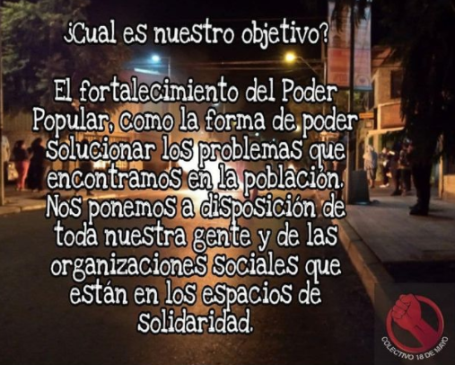
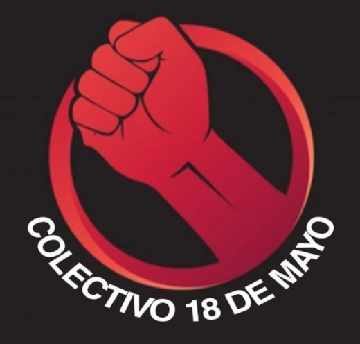

#### FOLIO:ELBO2
# Colectivo 18 Mayo 

[instagram](https://www.instagram.com/colectivo18demayo/)
[facebook]()
[twitter]()
<correo@correo.cl>
---

### Representantes
#### (Nombres o emails de voceros o representantes).
dm ig

---
### Interacciones frecuentes
#### (listar otras organizaciones que habitualmente)
* Resistencia zona sur
* Los morros el Bosque
* Colectivo cultural Luchín 
 

### Redes sociales
#### ¿Para qué se utiliza la red social?
| Instagram | Facebook | Twitter | Otra 
|---|---|---|---|
|Difusión de información y difusión de actividades| No aplica|No aplica| No aplica|

### **Instagram**
| seguidores | seguidos | publicaciones | hashtag 
|---|---|---|---|
|679|134|13| 0

---

* **Actividad:**   

* Primera Publicación IG: 30 Septiembre 2020 Inactiva. (activa solo septiembre y octubre)

---
### Frecuencia de publicación.

Publicaciones: Semanales

Actividades: semanales

---
### Ubicación
* Sector de la comununa/ciudad: El Bosque

---
### Describir temas de interés y/o trabajo
solidaridad, apoyo mutuo, autogestión
---
### Describir la imagen ideal por la cual se trabaja.
#### (El horizonte hacia el cual se quiere avanzar.)
* fortalecer el poder popular

---
### ¿Que se hace?
#### (Manifestaciones, marchas, intervenciones, actividades culturales, conversatorios, intercambio de saberes, actividades solidarias o de apoyo mutuo, abastecimiento, contra información, emplazamiento a autoridades etc.)
* Información y difusión
* Apoyo a ollas comunes (entrega de alimentos)
* Cicletada 
* Protestas

---
### Describir y distinguir demandas más reivindicativas de espacios sin relación con lo contencioso o con lo político mas prefigurativo
#### (lo contencioso; demanda al Estado, a alguna autoridad, privados, etc), (prefigurativo, transformación desde lo cotidiano, etc.).
* Se dirige a los vecinos, fortalecer poder popular. Y como colectivo se ponen a disposición de la comunidad para este objetivo. 
---
### Tipo de organización interna.
#### (Vocerías, asambleísmo, horizontalidad, etc.; *se entiende que esta dimensión es más difícil de captar vía análisis de redes sociales, pero quizás se puede vislumbrar a través de roles/cargos*)
* horizontalidad
### Describir los temas / imágenes- iconos / conceptos mas habitualmente presentes en sus publicaciones. Describir cambios/ transformaciones en los contenidos desde Octubre.

**Iconos:**

**Banderas:**

**Diseño estético:**

> Párrafo tipo cita 

---
### Percepciones que se tiene del Estado
#### (Aparato burocrático)
> resumen de lo encontrado

| Declaraciones | infografía | 
|---|---|
|Anotar los comunicados |  |

---
### Percepciones que se tiene de las Fuerzas de Orden
#### (Aparato represivo)
> resumen de lo encontrado

| Declaraciones | infografía | 
|---|---|
|Hoy estuvimos en la dignidad y fuimos testigos de cuando los pacos qls botaron al compa q no salgan a decir weas q el pueblo sabe cómo fue. Por todo esto y más a organizar el poder popular para mañana salir a devolver cada golpe y cada bala.| [Declaración a raíz caso del puente pio nono](https://www.instagram.com/p/CF3ZTHyF6I2/) |

---
### Incorporar aca notas, citas textuales, links, etc. extra a los ya incorporados, que sean de interés para comprender tanto la forma como los contenidos asociados a la organización.