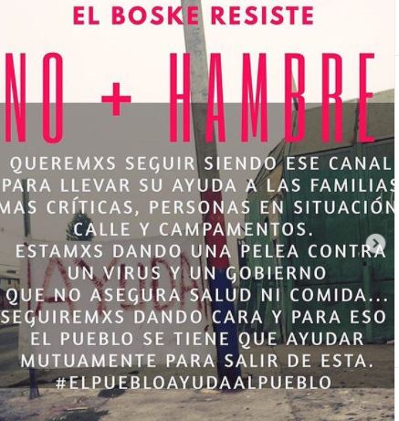
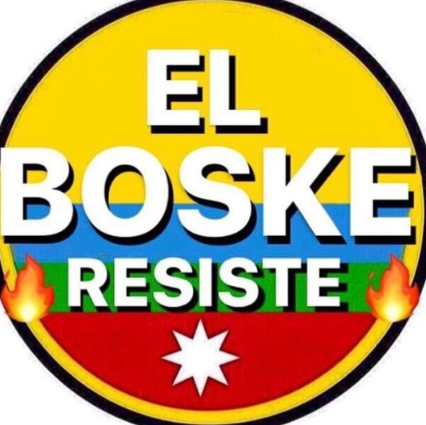
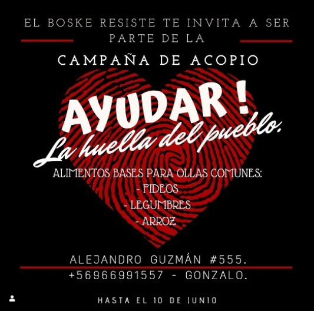
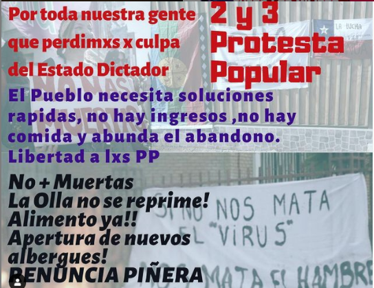

#### FOLIO: ELB03
# El boske Resiste

[instagram](https://www.instagram.com/el.boske.resiste/)
[facebook](https://www.facebook.com/elboske.resiste)
[twitter]()
<Elboskeresiste@gmail.com>
---

### Representantes
#### (Nombres o emails de voceros o representantes).
*Dm al instagram y gmail
---
### Interacciones frecuentes
#### (listar otras organizaciones que habitualmente)
* Zona sur en resistencia 
* Organización Flaite /LosMorros
* Red popular de acción comunitaria
* Lo Espejo en resistencia (info)
* San Beca en la Calle 
* Info Lambi el bosque
* Colectivo 18 Mayo

### Redes sociales
#### ¿Para qué se utiliza la red social?
| Instagram | Facebook | Twitter | Otra 
|---|---|---|---|
|Difusión de información y difusión de actividades| ídem Ig| No aplica| No aplica|

### **Instagram**
| seguidores | seguidos | publicaciones | hashtag 
|---|---|---|---|
|2,880|870|245| 0

---

* **Actividad:**   

* Primera Publicación IG: 26 Mayo (activa y continua)

---
### Frecuencia de publicación.

Publicaciones: Diarias

Actividades:Diarias (apoyo y coordinación con todas las ollas de la comuna)

---
### Ubicación
* Sector de la comununa/ciudad: PUNTO DE ACOPIO EN ALEJANDRO GUZMAN 495/ y Alejandro Guzmán 555. 

---
### Describir temas de interés y/o trabajo
Solidaridad, apoyo mutuo, organización, autogestión, coordinación territorial, ollas comunes. Compañerismo. 
---
### Describir la imagen ideal por la cual se trabaja.
#### (El horizonte hacia el cual se quiere avanzar.)
* ¡Ayudar, la huella del pueblo! ¡Sólo el pueblo ayuda al pueblo! ¡Entre vecinos nos levantaremos! ¡El boske activo y combativo! NO + HAMBRE, NO + Muertos, Renuncia de piñera. Vivienda Digna

)

---
### ¿Que se hace?
#### (Manifestaciones, marchas, intervenciones, actividades culturales, conversatorios, intercambio de saberes, actividades solidarias o de apoyo mutuo, abastecimiento, contra información, emplazamiento a autoridades etc.)
* Campaña ayudar, la huella del pueblo 
* Entrega de ayuda a ollas comunes 
* Entrega de ayuda y comida a personas en situación de calle
* Lukazos solidarios
* Velatón
* Cacerolazos
* Barricadas 
* Jornadas de protesta popular 
* Cicletada zona sur 
* Organización jornadas culturales / artísticas
---
### Describir y distinguir demandas más reivindicativas de espacios sin relación con lo contencioso o con lo político mas prefigurativo
#### (lo contencioso; demanda al Estado, a alguna autoridad, privados, etc), (prefigurativo, transformación desde lo cotidiano, etc.).
* Se dirige a vecinxs de el boske, a ayudarse entre ellos y a ser ayudados, en caso de cualquier problema pueden tener al colectivo de ayuda. "Organice a su pobla y muestre su enojo y descontento". Además emplaza al estado y al gobierno de la miseria en la periferia. 
---
### Tipo de organización interna.
#### (Vocerías, asambleísmo, horizontalidad, etc.; *se entiende que esta dimensión es más difícil de captar vía análisis de redes sociales, pero quizás se puede vislumbrar a través de roles/cargos*)
horizontal
---
### Describir los temas / imágenes- iconos / conceptos mas habitualmente presentes en sus publicaciones. Describir cambios/ transformaciones en los contenidos desde Octubre.

**Iconos:**

)

)
**Banderas:**

**Diseño estético:**

> " 1 mes resistiendo, trabajando en algo que no te llena el bolsillo pero si el alma" 

---
### Percepciones que se tiene del Estado
#### (Aparato burocrático)
> Estado dictador, negligente, abandono

| Declaraciones | infografía | 
|---|---|
|1. Denunciamos el abandono estatal, al poner los intereses empresariales por sobre la salud y los intereses del pueblo, no proporcionando las condiciones mínimas de alimentación e ingreso que aseguren una cuarentena efectiva para nuestros vecinos y vecinas. | [Comunicado Jornada Protesta Popular 2 y 3 Julio](https://www.instagram.com/p/CCICeHJpiRH/) |
|Denunciamos a un Estado que no consagra a la vivienda digna como un derecho fundamental para la vida de nuestra gente, condenándonos a condiciones extremas de hacinamiento, con dos, tres o más familias por sitio o departamento y donde las políticas de entrega de cajas de mercadería reflejan la ceguera y la invisibilización que el gobierno genera respecto de esta realidad. En consecuencia, resulta una política absolutamente ineficiente e insuficiente para cubrir las necesidades reales de nuestra población, al quedar muchas familias sin siquiera haber recibido una caja de mercadería.  |[Comunicado Jornada Protesta Popular 2 y 3 Julio](https://www.instagram.com/p/CCICeHJpiRH/) |
---
### Percepciones que se tiene de las Fuerzas de Orden
#### (Aparato represivo)
> resumen de lo encontrado

| Declaraciones | infografía | 
|---|---|
|JAMÁS UN POLICÍA VOLVERA A SER LLAMADO SER HUMANO JAMÁS!! A S E S I N O S ‼️ Es poco... BASTARDOS TODOS !!! MIL VECES LOS MALDIGO !!#georgefloyd #acab | [publicación a raíz asesinato George Floyd](https://www.instagram.com/p/CAwP7t5D2u8/) |
. Denunciamos el endurecimiento de leyes represivas que castigarán en mayor proporción a la gente más pobre, a quienes no pueden sino salir a buscar comida e ingreso para alimentar a sus familias y que además restringen la legitima solidaridad y organización que se da entre los vecinos y vecinas para enfrentar las duras condiciones actuales. |[Comunicado Jornada Protesta Popular 2 y 3 Julio](https://www.instagram.com/p/CCICeHJpiRH/) |

---
### Incorporar aca notas, citas textuales, links, etc. extra a los ya incorporados, que sean de interés para comprender tanto la forma como los contenidos asociados a la organización.

[**Publicación y video**, 25 Junio 2020](https://www.instagram.com/p/CB4TVnuJYqk/)
> De a poco, paso a paso, solucionando en el momento, aprendiendo y adaptándonos y creando unión entre vecinxs se a podido optimizar los recursos... según el alcance de cada olla.... la autogestión de cada parte ... la conciencia sobre la urgencia... nos a empujado a seguir esta lucha haciendo partícipe a cada vecinx.. el video muestra el trabajo detrás, las complicaciones y más que eso el newen que finalmente uno le pone a su ollita, el empeño por entregar un plato digno !! No solo parar la olla si no que no olvidar el motivo a la ayuda, la necesidad, el abandono que nos han dado,... con unidad lo vamos a combatir ✊🏽. Mil gracias a la
@coordinadoraollascomunes x estar tan comprometidxs y apañar todo esto x más difícil que se ponga la situación... nuestrx respeto.. .
Independientes autogestionados Apartidistas.

[**Video y Publicación sobre la No Romantización de la Ollas Comunes**, 29 Junio 2020](https://www.instagram.com/p/CCCY93Wp4SH/)
>Abandono. Si bien la olla es unión, una manera de seguir luchando... nos deja en claro que el gobierno de manera premeditada nos guió a esta miseria... no podemos seguir así y se exige un cambio ya!!

>La olla no se reprime!
La olla no se come su cuento!!
.

>Jugar con la vida de las personas, el convertir en vidas en número y dar una esperanza falsa a lxs chilenxs quiere decir desinterés x su pueblo... seguir adelante con la lucha... todxs estamxs en esta‼️

>Abrir espacios para las ollas comunes como las sedes para no arriesgar a las familias y si no habilitar una sede como albergue y que la municipalidad se haga cargo de cada persona que quede o este en condición de calle.
.
>Estamxs en una situación crítica, donde cada espacio o cada herramienta debe ser ocupada para el bien de la comunidad.

**"El Pueblo se Cansó"** 1 Julio 2020
>El Pueblo se cansó‼️
PAN PAN VINO VINO
.
El gobierno hizo todo por traernos a esta miseria, el pueblo lucha, lucha por sobrevivir, por hacer una chaucha pal pan... el pueblo ya no paga el internet,no tiene pa eso por que tienen que pagar la luz , el agua y el gas...
aún nos cobran las cuentas y cada vez estamos mas cagados... que va pasar si seguimos por esta linea? Cuantos vecinos y vecinas mas tendrán que morir por salir a ganarse esa moneda y arriesgar un contagio?!!
.
Apoyamos cada demanda !!
Basta de abusos, de hostigamiento policial... de represión e impunidad!!
.
De manera premeditada nos están matando...
LA POBREZA NO SE ELIMINA ELIMINANDO A LOS POBRES!!!
.
Acusamos a cada diputad@
A cada senador@
Cada dirigente que no ha hecho su pega !! Se olvidaron a quienes se deben !! SUCIOS!!
.
Cada vecino y vecina es parte de toda esta crisis...
Cada vecino y vecina tiene que levantarse y gritar y peliar por su gente !!!
.
EL PUEBLO UNIDOS JAMÁS SERÁ VENCIDO ‼️

**Comunicado Red de Ollas Cooperativas El Boske.
02 de julio, 2020**
>Creemos que ni el Estado, ni el parlamento, ni el Gobierno de turno, ni el alcalde de la comuna de El Bosque, han estado a la altura de la actual crisis económica y sanitaria que está viviendo la gente de nuestro territorio, así como del país en general.
Fuimos la primera comuna de la periferia en cuarentena obligatoria, en conjunto con una gran parte de San Bernardo. Esto, sin siquiera el Estado tener asegurado un ingreso a cada familia que se quedaría sin la posibilidad de salir a trabajar y que viven del día, a quienes perdieron sus trabajos por las inescrupulosas medidas del estado en liberar de la crisis a los empresicarios, o a quienes ya venían viviendo la cesantía, en completo abandono estatal.
El día 18 de mayo, a 1 mes de la cuarentena obligatoria, la gente salió a protestar por el hambre y la dignidad como pobladores ante la incompetencia e insuficiencia de las medidas económicas interpuestas por el impune gobierno de Piñera para apalear la crisis… Y ¿cuál fue la respuesta inmediata? Nos vuelven a reprimir, esta vez en nuestras casas, en nuestras calles, a la tia Carli, al vecino Juan, Claudita y l chico toño.
Antes de la protesta por el hambre, ya se estaban levantando ollas comunes por algunos territorios. Sin embargo, vecinos y vecinas autogestionadas, agrupaciones, organizaciones territoriales nos hemos levantado siendo decenas de ollas que se ven en nuestras calles, parando la olla a pulso, entre todes, porque vivimos aquí y nos damos cuenta de la cruda realidad que acontece, disponiéndonos a trabajar por la dignidad de nuestra población y a crear en conjunto la alianza necesaria para sobrevivir, para resistir, aun cuando en el parlamento y el gobierno nos prefieran muriendo, da lo mismo si de Covid o si de hambre…
Cada día de olla son realidades diferentes, con les vecines de siempre, con les de nunca… Ya pasado el tiempo, hemos visto cómo se han ido agudizando las condiciones de vida de nuestra comunidad; como hay familias en completa cesantía, nada en la despensa, cómo el poco dinero que mantenían se ha ido desvaneciendo; cómo 1 mísera caja de mercadería del gobierno.