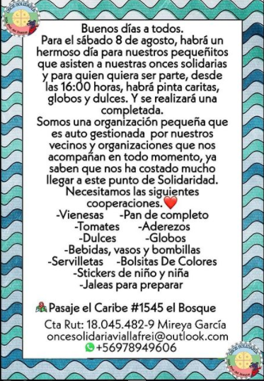
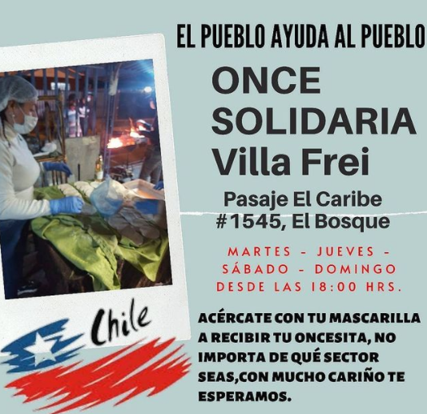

#### FOLIO: ELB04
# Once Solidaria Villa Frei
[instagram](https://www.instagram.com/oncesolidaria/)
[facebook](https://www.facebook.com/groups/699564904160955/?ref=share)
[twitter]()
<oncesolidariaviallafrei@outlook.com>
---

### Representantes
#### (Nombres o emails de voceros o representantes).
dm al Ig
---
### Interacciones frecuentes
#### (listar otras organizaciones que habitualmente)
* Olla común territorial el bosque
* El Bosque resiste

### Redes sociales
#### ¿Para qué se utiliza la red social?
| Instagram | Facebook | Twitter | Otra 
|---|---|---|---|
|Difusión de información y de actividades|Idem Ig|No aplica| No aplica|

### **Instagram**
| seguidores | seguidos | publicaciones | hashtag 
|---|---|---|---|
|1308|3,074|160| 0

---

* **Actividad:**   

* Primera Publicación IG: 8 Junio (inactiva desde septiembre, pero funcionó continuamente 3 meses)

---
### Frecuencia de publicación.

Publicaciones: semanales(3,4 veces)

Actividades: Semanales (martes, jueves, sabado y domingo)

---
### Ubicación
* Sector de la comununa/ciudad: Pasaje el caribe 1545, Villa Frei, el Bosque

---
### Describir temas de interés y/o trabajo
* apoyo mutuo, solidaridad, amor 
---
### Describir la imagen ideal por la cual se trabaja.
#### (El horizonte hacia el cual se quiere avanzar.)
* ¡Hasta que la dignidad se haga costumbre! ¡Solo el pueblo ayuda al pueblo!¡Me cuidan mis vecinos no la muni ni el estado! Libertad a lxs presxs mapuche

---
### ¿Que se hace?
#### (Manifestaciones, marchas, intervenciones, actividades culturales, conversatorios, intercambio de saberes, actividades solidarias o de apoyo mutuo, abastecimiento, contra información, emplazamiento a autoridades etc.)
* Ayuda solidaria 
* Entrega de Comida 
* Actividad día del niñx
* Concurso para niñxs "dibuja la Olla Solidaria"
* Mural 

---
### Describir y distinguir demandas más reivindicativas de espacios sin relación con lo contencioso o con lo político mas prefigurativo
#### (lo contencioso; demanda al Estado, a alguna autoridad, privados, etc), (prefigurativo, transformación desde lo cotidiano, etc.).
Se dirige a vecinxs y vecinxs, que se ayude al prójimo. 
---
### Tipo de organización interna.
#### (Vocerías, asambleísmo, horizontalidad, etc.; *se entiende que esta dimensión es más difícil de captar vía análisis de redes sociales, pero quizás se puede vislumbrar a través de roles/cargos*)
horizontal 
---
### Describir los temas / imágenes- iconos / conceptos mas habitualmente presentes en sus publicaciones. Describir cambios/ transformaciones en los contenidos desde Octubre.

**Iconos:**

**Banderas:**

**Diseño estético:**

> Párrafo tipo cita 

---
### Percepciones que se tiene del Estado
#### (Aparato burocrático)
> resumen de lo encontrado

| Declaraciones | infografía | 
|---|---|
|Anotar los comunicados |  |

---
### Percepciones que se tiene de las Fuerzas de Orden
#### (Aparato represivo)
> resumen de lo encontrado

| Declaraciones | infografía | 
|---|---|
|Anotar los comunicados |  |

---
### Incorporar aca notas, citas textuales, links, etc. extra a los ya incorporados, que sean de interés para comprender tanto la forma como los contenidos asociados a la organización.

**Comunicado Fin de la Once** - Septiembre 2020
> Queremos Dar Las Gracias A Todas Las Personas Que Fueron Parte De Esto Tan Lindo Que Fue Nuestra Once Solidaria Villa Frei ❤️Conocimos gente hermosa En nuestro Camino✨ si !!! Al l comienzo fue difícil demasiado difícil pero se logró 🤗 3 meses y algo y una semana exactamente Logramos regalar solidaridad a nuestros vecinos🌼a nuestros viejitos en situación de calle💓 logramos unir Un Poco Más A Nuestra comunidad✊ conocer a nuestros vecinxs Aprendimos a Tener Más Empatia Por El Otro conosimos en Más Profundidad A Nuestra Bella Comunidad ✨ Logramos Mucho Más De Lo Que Pensamos !!!Nuestros vecinos del manzanal cuando tuvieron en pleno temporal de invierno una inundación grande más de 40 familias damnificadas comenzamos con la campaña ayudemos al manzanal con la ayuda de muchas organizaciones que nos tendían Una Mano❤️ logramos llegar a la meta y ayudar a toda esa familia que necesitaban ✊✊con nuestra familia en situación de calle llegamos a ellos con mercadería frazadas y la 11 solidaria que Entregamos los martes jueves sábados y domingos ..Luego con actividades del día del niñocon el apoyo de la organización y la autogestión de los vecinos logramos una actividad hermosa en la cual los niños fueron muy agradecido y estaban felices por todas las actividades que Se realizaron los regalos que se entregaron y toda la ayuda que se brindó ❤️ojo cabe mencionar que nosotros como organización igual entregamos pañal leche aquel que necesitaba ! también entregamos ropa,zapatos, frazadas a nuestra comunidad✨estamos muy agradecidos de todo lo que se logró de todos los que apoyaron con leña con un kilito de harina o con un quintal de harina avena leche botellas en fin estamos agradecido de la vida por habernos permitido poder conocer a todos nuestros ángeles que se cruzaron en el camino y nos brindaron una manoMuchísimas gracias por todo el cariño y el amor que nos brindaron el apoyo a mis compañeros que se sacaron la cresta por sacar esto adelante y yo personalmente como representante(Beba) de esta hermosa labor estoy muy agradecida de haber conocido a tanta gente bella 💓10643 Pansitos entregados y 9872 Sopaipillas ❤️ de verdad de todo Corazón gracias hasta Pronto
>

