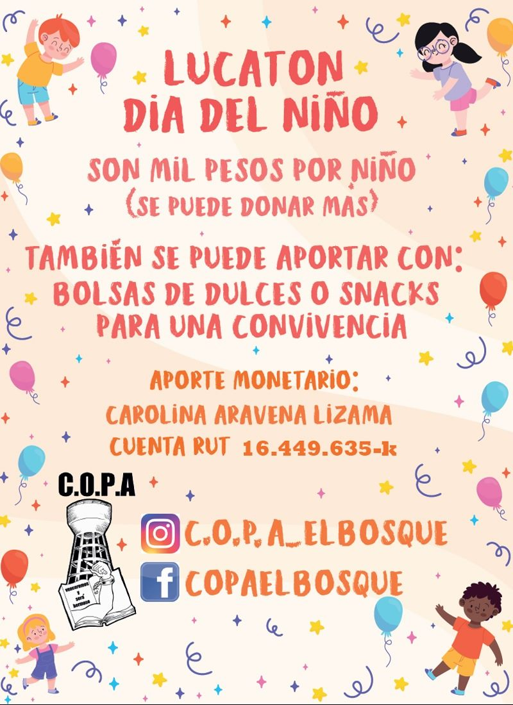
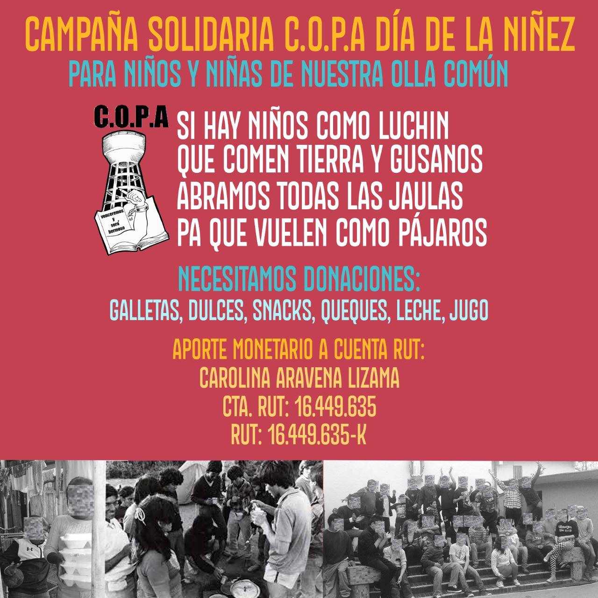
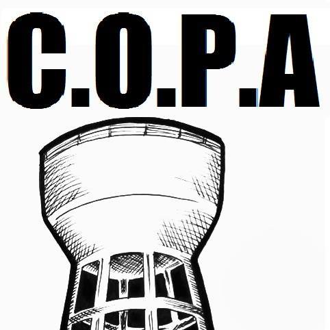
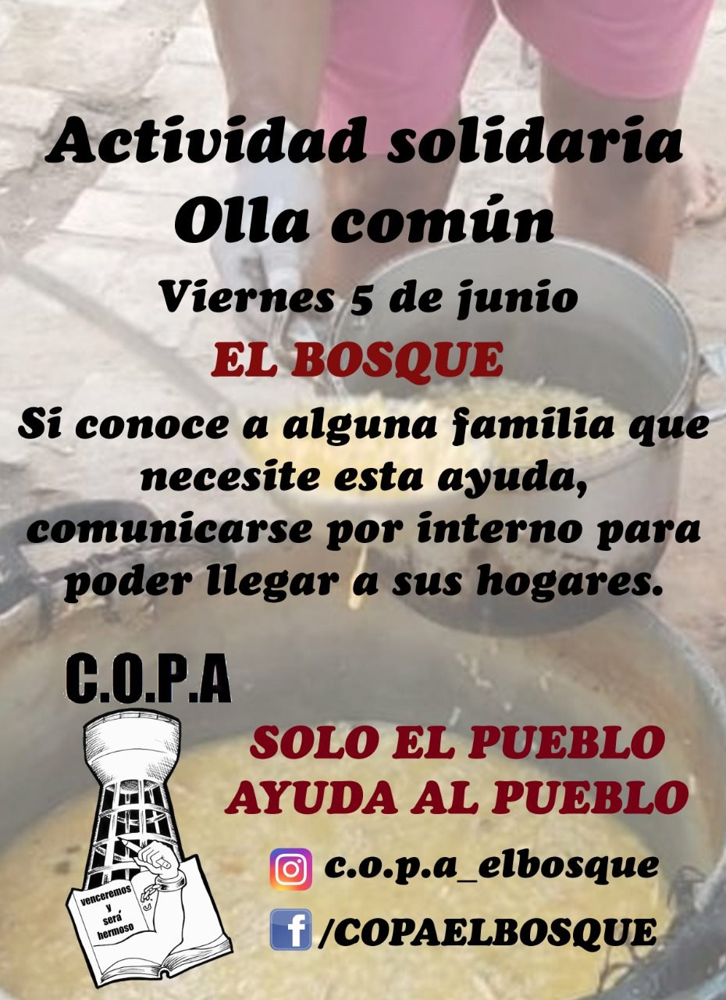

#### FOLIO: ELB05
# Colectivo Organizado de Pobladores Apartidistas

[instagram](https://www.instagram.com/c.o.p.a_elbosque/)
[facebook](https://www.facebook.com/COPAELBOSQUE/)
[twitter]()
<correo@correo.cl>
---

### Representantes
#### (Nombres o emails de voceros o representantes)Erasmo Catalán, catalan.castillo.erasmo@gmail.com 

---
### Interacciones frecuentes
#### (listar otras organizaciones que habitualmente)
* El bosque resiste
* Red popular de acción común
* Tetera común
* La terrible de olla 
### Redes sociales
#### ¿Para qué se utiliza la red social?
| Instagram | Facebook | Twitter | Otra 
|---|---|---|---|
|Difusión de información y difusión de actividades|No aplica|No aplica| No aplica|

### **Instagram**
| seguidores | seguidos | publicaciones | hashtag 
|---|---|---|---|
|598|661|67| 0

---

* **Actividad:**   

* Primera Publicación IG: 24 Mayo (Inactivo en Ig esde 22 Octubre, pero en facebook hicieron una publicación 19 noviembre convocando a una actividad)

---
### Frecuencia de publicación.

Publicaciones: Semanales 

Actividades: Semanales, lunes y miércoles olla común

---
### Ubicación
* Sector de la comununa/ciudad: Pje.Liszt # 11941
Beethoven #11717
La esmeralda #11303

---
### Describir temas de interés y/o trabajo
* apoyo mutuo, autogestión, solidaridad, amor por la pobla
---
### Describir la imagen ideal por la cual se trabaja.
#### (El horizonte hacia el cual se quiere avanzar.)
* Solidaridad, resistencia, apoyo mutuo y autogestión de la misma población! "Hasta que se viva con dignidad" "Hasta que la dignidad se haga costumbre" ¡En tiempo de pandemia que la solidaridad y responsabilidad entre pobladores sea nuestra mejor arma! 

---
### ¿Que se hace?
#### (Manifestaciones, marchas, intervenciones, actividades culturales, conversatorios, intercambio de saberes, actividades solidarias o de apoyo mutuo, abastecimiento, contra información, emplazamiento a autoridades etc.)
* Ollas comunes
* Bingos 
* Actividades día del niñx 
* Campaña día del niñx 
* Campañas solidarias de recolección de alimentos
* Cacerolazos 

---
### Describir y distinguir demandas más reivindicativas de espacios sin relación con lo contencioso o con lo político mas prefigurativo
#### (lo contencioso; demanda al Estado, a alguna autoridad, privados, etc), (prefigurativo, transformación desde lo cotidiano, etc.).
* Se dirige a vecinxs y vecinxs a solicitar ayuda, recibirle y también organizarse para ello. Además se emplaza a preferir economía local :"*Prefiera los negocios de barrio que las grandes empresas trasnacionales que explotan a sus trabajadores*."
---
### Tipo de organización interna.
#### (Vocerías, asambleísmo, horizontalidad, etc.; *se entiende que esta dimensión es más difícil de captar vía análisis de redes sociales, pero quizás se puede vislumbrar a través de roles/cargos*)
horizontal
---
### Describir los temas / imágenes- iconos / conceptos mas habitualmente presentes en sus publicaciones. Describir cambios/ transformaciones en los contenidos desde Octubre.

**Iconos:**

**Banderas:**

**Diseño estético:**

> Párrafo tipo cita 

---
### Percepciones que se tiene del Estado
#### (Aparato burocrático)
> opresor y abandono. 

| Declaraciones | infografía | 
|---|---|
|Ver comunicado anexo, actividad pro fondos|  |

---
### Percepciones que se tiene de las Fuerzas de Orden
#### (Aparato represivo)
> resumen de lo encontrado

| Declaraciones | infografía | 
|---|---|
|Anotar los comunicados |  |

---
### Incorporar aca notas, citas textuales, links, etc. extra a los ya incorporados, que sean de interés para comprender tanto la forma como los contenidos asociados a la organización.

**Comunicado Pro Fondos**, 12 Junio 
>Actividad Solidaria, Pro-Fondos C.O.P.A.
Domingo 14 de junio, El Bosque. Frente al abandono del Malgobierno, el Estado opresor y de las autoridades locales, en donde se han visualizado y salido a la luz pública las condiciones precarias en el que lxs vecinxs viven día a día en las comunas y poblaciones populares como la nuestra. Por esto, y muchas cosas más, como pobladores no podemos ser ajenos y pasivos frente a los atropellos del sistema; llevamos casi un mes organizándonos para parar la olla a muchas familias, quienes no pueden sustentar una necesidad tan básica como es la alimentación, en donde una vez más, como en otras esferas, el Estado es vulnerador en vez de garante de derecho.
Como C.O.P.A. tenemos que seguir funcionando y abarcando la misma cantidad de personas y familias que tenemos en la actualidad, si podemos sumar mejor, en donde nunca vamos a negar un plato de comida ni dejar de tender una mano a ningún vecinx que lo requiera, por que vivimos en la pobla, conocemos la realidad de esta y nos sentimos orgullosos de ser parte de esta. Para lograr este objetivo, tenemos que tener recursos, los cuales son escasos, ya que somos una organización autogestionada sin apoyo de ninguna institucionalidad.
El día DOMINGO 14 DE JUNIO, vamos a realizar una actividad de plato único que consiste en ARROZ CON POLLO Y ENSALADA A LA CHILENA, el cual tendrá el precio popular de $2.000 el plato y 3X$5.000, con servicio DELIVERY. Todo lo recaudado será para reunir fondos para el colectivo y seguir llegando con nuestro aporte a todas las familias bosquinas.

> APOYO MUTUO Y AUTOGESTIÓN!
>SEGUIMOS PUÑO EN ALTO HASTA QUE LA DIGNIDAD SE HAGA COSTUMBRE.

**Comunicado a 1 mes 18 Mayo, Protestas en El Bosque**
>A un mes del 18 de mayo, en donde lxs vecinxs de El Bosque nos levantamos contra la miseria y abandono de las autoridades en la “Revuelta del hambre”; lo que llevo el surgimiento de distintas organizaciones sociales en las poblaciones de la comuna y a lo largo del territorio, todas con el mismo objetivo de parar la olla de forma comunitaria para que a ningún poblador le falte para garantizar una necesidad básica como es la alimentación.

> Como Colectivo Organizado por Pobladores Apartidistas, C.O.P.A., seguimos puño en alto brindando nuestro apoyo y acompañamiento a cada vecinx que lo necesite, por esto que agradecemos los distintos aportes anónimos que desde el primer día hemos recibido de una u otra manera para lograr el objetivo común, ya que no somos parte ni recibimos recursos de ninguna institución, siendo la solidaridad, el apoyo mutuo y la autogestión los cimientos de la organización. No olvidamos que debemos exigir nuestros derechos a quienes deben garantizarlo y no desresponsabilizar al Estado de su propia gente.

>Los recursos nuestros son limitados, tanto económicos y humanos, los cuales se van agotando paulatinamente al trabajar con 200 personas en 50 familias de distintos sectores de la comuna, es que como organización nos encontramos en campaña para captar recursos de todo tipo, principalmente económicos donde tenemos habilitada una Cuenta Rut y puntos de acopios, y humano, donde necesitamos sumar personas comprometidas para cumplir labores en las distintas comisiones del colectivo.

>Si quieres aportar de alguna manera, comunicarse por las páginas del colectivo.
Hasta que la dignidad se haga costumbre !!