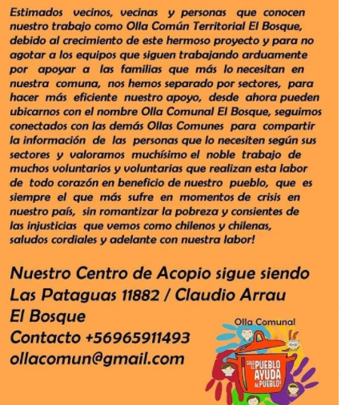
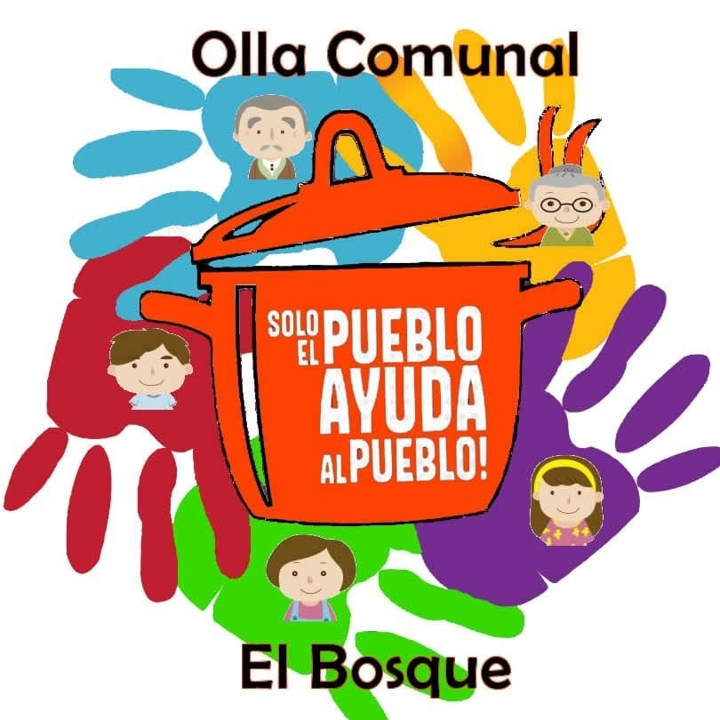
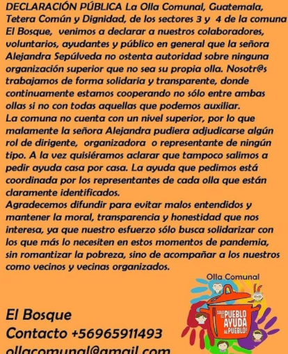
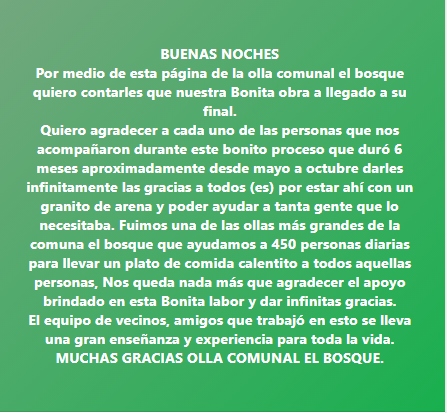

#### FOLIO: ELB06
# Olla Comunal El Bosque
[instagram](https://www.instagram.com/ollacomunalelbosque/)
[facebook]()
[twitter]()
<ollacomunal@gmail.com>
---

### Representantes
#### (Nombres o emails de voceros o representantes)* ollacomunal@gmail.com
* Contacto: + 569 65911493 / Claudio Arrau

---
### Interacciones frecuentes
#### (listar otras organizaciones que habitualmente)
* A parar la olla 
* Cuchara de palo chile 

### Redes sociales
#### ¿Para qué se utiliza la red social?
| Instagram | Facebook | Twitter | Otra 
|---|---|---|---|
|Difusión de Info y actividades|ídem Ig|No aplica| No aplica|

### **Instagram**
| seguidores | seguidos | publicaciones | hashtag 
|---|---|---|---|
|705|1,394|100| 0

---

* **Actividad:**   

* Primera Publicación IG: 28 Mayo (última publicación 28 Octubre, inactiva desde el 2 Noviembre, comunicado en facebook)

---
### Frecuencia de publicación.

Publicaciones: diario

Actividades: diario

---
### Ubicación
* Sector de la comununa/ciudad: Las Pataguas 11882 (sede de acopio)

---
### Describir temas de interés y/o trabajo
* apoyo mutuo, solidaridad, compañerismo, coordinación territorial.
---
### Describir la imagen ideal por la cual se trabaja.
#### 
* No más hambre en el territorio, el pueblo ayuda al pueblo

---
### ¿Que se hace?
#### (Manifestaciones, marchas, intervenciones, actividades culturales, conversatorios, intercambio de saberes, actividades solidarias o de apoyo mutuo, abastecimiento, contra información, emplazamiento a autoridades etc.)
* Olla común
* Acopio
* Campañas solidarias
* Reporte semanal de actividades
* Coordinación con otras ollas 
---
### Describir y distinguir demandas más reivindicativas de espacios sin relación con lo contencioso o con lo político mas prefigurativo
#### (lo contencioso; demanda al Estado, a alguna autoridad, privados, etc), (prefigurativo, transformación desde lo cotidiano, etc.).
* Se dirige a vecinxs, a recibir y colaborar con ayuda. 
---
### Tipo de organización interna.
#### (Vocerías, asambleísmo, horizontalidad, etc.; *se entiende que esta dimensión es más difícil de captar vía análisis de redes sociales, pero quizás se puede vislumbrar a través de roles/cargos*)
* voluntariado, acopio en un lugar y se separan por sedes para llegar a más vecinos, "el chef del pueblo" lidera al equipo de cocineros. 

---
### Describir los temas / imágenes- iconos / conceptos mas habitualmente presentes en sus publicaciones. Describir cambios/ transformaciones en los contenidos desde Octubre.

**Iconos:**
 
**Banderas:**

**Diseño estético:**

> Párrafo tipo cita 

---
### Percepciones que se tiene del Estado
#### (Aparato burocrático)
> resumen de lo encontrado

| Declaraciones | infografía | 
|---|---|
|Anotar los comunicados |  |

---
### Percepciones que se tiene de las Fuerzas de Orden
#### (Aparato represivo)
> resumen de lo encontrado

| Declaraciones | infografía | 
|---|---|
|Anotar los comunicados |  |

---
### Incorporar aca notas, citas textuales, links, etc. extra a los ya incorporados, que sean de interés para comprender tanto la forma como los contenidos asociados a la organización.

[**Video olla comunal el bosque**](https://www.instagram.com/p/CA38RKHFtsc/)

* **Aclaración situación de dirigencia Ollas**

* **Comunicado finalización Olla Comunal, Publicación en Facebook, 2 Noviembre 2020**

