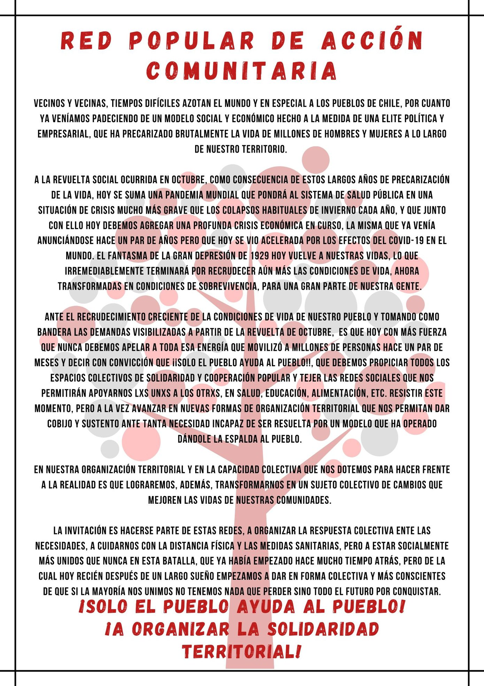
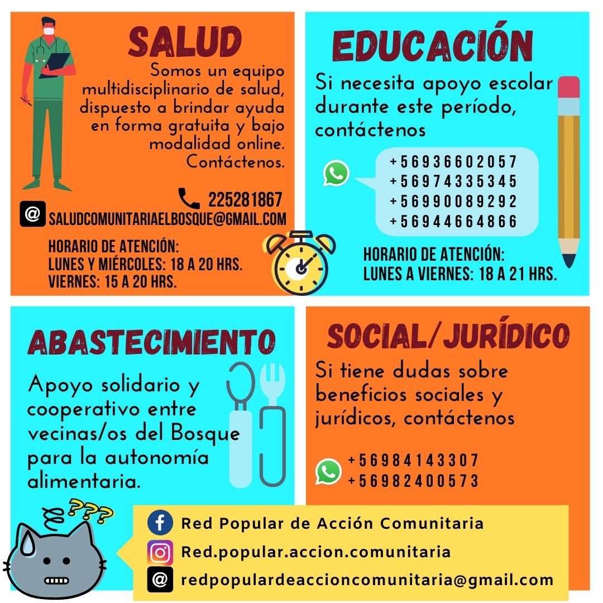
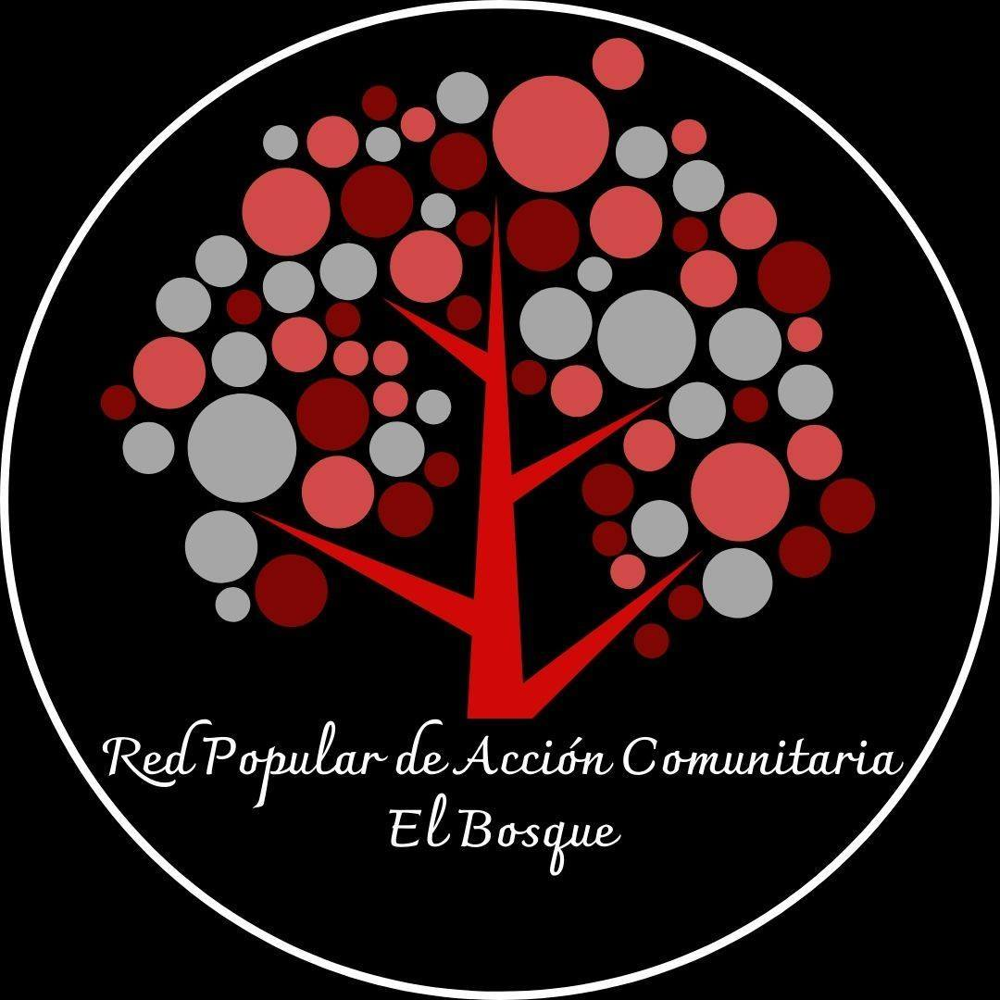

#### FOLIO: ELB07
# Red Popular de Acción Comunitaria

[instagram](https://www.instagram.com/red.popular.accion.comunitaria/)
[facebook]()
[twitter]()
<correo@correo.cl>
---

### Representantes
#### (Nombres o emails de voceros o representantes)* dm al Ig, redpopulardeaccioncomunitaria@gmail.com 

---
### Interacciones frecuentes
#### (listar otras organizaciones que habitualmente)
* El bosque resiste
* Organización flaite
*
### Redes sociales
#### ¿Para qué se utiliza la red social?
| Instagram | Facebook | Twitter | Otra 
|---|---|---|---|
|difusión de info y actividades|idem Ig|No aplica| No aplica|

### **Instagram**
| seguidores | seguidos | publicaciones | hashtag 
|---|---|---|---|
|757|371|32| 0

---

* **Actividad:**   

* Primera Publicación IG: 12 Mayo (inactivo, desde Octubre 2020)

---
### Frecuencia de publicación.

Publicaciones: semanales

Actividades: semanales

---
### Ubicación
* Sector de la comununa/ciudad: Junta de Vecinos población el sauce (acopio)

---
### Describir temas de interés y/o trabajo
* apoyo mutuo, solidaridad, organización comunitaria. 
---
### Describir la imagen ideal por la cual se trabaja.
#### (El horizonte hacia el cual se quiere avanzar.)
* Crear redes de apoyo cooperativo, generar una red que articule a vecinxs y vecinxs del bosque. ¡Avanzar y organizar la solidaridad territorial! ¡¡Porque solo el Pueblo ayuda al Pueblo!!

---
### ¿Que se hace?
#### (Manifestaciones, marchas, intervenciones, actividades culturales, conversatorios, intercambio de saberes, actividades solidarias o de apoyo mutuo, abastecimiento, contra información, emplazamiento a autoridades etc.)
* Catastro de Red de abastecimiento el bosque: https://docs.google.com/forms/d/e/1FAIpQLSeTPbqUr-TKBLWNUF4hcidldVabHlDEJ0gCTVW7FjxAeYfTgA/viewform 
* Canastas solidarias
* Información (afiches)
* Conversatorios
* Clases particulares
* Apoyo violencia intra familiar
* Acopio solidario
* Huerto comunitario

---
### Describir y distinguir demandas más reivindicativas de espacios sin relación con lo contencioso o con lo político mas prefigurativo
#### (lo contencioso; demanda al Estado, a alguna autoridad, privados, etc), (prefigurativo, transformación desde lo cotidiano, etc.).
* Se dirige a los vecinxs, se les llama a cuidarse pero al mismo tiempo estar más cercanos que nunca. y a participar y organizarse. 

---
### Tipo de organización interna.
#### (Vocerías, asambleísmo, horizontalidad, etc.; *se entiende que esta dimensión es más difícil de captar vía análisis de redes sociales, pero quizás se puede vislumbrar a través de roles/cargos*)
* horizontal, por áreaS: educación comunitaria, salud comunitaria, economía popular, social/jurídico, abastecimiento. 

* [Aquí video explicativo sobre funcionamiento](https://www.instagram.com/p/CAdJSMVFiPd/)

---
### Describir los temas / imágenes- iconos / conceptos mas habitualmente presentes en sus publicaciones. Describir cambios/ transformaciones en los contenidos desde Octubre.

**Iconos:**

**Banderas:**

**Diseño estético:**

> Párrafo tipo cita 

---
### Percepciones que se tiene del Estado
#### (Aparato burocrático)
> resumen de lo encontrado

| Declaraciones | infografía | 
|---|---|
|Anotar los comunicados |  |

---
### Percepciones que se tiene de las Fuerzas de Orden
#### (Aparato represivo)
> resumen de lo encontrado

| Declaraciones | infografía | 
|---|---|
|Anotar los comunicados |  |

---
### Incorporar aca notas, citas textuales, links, etc. extra a los ya incorporados, que sean de interés para comprender tanto la forma como los contenidos asociados a la organización.
* Comunicado creación de la red:
>Entre un grupo de organizaciones sociales, dirigentxs y vecinxs de nuestra comuna, conscientes de la dura crisis social y económica que dio origen a la revuelta en octubre y que hoy se verá agudizada y profundizada por una crisis sanitaria y la pandemia mundial provocada por el covid-19, hemos decidido organizarnos y responder desde la acción solidaria y la cooperación mutua, creando una de red comunitaria que nos permita enfrentar y organizar las diversas necesidades que como comunidad tendremos producto de la agudización de la crisis.

>Sabemos que el fondo de la crisis es un modelo social y económico que permanentemente le ha dado la espalda al pueblo y que solo el pueblo desde sus propias capacidades puede crear las mejores respuestas para enfrentarla. Las áreas que estamos desarrollando son educación, salud, economía, jurídica y social. Generando apoyo educativo a nuestros niños y niñas, atenciones on-line en medicina general y psicología, creando redes de distribución de alimentos, asesorando respecto a los programas sociales y resolviendo dudas jurídicas. Los y las invitamos a hacerse parte de esta red ya sea organizándose con nosotros, ayudando a difundir o simplemente participando de los apoyos que estamos creando para la comunidad.

>¡¡Porque solo el Pueblo ayuda al Pueblo!!
¡¡A organizar la solidaridad territorial!!

Red popular de acción comunitaria El Bosque