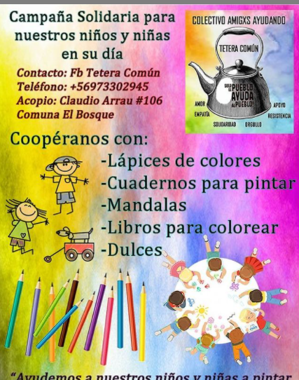
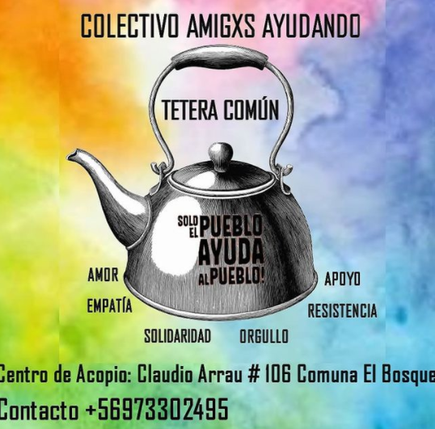
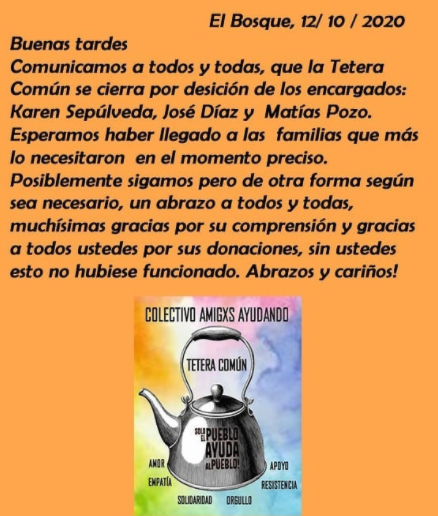

#### FOLIO:ELB08
# Tetera Común 

[instagram](https://www.instagram.com/p/CBHUxkPHhm9/)
[facebook]()
[twitter]()
<teteracomun@gmail.com>
---

### Representantes
#### (Nombres o emails de voceros o representantes)+56973302495 y gmail

---
### Interacciones frecuentes
#### (listar otras organizaciones que habitualmente)
* 
* 
*

### Redes sociales
#### ¿Para qué se utiliza la red social?
| Instagram | Facebook | Twitter | Otra 
|---|---|---|---|
|difusión de información y actividades|0|0| 0|

### **Instagram**
| seguidores | seguidos | publicaciones | hashtag 
|---|---|---|---|
|834|2,125|129| 0

---

* **Actividad:**   

* Primera Publicación IG; 6 Junio 2020 (se da por terminado el trabajo en Octubre 2020, ver imagen anexo)

---
### Frecuencia de publicación.

Publicaciones: semanales

Actividades: diarias, entrega de onces. 

---
### Ubicación
* Sector de la comununa/ciudad: Claudio Arrau 106
---
### Describir temas de interés y/o trabajo
* Apoyo mutuo, empatía, amor solidaridad,  cooperativismo, autogestión. 
---
### Describir la imagen ideal por la cual se trabaja.
#### (El horizonte hacia el cual se quiere avanzar.)
Ayuda y prevención de hambre. ¡Sólo el pueblo ayuda al pueblo!

---
### ¿Que se hace?
#### (Manifestaciones, marchas, intervenciones, actividades culturales, conversatorios, intercambio de saberes, actividades solidarias o de apoyo mutuo, abastecimiento, contra información, emplazamiento a autoridades etc.)
* Olla común 
* Acopio 
* Actividad día del niñx 
* Rifas a beneficio
* Bingo Virtual 

---
### Describir y distinguir demandas más reivindicativas de espacios sin relación con lo contencioso o con lo político mas prefigurativo
#### (lo contencioso; demanda al Estado, a alguna autoridad, privados, etc), (prefigurativo, transformación desde lo cotidiano, etc.).
* Se dirige a los vecinxs
---
### Tipo de organización interna.
#### (Vocerías, asambleísmo, horizontalidad, etc.; *se entiende que esta dimensión es más difícil de captar vía análisis de redes sociales, pero quizás se puede vislumbrar a través de roles/cargos*)
voluntariado, encargados: Karen Sepulveda, José Díaz y Matías Pozo
---
### Describir los temas / imágenes- iconos / conceptos mas habitualmente presentes en sus publicaciones. Describir cambios/ transformaciones en los contenidos desde Octubre.

**Iconos:**

**Banderas:**

**Diseño estético:**

> Párrafo tipo cita 

---
### Percepciones que se tiene del Estado
#### (Aparato burocrático)
> resumen de lo encontrado

| Declaraciones | infografía | 
|---|---|
|Anotar los comunicados |  |

---
### Percepciones que se tiene de las Fuerzas de Orden
#### (Aparato represivo)
> resumen de lo encontrado

| Declaraciones | infografía | 
|---|---|
|Anotar los comunicados |  |

---
### Incorporar aca notas, citas textuales, links, etc. extra a los ya incorporados, que sean de interés para comprender tanto la forma como los contenidos asociados a la organización.

 