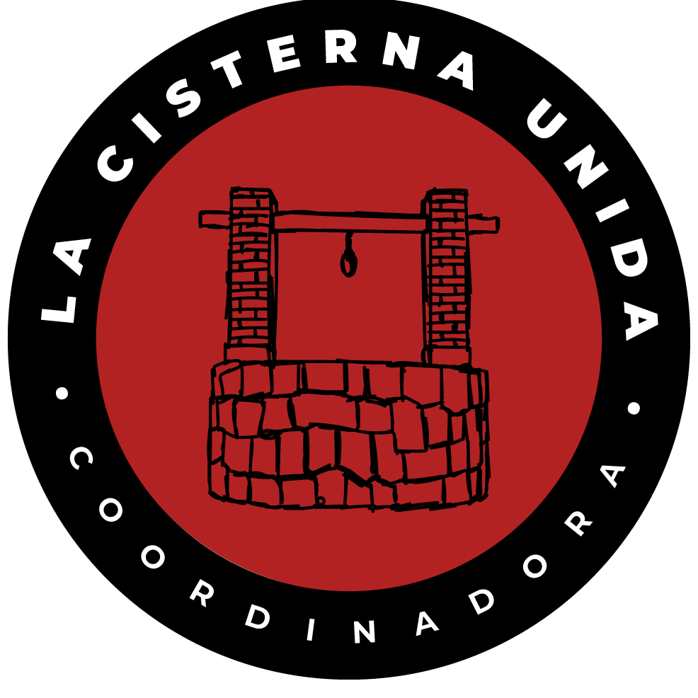
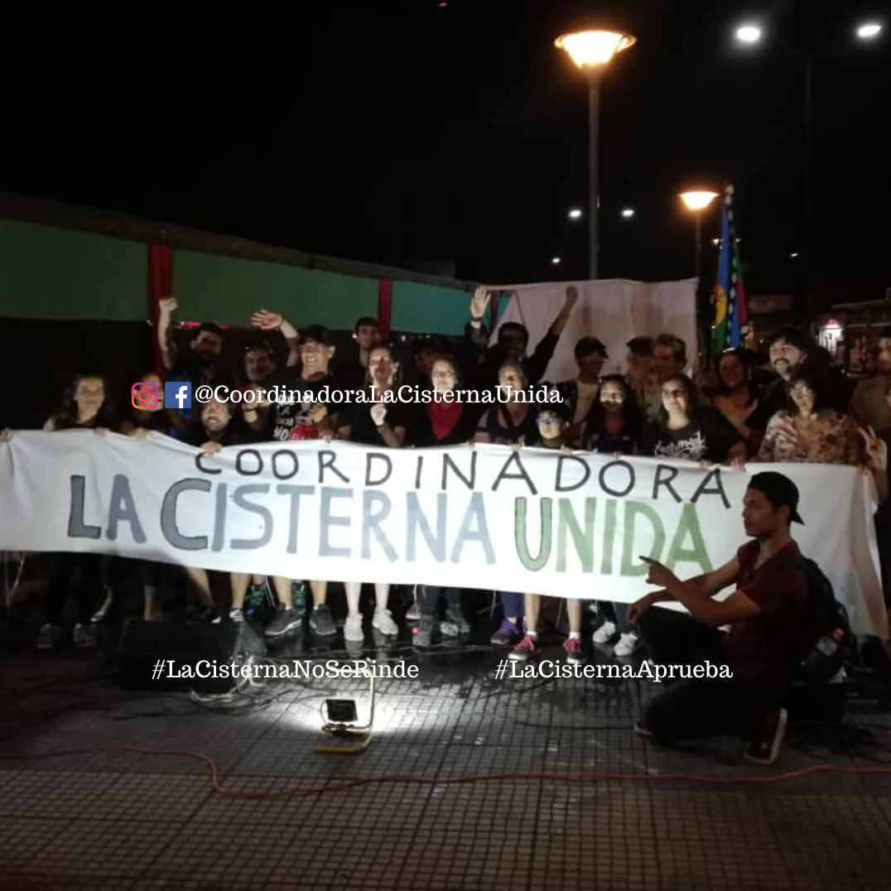

#### FOLIO: LAC01
# Coordinadora La Cisterna Unida 

[instagram](https://www.instagram.com/coordinadoralacisternaunida/)
[facebook]()
[twitter]()
<coordinadoralacisternaunida@gmail.com>
---

### Representantes
#### (Nombres o emails de voceros o representantes).
gmail o dm Ig.
---
### Interacciones frecuentes
#### (listar otras organizaciones que habitualmente)
* Asamblea Territorial Autoconvocada La Cisterna (ATALA)
* Trawun el 18 
* San Miguel Resistente 
* Asamblea Ciudad del niño San Miguel
* Capuchas revolucionarios 
* La Granja movilizada
* La Cisterna Pedalea, y Movimientos ciclistas de zona sur (cletero ilustre, ciclistas combatientes, otres)
* Asamblea La Cisterna 
* Mujeres en red la cisterna 
* El Bosque Resiste
* JJVV Augusto Biaut
* Teatro el Aleph

### Redes sociales
#### ¿Para qué se utiliza la red social?
| Instagram | Facebook | Twitter | Otra 
|---|---|---|---|
|difusión de información y actividades|0|0| 0|

### **Instagram**
| seguidores | seguidos | publicaciones | hashtag 
|---|---|---|---|
|2,552|1,036|202| 0

---

* **Actividad:**   

* Primera Publicación IG: 12 Diciembre 2019 (actualmente activa)

---
### Frecuencia de publicación.

Publicaciones: Diarias hasta marzo, luego semanales (3,4)

Actividades: Semanales 

---
### Ubicación
* Sector de la comununa/ciudad: La Cisterna, plaza de lospoetas, paradero 25 Gran Av. 

---
### Describir temas de interés y/o trabajo
 * Proceso constituyente, apoyo mutuo, educación, salud y pensiones. Organización autónoma, popular.
---
### Describir la imagen ideal por la cual se trabaja.
#### (El horizonte hacia el cual se quiere avanzar.)
* Nueva constitución con Asamblea Constituyente, salud digna, educación sin deudas, NO + AFP. Cárcel para piñera. Agua como derecho. Recuperar las calles. "Hasta que la dignidad se haga costumbre" 

---
### ¿Que se hace?
#### (Manifestaciones, marchas, intervenciones, actividades culturales, conversatorios, intercambio de saberes, actividades solidarias o de apoyo mutuo, abastecimiento, contra información, emplazamiento a autoridades etc.)
* Cacerolazos
* Marchas
* Cicletadas 
* Completadas (almuerzoz/comidas) populares 
* Marchas 
* Navidad Popular
* Jornadas Informativas 
* Talleres: artísticos, talleres  reparación bicicletas y muralismo, menstruación consciente, derechos sexuales y reproductivos 
* Actividades y juegos infantiles
* Música en vivo
* Ayuda solidaria a Valpo (incendios Dic2019)
* Escuela Constituyente (en JJVV Augusto Biaut)
* Mural  
* Velatones conmemorativos
* Lives en contexto pandemia (autocuidado, enseñar en casa, violencia contra la mujer, migración en cuarentena )
* Sanitización gran avenida
* Campaña la Cisterna Solidaria
* Círculo Virtuoso Solidario La Cisterna

---
### Describir y distinguir demandas más reivindicativas de espacios sin relación con lo contencioso o con lo político mas prefigurativo
#### (lo contencioso; demanda al Estado, a alguna autoridad, privados, etc), (prefigurativo, transformación desde lo cotidiano, etc.).
Se dirige a vecinxs de La Cisterna a que la lucha no pare, ya que aún no se ha ganado nada, a no rendirse y a organizarse día a día.  Emplaza a presidente y a ministros a renunciar. 
---
### Tipo de organización interna.
#### (Vocerías, asambleísmo, horizontalidad, etc.; *se entiende que esta dimensión es más difícil de captar vía análisis de redes sociales, pero quizás se puede vislumbrar a través de roles/cargos*)
* Asamblea, comisiones. (educacioncoordinadoracisternaunida@gmail.com)
---
### Describir los temas / imágenes- iconos / conceptos mas habitualmente presentes en sus publicaciones. Describir cambios/ transformaciones en los contenidos desde Octubre.

**Iconos:** 

Desde lo más reciente a primero publicado (Diciembre 2019)

 
 
 

**Banderas:**

**Diseño estético:**

> Párrafo tipo cita 

---
### Percepciones que se tiene del Estado
#### (Aparato burocrático)
> resumen de lo encontrado

| Declaraciones | infografía | 
|---|---|
|Anotar los comunicados |  |

---
### Percepciones que se tiene de las Fuerzas de Orden
#### (Aparato represivo)
> resumen de lo encontrado

| Declaraciones | infografía | 
|---|---|
|Anotar los comunicados |  |

---
### Incorporar aca notas, citas textuales, links, etc. extra a los ya incorporados, que sean de interés para comprender tanto la forma como los contenidos asociados a la organización
* Declaración 17 Diciembre - "La Cisterna por un cambio"
> La Cisterna por una Nueva Constitución
.
Gran respaldo a una nueva Constitución y a la Convención Constitucional hubo en la consulta ciudadana organizada por la Asociación Chilena de Municipalidades. La participación de las y los cisterninos fue masiva, con una gran cantidad de votantes incluso mayor a las últimas elecciones municipales, en las cuales votaron 21.522 personas, de un padrón total (hasta octubre de 2016) de 84.017. .
En la consulta ciudadana participaron 25.020 personas, de las cuales el 91% (23.396) optó por la opción de una nueva Constitución y sobre el 75% (18.868) optó por el mecanismo de Convención Constitucional. Esta votación sienta un precedente importante para el plebiscito que se viene en abril de 2020, el que será decisivo y vinculante. .
Lamentamos que producto de la poca voluntad política de Alcalde y algunos concejales no se haya podido incorporar -pese a los esfuerzos de la comunidad organizada- la pregunta por ASAMBLEA CONSTITUYENTE, único mecanismo realmente democrático y soberano para elaborar una Nueva Constitución y que fue reemplazado por un sucedáneo que es la Convención Constitucional.
.
La gran y principal diferencia entre la Asamblea Constituyente y la Convención Constitucional es que la primera es autónoma del congreso y otros poderes de Estado, pues es un órgano que se da el mismo Pueblo para poder reescribir las reglas del juego. En cambio, la convención constitucional está limitada por el Congreso, está hecha a la medida de la clase política y no de la ciudadanía. .
La clase política sigue sin entender lo que el pueblo quiere. No obstante eso, nosotros, el Pueblo, tenemos claro nuestro camino y estamos esperanzados en que podremos barrer con los obstáculos que nos ponga la élite de nuestro país.
.
#coordinadoralacisternaunida #editorial #nuevaconstitución
#LaCisternaNoSeRinde

* Comunicado 2 de Enero: "De la Revuelta Popular a la Revolución Social" 
> Un nuevo año comienza y la frase que en todos lados resuena es “Chile cambió”. No sólo despertamos, sino que cambiamos. Ya no es producto del círculo cercano que suele pensar como uno. Es en todos lados: la micro, la calle, la feria, el supermercado, el metro, la pega, cuando decido comprar un café en un negocio pequeño para ayudar a los otros como yo. La prensa, las redes sociales y la televisión analizan el fenómeno. ¿Qué tanto hemos cambiado?

> El 18 de octubre es el día cero. El primer día del llamado “estallido social”, o como a la prensa del sistema le gusta llamar, “crisis social”. Todos eufemismos que no logran dar cuenta de la relevancia de este nuevo periodo en la historia del país. Lo que acontece hoy es una revuelta popular que incluso es germen de una verdadera revolución. Acción popular que ha puesto en jaque al gobierno y a todo el régimen político putrefacto que nos rige.
La crisis política viene de mucho tiempo atrás, incubada por décadas, acelerada en los últimos diez años por acción de la misma clase política: escandalosos casos de corrupción, cohecho, leyes solo a favor de los grandes empresarios, nula representatividad, violaciones a los derechos humanos, negligencia administrativa y sobre todo un sistema político que no daba respuesta a las demandas sociales. De todo esto el pueblo se cansó, y nada volverá a ser igual.

> El 25 de octubre fue otra jornada histórica, la manifestación más masiva en la historia de Chile, donde ya quedó claro que no queríamos solo una rebaja de los 30 pesos, queríamos cambiarlo todo. Esta jornada marca otro hito, que deja claro que el movimiento tiene una alta legitimidad y apoyo ciudadano.

> El otro día clave fue la jornada de huelga general y protesta popular del 12 de noviembre, histórica movilización que logró paralizar al 60% de la economía: portuarios, mineros, trabajadores del transporte, salud, profesores, empleados públicos, dueñas de casa, trabajadores del retail, en definitiva una amplia mayoría de la clase trabajadora dejó caer su fuerza y logró correr el cerco.

>aunque pasaron varias jornadas importantes entre medio, quisimos destacar la manifestación de Año Nuevo Popular, tanto en Plaza Dignidad como en todo Chile, cerrando el 2019 con un triunfo y recibiendo el 2020 con lucha social activa, con unidad, con un pueblo que seguirá en la pelea por un Nuevo Chile. 
El 2020 será un año decisivo, tenemos el desafío de mantener y profundizar la movilización, y además de ganar el plebiscito y elecciones para la nueva constitución. Todo esto depende de nosotros. Las personas debemos mantener la discusión política activa y educarnos para ser capaces de lograr los cambios que estamos exigiendo. Y por supuesto, ir a votar por una nueva constitución y la Asamblea Constituyente será la opción. Para ser un pueblo soberano, tenemos que ser capaces de “caminar y mascar chicle a la vez”, como se dice.
#revolucionsocial #chiledesperto #coordinadoralacisternaunida

* Comunicado Público sobre contingencia nacional y pandemia de coronavirus - 23 Marzo 2020
https://www.instagram.com/p/B-FL7GUpNcy/ 