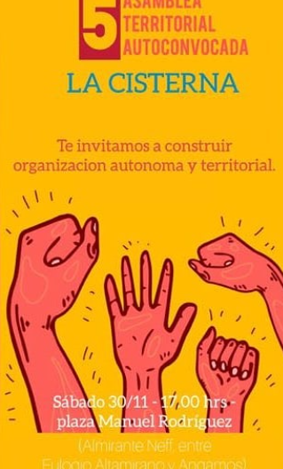
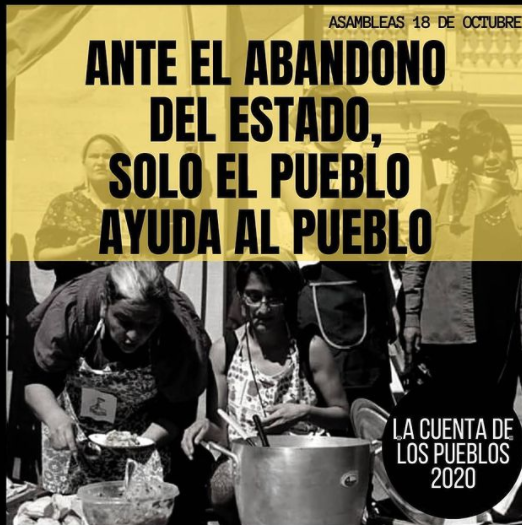
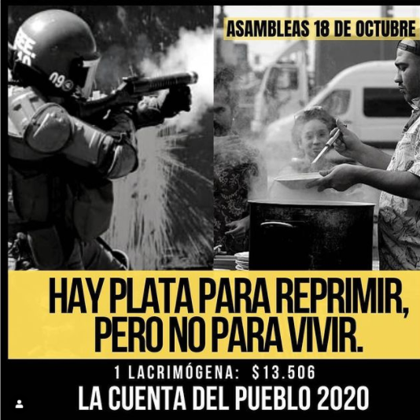

#### FOLIO: LAC02
#  Asamblea Popular Autoconvocada La Cisterna (ATA)

[instagram](https://www.instagram.com/atalacisterna/)
[facebook]()
[twitter]()
<correo@correo.cl>
---

### Representantes
#### (Nombres o emails de voceros o representantes).
dm Ig
---
### Interacciones frecuentes
#### (listar otras organizaciones que habitualmente)
* San Miguel resistente
* Trawun el 18 (muchas activades juntes)
* Asamblea La Cisterna 
* La Cisterna no se duerme 
* 

### Redes sociales
#### ¿Para qué se utiliza la red social?
| Instagram | Facebook | Twitter | Otra 
|---|---|---|---|
|Difusión de Información y actividades|0|0| 0|

### **Instagram**
| seguidores | seguidos | publicaciones | hashtag 
|---|---|---|---|
|727|962|105| 0

---

* **Actividad:**   

* Primera Publicación IG: 28 Noviembre 2019 (inactiva hace 1 mes, 26 Octubre)

---
### Frecuencia de publicación.

Publicaciones: Semanales

Actividades: Semanales 

---
### Ubicación
* Sector de la comununa/ciudad:

---
### Describir temas de interés y/o trabajo
* organización y vínculo vecinal autónomo, apoyo mutuo, protesta social,  educación popular,coordinación territorial (la cisterna y zona sur)
---
### Describir la imagen ideal por la cual se trabaja.
#### (El horizonte hacia el cual se quiere avanzar.)
* "Construir agenda de trabajo para construir vida comunitaria". Reivindicar protesta social. Libertad a los presos políticos. " "Una organización popular por la vida digna"
---
### ¿Que se hace?
#### (Manifestaciones, marchas, intervenciones, actividades culturales, conversatorios, intercambio de saberes, actividades solidarias o de apoyo mutuo, abastecimiento, contra información, emplazamiento a autoridades etc.)
* Jornada de "juegos en resistencia"
* Marchas 
* Asambleas
* Velatón / conmemoraciones
* Foros
* Actividad Familiares 
* Talleres y juegos para niñes
*  Ciclo de Talleres de formación política (Junio a Julio) Ver aquí cronograma/temáticas: https://www.instagram.com/p/CBl9x9BpoEm/
* 

--- 
### Describir y distinguir demandas más reivindicativas de espacios sin relación con lo contencioso o con lo político mas prefigurativo
#### (lo contencioso; demanda al Estado, a alguna autoridad, privados, etc), (prefigurativo, transformación desde lo cotidiano, etc.).
* Se dirige a vecinxs a tomarse sus espacios, a cuidarse entre ellos mismos ya que sólo se tienen entre ellos. "¡La cisterna se conoce, se organiza y se levanta! Emplaza al Estado y a las fuerzas del orden por su inhumano actuar. 
---
### Tipo de organización interna.
#### (Vocerías, asambleísmo, horizontalidad, etc.; *se entiende que esta dimensión es más difícil de captar vía análisis de redes sociales, pero quizás se puede vislumbrar a través de roles/cargos*)
* asamblea, comisiones. 
---
### Describir los temas / imágenes- iconos / conceptos mas habitualmente presentes en sus publicaciones. Describir cambios/ transformaciones en los contenidos desde Octubre.

**Iconos:**

  

**Banderas:**

**Diseño estético:**

> Párrafo tipo cita 

---
### Percepciones que se tiene del Estado
#### (Aparato burocrático)
> Estado inoperante e inhumano, que criminaliza la protesta social. 

| Declaraciones | infografía | 
|---|---|
|Dichas prácticas evidencian la inoperancia del estado (...) es importante visibilizar la criminalización del malestar y la protesta social como una estrategia históricamente despleada por el estado. | [Ver aquí comunicado completo 2 diciembre 2019](https://www.instagram.com/p/B5okXVplE5g/) |) |
|"Solo el pueblo ayuda al pueblo"|  |)|
---
### Percepciones que se tiene de las Fuerzas de Orden
#### (Aparato represivo)
> Reproche y condena absoluta a su actuar.

| Declaraciones | infografía | 
|---|---|
|"Durante semanas hemos sido testigos del despiado actuar de las fuerzas del orden público, que dirigida principalmente a manifestantes jóvenes y menores de edad han dejado al descubierto que las humillaciones, desnudamientos y otros (...) parecen ser medios legitimados y habituales en los procedimientos disuasivos desarrollados por Carabineros, PDI Y FF.AA de Chile. .... ¡Vecinos no nos olvidemos solo nos tenemos a nosotros!| [Ver aquí comunicado completo 2 diciembre 2019](https://www.instagram.com/p/B5okXVplE5g/) |
|"Hay plata para reprimir pero no para vivir" | ||

---
### Incorporar aca notas, citas textuales, links, etc. extra a los ya incorporados, que sean de interés para comprender tanto la forma como los contenidos asociados a la organización.

* Publicación 19 de Mayo, acopio solidario - protestas, hambre: 
> Desde nuestra Asamblea Territorial Autoconvocada La Cisterna, extendemos la invitación y el compromiso a solidarizar con la situación que estalló el día 18 de de Mayo en la Comuna de El Bosque.
El hambre se hizo más presente que de costumbre en los sectores en donde el capitalismo se ha dedicado a golpear cada vez más fuerte, y la pésima gestión de la pandemia agudiza la crisis. Nuevamente, la administración de la vida como simple mercancía destruye las posibilidades de bienestar de la comunidad. Y ante una comunidad que exige alimento; quienes pretenden gobernarnos nos mandan violencia, disparos, personas detenidas, lacrimógenas en los pasajes y el sostenimiento del hambre. Ya no creemos en su política ni confiamos en sus ajustes; solo el pueblo ayuda el pueblo y hoy más que nunca esta consigna debe hacerse carne. Nuestra gente tiene hambre; así de simple y profundo. Retomar la solidaridad con compromiso hoy es primordial para re pensar un "nosotrxs" y así buscar nuevas formas de sostener la vida. Por lo anterior, les dejamos la invitación para participar activamente de nuestro Acopio Solidario para organizaciones de la Comuna de El Bosque. Estaremos recibiendo Alimentos no perecibles y Útiles de aseo, los que serán retirados en domicilio previa coordinación llamando al +56987102447.
¡Que la solidaridad se active en todos los territorios!