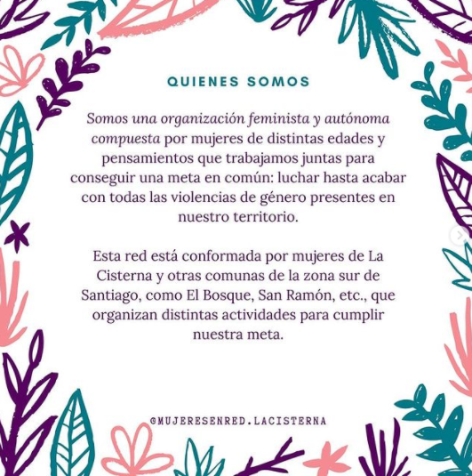
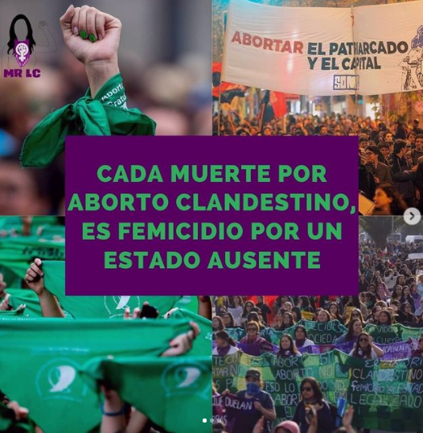
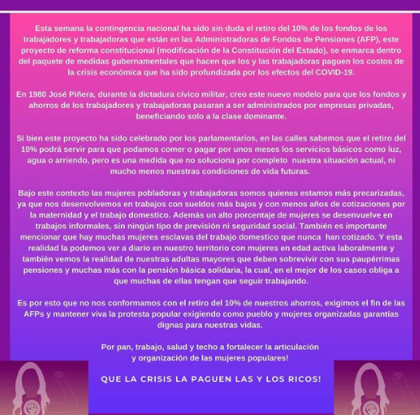

#### FOLIO: LAC04
# Mujeres en Red la Cisterna 
[instagram](https://www.instagram.com/mujeresenred.lacisterna/)
[facebook](https://www.facebook.com/mujeresenred.lacisterna/)
[twitter]()
<correo@correo.cl>
---

### Representantes
#### (Nombres o emails de voceros o representantes).
* dm al Ig/ 09 6879 7575 (fono de contacto en fb)

---
### Interacciones frecuentes
#### (listar otras organizaciones que habitualmente)
* Colectivo Las Violetas Sue (coordinadora feminista zona sur)
* Mujeres San Miguel
* Mujeres en red zona sur 
* Asamblea Territorial San Miguel Unidad Territorial 3
* Colectiva feminista Lo Espejo (pre 18 Octubre, movilizaciones 2018) 
* Circulo mujeres organizadas
* JJVV Augusto Biaut
* Teatro el Aleph 

### Redes sociales
#### ¿Para qué se utiliza la red social?
| Instagram | Facebook | Twitter | Otra 
|---|---|---|---|
|Difusión de info y actividades|0|0| 0|

### **Instagram**
| seguidores | seguidos | publicaciones | hashtag 
|---|---|---|---|
|1,253|1,455|54| 0

---

* **Actividad:**   

* Primera Publicación IG: 31 Enero 2020 (continuo, lleva inactiva desde Octubre)

---
### Frecuencia de publicación.

Publicaciones: semanales (1,2 veces)

Actividades: semanales 

---
### Ubicación
* Sector de la comununa/ciudad: La Cisterna

---
### Describir temas de interés y/o trabajo
* feminismo, proceso constituyente, vinculación feminista territorial, apoyo mutuo. Autoformación y Educación popular feminista. Antiracismo, pueblos originarios. 
---
### Describir la imagen ideal por la cual se trabaja.
#### (El horizonte hacia el cual se quiere avanzar.)
 * igualdas social, Crear espacios seguros para todas y todos en contra de la violencia machista, constitución paritaria, integre pueblos  originarios e independientes,  democracia inclusiva y feminista. ABORTO LIBRE, LEGAL, ANTIRRACISTA Y GRATUITO
 > "¡NUEVA CONSTITUCIÓN PARÁ UNA NUEVA DEMOCRACIA FEMINISTA!" ¡"Pan, trabajo, salud y techo, mujeres a luchar!" 
---
### ¿Que se hace?
#### (Manifestaciones, marchas, intervenciones, actividades culturales, conversatorios, intercambio de saberes, actividades solidarias o de apoyo mutuo, abastecimiento, contra información, emplazamiento a autoridades etc.)
* Intervenciones callejeras
* Panfleteo informativo (constitución paritaria)
* Marchas
* Asambleas territoriales 
* Cacerolazos feministas 
* Conmemoración feminicidos, intervenciones artísticas callejeras(afiches )
* Velatón
* Información sobre lecturas feministas
* Talleres de formación feminista 
* Campaña solidaria feminista en apoyo de cuerpas y mujeres menstruantes y lactantes (toallitas, leches, pañales, etc.)
* Funas 
---
### Describir y distinguir demandas más reivindicativas de espacios sin relación con lo contencioso o con lo político mas prefigurativo
#### (lo contencioso; demanda al Estado, a alguna autoridad, privados, etc), (prefigurativo, transformación desde lo cotidiano, etc.).
* Se dirige a mujeres y otres de la comuna, a levantarse contra la violencia machista y a unirse para levantar espacios seguros para todas y todos
---
### Tipo de organización interna.
#### (Vocerías, asambleísmo, horizontalidad, etc.; *se entiende que esta dimensión es más difícil de captar vía análisis de redes sociales, pero quizás se puede vislumbrar a través de roles/cargos*)
Asamblea / horizontal 
---
### Describir los temas / imágenes- iconos / conceptos mas habitualmente presentes en sus publicaciones. Describir cambios/ transformaciones en los contenidos desde Octubre.

**Iconos:**

**Banderas:**

**Diseño estético:**

> Párrafo tipo cita 

---
### Percepciones que se tiene del Estado
#### (Aparato burocrático)
> Estado débil, ausente e inoperante. 

| Declaraciones | infografía | 
|---|---|
|"Cada muerte por un aborto clandestino es femicidio por un estado ausente" |  |

---
### Percepciones que se tiene de las Fuerzas de Orden
#### (Aparato represivo)
> Anti carabineros, repudio, odio. 

| Declaraciones | infografía | 
|---|---|
|A pesar de todo esto, queremos recordar que no hemos logrado nada. Los poderosos siguen abusando de nosotros, la represión y atribuciones de las FFAA, que nunca han velado por el pueblo y sólo han protegido a los ricos, siguen en aumento, todavía tenemos presas y presos políticos y como si fuera poco ¡A NOSOTRAS NOS SIGUEN VIOLENTANDO Y MATANDO! | [Declaración a 6 Meses de la lucha social](https://www.instagram.com/p/B_K_ZDcpzzH/) |
|Cómo MUJERES EN RED LA CISTERNA repudiamos a esta nefasta institución. Ellas y ellos son los lacayos que defienden este sistema capitalista y patriarcal.Por eso nos oponemos a seguir con el adoctrinamiento en las aulas. Niños y niñas no deberían vestir su sangriento uniforme ni celebrarlos más.Por último recordamos a los y a las caídas, a los y las mutiladas, a los y las torturadas en manos de la yuta y exigimos libertad a los y las presas del alzamiento popular. ¡No estamos dormidas. Nos cuidamos para salir con más fuerza a la calle! | [Declaración día del Carabinero/a] (https://www.instagram.com/p/B_eUp8yJbWa/)

---
### Incorporar aca notas, citas textuales, links, etc. extra a los ya incorporados, que sean de interés para comprender tanto la forma como los contenidos asociados a la organización.
* **Declaración a 6 meses de la lucha social**:
> Ayer sábado 18 de abril se cumplieron 6 meses desde el inicio del estallido social en nuestro país. Una revolución histórica que busca la oportunidad de hacer un cambio real en Chile, un cambio que nos ampare a todas y todos, y no solamente a la clase privilegiada.

> Hemos vivido unos meses intensos, donde además de tener que pelear con toda nuestra fuerza, hemos tenido que hacer cambios desde nuestro interior, hasta nuestro estilo de vida.

>Como mujeres feministas seguimos unidas y conectadas, seguimos luchando por hacer una nueva historia y que la antigua no se repita. Como organización territorial, seguimos buscando hacer el cambio desde nuestro espacio, para llegar a todos los rincones de nuestro país.
> A pesar de todo esto, queremos recordar que no hemos logrado nada. Los poderosos siguen abusando de nosotros, la represión y atribuciones de las FFAA, que nunca han velado por el pueblo y sólo han protegido a los ricos, siguen en aumento, todavía tenemos presas y presos políticos y como si fuera poco ¡A NOSOTRAS NOS SIGUEN VIOLENTANDO Y MATANDO!

> No olvidemos los puntos y demandas que motivaron este movimiento, aún no hemos logrado nada, un claro ejemplo es el déficit del sistema de salud que hemos visto durante esta crisis sanitaria, pero siempre valdrá la pena luchar por nuestra dignidad.

> #8M #nuncamassinnosotras #Mujeres #feministas #ZonaSur #abajoelpatriarcado #Apruebo #feminismo #mujeresenlalucha

* **Declaración 26 Abril, Plebiscito original:
> Hoy domingo 26 de abril, en Chile se estaría viviendo el día que cambiaría la historia de nuestro país, un día que logramos entre todas y todos después de intensas jornadas de lucha.
En este momento, todas y todos los chilenos nos enfrentamos a esta crisis sanitaria que postergó la votación para iniciar el proceso constituyente. Pero esto solamente significa que nos estamos cuidando para llegar al 25 de octubre con más fuerza.
Como Mujeres en Red La Cisterna, nos declaramos feministas autónomas y anticapitalistas, y APROBAMOS UNA NUEVA CONSTITUCIÓN REDACTADA POR UNA CONVENCIÓN CONSTITUCIONAL, porque creemos que es el primer paso para que nuestro país vele por los derechos de la mujer y acabe con todo tipo de violencia patriarcal que ejerce esta sociedad machista sobre nosotras.

* **Declaración protestas 30 junio 2020**
> Cansadas de la histórica doble explotación en que nos mantiene esta alianza criminal entre capitalismo y patriarcado, hoy además, debemos pagar los costos de la crisis sanitaria, la que nos ha afectado el doble y el triple en todas las áreas de nuestras vidas. Pues antes de la expansión del Coronavirus nuestras vidas ya se desarrollaban en condiciones de explotación, opresión y precariedad.
Las mujeres de la clase trabajadora hemos tenido que exponernos a diario para llegar nuestro trabajo, pensando a la vez con quien dejar a nuestro hije al día siguiente. Somos las que estamos con teletrabajo,’ debiendo responder por ello, por el cuidado de hijes y por el trabajo doméstico. Somos las que quedamos sin trabajo por despido o suspensión de contrato laboral . Somos las que hemos trabajo una vida como vendedoras ambulantes, trabajando y produciendo para este sistema capital sin derecho seguridad social. Somos las mujeres migrantes, las que estamos aún más precarizadas. Somos las dueñas de casa, las que debemos responder por todo el que hacer doméstico y emocional de toda nuestra familia. Por la violencia doméstica, económica, política, física y sexual que sufrimos las mujeres de nuestra clase. Somos quienes hemos pagado esta crisis haciéndonos cargos de los costos mas altos.
Por estas y mil razones más, súmate al llamado de Protesta Popular este 02 y 03 de Julio, tomando todas las medidas sanitarias pertinentes, con creatividad y combatividad en todo el territorio.

> Por pan, Trabajo, Salud y Techo! Mujeres a Luchar!

* Declaración retiro 10% AFP: 

