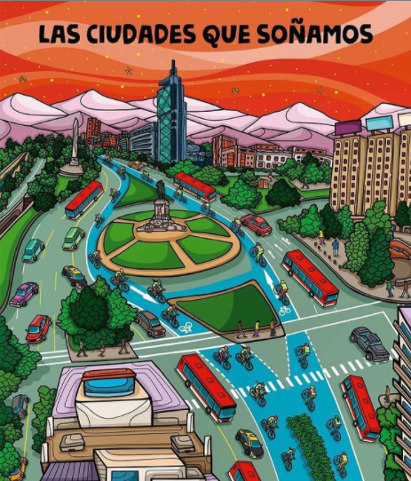
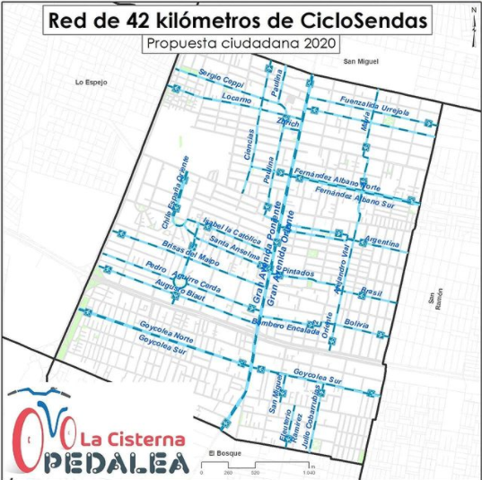

#### FOLIO: LAC05
# La Cisterna Pedalea
[instagram](https://www.instagram.com/lacisternapedalea/)
[facebook]()
[twitter]()
<correo@correo.cl>
---

### Representantes
#### (Nombres o emails de voceros o representantes).
cicloviaslacisterna@gmail.com
---
### Interacciones frecuentes
#### (listar otras organizaciones que habitualmente)
* Cicletada territorial San Ramón
* Revolución Ciclista
* Pedaleros zona cero
* bicidencias
* La PAC pedalea
* Stgo Norte pedalea
* Pedales Sur Oriente
* Cletero ilustre
* El Bosque resiste 
* La Cisterna no se duerme 
* 

### Redes sociales
#### ¿Para qué se utiliza la red social?
| Instagram | Facebook | Twitter | Otra 
|---|---|---|---|
|Difusión de información y actividades|Difusión de información y actividades|0| 0|

### **Instagram**
| seguidores | seguidos | publicaciones | hashtag 
|---|---|---|---|
|3,935|874|221| 0

---

* **Actividad:**   

* Primera Publicación IG: 14 Septiembre 2020 (organizades desde Mayo 2020)

---
### Frecuencia de publicación.

Publicaciones: diarias

Actividades: Semanales

---
### Ubicación
* Sector de la comununa/ciudad: La Cisterna

---
### Describir temas de interés y/o trabajo
* Ciclismo urbano, ciclovías, activismo social, protesta social, desarrollo sustentable. Proceso constituyente. Ciclistas de La Cisterna que promueven la creación de ciclovías en la comuna. Activismo para una mejor conciencia vial.
---
### Describir la imagen ideal por la cual se trabaja.
#### (El horizonte hacia el cual se quiere avanzar.)
* Ciclovías y sendas de emergencia para la cisterna. Ciclovía en  todo gran Avenida Mejor conciencia vial. "BICIvilizar" situación vial y ciclista. ¡Revolución ciclista plurinacional! Nueva constitución ¡Pedalear y aprobar, otra forma de luchar! 

##### Ilustración de @hugotapiaberardi inspirada en el trabajo de @mathiaskochcc

---
### ¿Que se hace?
#### (Manifestaciones, marchas, intervenciones, actividades culturales, conversatorios, intercambio de saberes, actividades solidarias o de apoyo mutuo, abastecimiento, contra información, emplazamiento a autoridades etc.)
* Cicletadas
* Firmas: 
https://www.change.org/ciclovias-para-la-cisterna
* Creación propuesta 42 km ciclosendas - emplazamiento autoridades
---
### Describir y distinguir demandas más reivindicativas de espacios sin relación con lo contencioso o con lo político mas prefigurativo
#### (lo contencioso; demanda al Estado, a alguna autoridad, privados, etc), (prefigurativo, transformación desde lo cotidiano, etc.).
* Se dirige a las autoridades de gobierno central y local emplazando a la creación de ciclovías, además se dirige a las ciudadanía para generer conciencia vial tanto a ciclistas (no + ciclista drogados, no + ciclistas sin cascos, no + ciclistas borrachos) y no + ciclistas muertos. 
---
### Tipo de organización interna.
#### (Vocerías, asambleísmo, horizontalidad, etc.; *se entiende que esta dimensión es más difícil de captar vía análisis de redes sociales, pero quizás se puede vislumbrar a través de roles/cargos*)
Horizontalidad / vocerías 
---
### Describir los temas / imágenes- iconos / conceptos mas habitualmente presentes en sus publicaciones. Describir cambios/ transformaciones en los contenidos desde Octubre.

**Iconos:**

**Banderas:**

**Diseño estético:**

> Párrafo tipo cita 

---
### Percepciones que se tiene del Estado
#### (Aparato burocrático)
> resumen de lo encontrado

| Declaraciones | infografía | 
|---|---|
|Anotar los comunicados |  |

---
### Percepciones que se tiene de las Fuerzas de Orden
#### (Aparato represivo)
> resumen de lo encontrado

| Declaraciones | infografía | 
|---|---|
|Anotar los comunicados |  |

---
### Incorporar aca notas, citas textuales, links, etc. extra a los ya incorporados, que sean de interés para comprender tanto la forma como los contenidos asociados a la organización.

* **Petición oficial de ciclovías en Change.org** 
https://www.change.org/ciclovias-para-la-cisterna

** Aprobación 300 Millones Ciclovías en La Cisterna - Noviembre 2020
> Se aprueban 300 millones para ciclovías en La Cisterna y se avanza en el proyecto intercomunal de Gran Avenida

> Hola amigxs!

>Como ya saben, desde mayo de 2020 venimos trabajando en una propuesta seria y ambiciosa de una completa red de ciclovías para la comuna, que incluye el eje Gran Avenida, y luego de presionar a las autoridades, éstas se abrieron a conversar con nosotros y aceptar nuestra propuesta.

>El día viernes 30 de octubre tuvimos la esperada reunión con el alcalde Santiago Rebolledo, en donde nos dieron buenas noticias. El Concejo Municipal aprobó un presupuesto de 300 millones de pesos para la construcción de ciclovías en la comuna. “El uso de la bicicleta hoy se ha transformado en un medio esencial para resolver el tema de la pandemia. Tenemos 300 millones de pesos, ahora ya”, ha dicho Rebolledo.

>Propuesta del municipio e invitación a mesas de trabajo

>El municipio presentó una propuesta, basada en la nuestra, que da pie a la construcción de ciclovías en algunas calles de la comuna, sumando 12 kilómetros en total. Valentín Bustos, Asesor Urbano, ha declarado que “La idea es poder analizarla, no está escrita en piedra. Se ajusta al estándar que nos solicitaron, ya estamos generando los insumos para hacer la licitación. Nosotros nos basamos en lo que ustedes han entregado. Ustedes han entregado una red de ciclovías, nosotros presentamos una aproximación a una primera parte”.

>Además, fuimos invitados a participar en dos instancias de trabajo. La primera, una Mesa de Movilidad, que fue creada en el último concejo municipal. Y la otra, una reunión para revisar esta propuesta, junto a Directora de Obras, Director Secpla, Directora de Seguridad Pública y el Director de Desarrollo Comunitario.

>En palabras del alcalde Santiago Rebolledo: “Queremos que ustedes participen en el proceso desde el inicio. Ustedes son los que se han organizado en el grupo que tienen en La Cisterna de los ciclistas, que me parece super bien”.