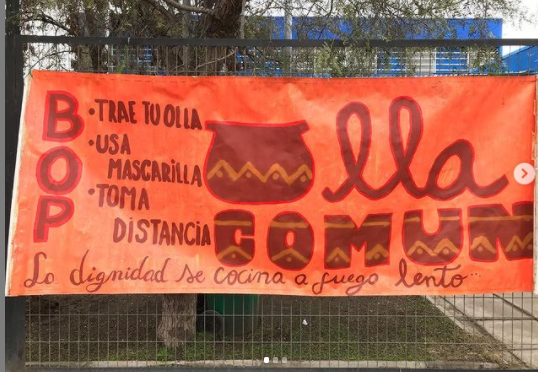

#### FOLIO: LAC06
# El bloque La Cisterna (BOP)

[instagram](https://www.instagram.com/bop_lacisterna/)
[facebook](https://www.facebook.com/elbloque.lacisterna)
[twitter]()
<correo@correo.cl>
---

### Representantes
#### (Nombres o emails de voceros o representantes).
elbloquelacisterna@gmail.com 
---
### Interacciones frecuentes
#### (listar otras organizaciones que habitualmente)
* Trawun 18
* El Bloque (de organizaciones populares)
* 
### Redes sociales
#### ¿Para qué se utiliza la red social?
| Instagram | Facebook | Twitter | Otra 
|---|---|---|---|
|Difusión de info y actividades|Idem Ig|No aplica| No aplica|

### **Instagram**
| seguidores | seguidos | publicaciones | hashtag 
|---|---|---|---|
|625|405|64| 0

---

* **Actividad:**   

* Primera Publicación IG: 15 Mayo (activa, incluso la olla común)

---
### Frecuencia de publicación.

Publicaciones: Semanales 

Actividades: Semanales (olla común martes y jueves)

---
### Ubicación
* Sector de la comununa/ciudad: Olla común Villa Los troncos

---
### Describir temas de interés y/o trabajo
* organización, lucha y combate popular, solidaridad, feminismo de clase, apoyo mutuo. 
---
### Describir la imagen ideal por la cual se trabaja.
#### (El horizonte hacia el cual se quiere avanzar.)
* Sociedad anticapitalisa, solo el pueblo ayuda al pueblo.  PAN, TRABAJO, SALUD Y TECHO.! Libertad a presos políticos mapuche. Unidas y unidos venceremos el patriarcado y el capitalismo. Ni constituyente, ni circo electoral... Unico camino: protesta popular!
---
### ¿Que se hace?
#### (Manifestaciones, marchas, intervenciones, actividades culturales, conversatorios, intercambio de saberes, actividades solidarias o de apoyo mutuo, abastecimiento, contra información, emplazamiento a autoridades etc.)
* Lukatón 
* Olla Comunes
* Protestas 
* Información /afiches de autocuidado en pandemia 
* Cacerolazo 
* Campaña "Apaña con una canasta familiar"
* Huerto Comunitario Villa los troncos (surge a raíz de la Olla común) [aquí video](https://www.instagram.com/p/CCml8VdJ53h/)
* Taller on line de salud "primeros auxilios básicos de soporte vital" 
* Cacerolazos 
* 

---
### Describir y distinguir demandas más reivindicativas de espacios sin relación con lo contencioso o con lo político mas prefigurativo
#### (lo contencioso; demanda al Estado, a alguna autoridad, privados, etc), (prefigurativo, transformación desde lo cotidiano, etc.).
* Se dirige a vecinxs y vecinxs a seguir luchando.  Y emplazar a los poderes del estado a través de la protesta. 
---
### Tipo de organización interna.
#### (Vocerías, asambleísmo, horizontalidad, etc.; *se entiende que esta dimensión es más difícil de captar vía análisis de redes sociales, pero quizás se puede vislumbrar a través de roles/cargos*)
horizontalidad 
---
### Describir los temas / imágenes- iconos / conceptos mas habitualmente presentes en sus publicaciones. Describir cambios/ transformaciones en los contenidos desde Octubre.

**Iconos:**

**Banderas:**

**Diseño estético:**

> Párrafo tipo cita 

---
### Percepciones que se tiene del Estado
#### (Aparato burocrático)
> Gobierno y estado indolente. 

| Declaraciones | infografía | 
|---|---|
|"Desde las poblaciones lo único que vemos es un gobierno indolente, cuya única respuesta es una fuerte represión al pueblo trabajador y un sistema de salud que no da abasto frente a la crisis sanitaria.Llamamos a los vecin@s a seguir organizad@s y fortalecer la protesta popular"| [extracto comunicado a raíz de protestas en el bosque, Mayo 2020](https://www.instagram.com/p/CAV66LpjG6R/) |

---
### Percepciones que se tiene de las Fuerzas de Orden
#### 
> denostables, luchar contra ellos. 

| Declaraciones | infografía | 
|---|---|
|Es así como el pueblo instaló los viernes como el día de la protesta, y quienes resguardan el orden del sistema capital se han encargado de hacer su trabajo lo mejor posible. Cada viernes hemos sido testigos de cómo han ocupado todas las maneras y formas represivas para apagar la llama de la protesta; mutilaciones oculares, gas pimienta, gas lacrimógeno, golpizas, violaciones, detenciones ilegales... tortura! Y ayer explícitamente intentaron quitarle la vida a un joven arrojándolo al Río Mapocho. Ellos tienen las armas. Nosotros y nosotras también debemos tomar nuestras armas para pelear fuego a fuego con organización, lucha y combatividad.|[declaración a raíz caso Puente Pio Nono](https://www.instagram.com/p/CF4i8JPJdZZ/) |

---
### Incorporar aca notas, citas textuales, links, etc. extra a los ya incorporados, que sean de interés para comprender tanto la forma como los contenidos asociados a la organización.

* **Declaración 18 Junio** - Aniversario 8 meses Revuelta Popular:
> 18 de junio: 8 meses de protesta popular

> Han pasado 8 meses desde aquel 18 de octubre, día que quedó marcado en la memoria de la clase trabajadora y del pueblo en su conjunto, por la combatividad y niveles de lucha que se desataron, y que generaron mayores niveles de organización, conciencia y lucha.
La rebeldía popular, soportó los embates de las clases dominantes, sus cocinas legislativas y acuerdos burgueses, la represión de los pacos y milicos, toques de queda y todo su aparato jurídico represivo.
Hoy en un contexto distinto, nos encontramos con una pandemia desatada y con el mismo gobierno antipopular y criminal, con un empresariado que marca la pauta política y económica del país y con mayores niveles de represión. Le agregamos la agudización de una crisis económica, que da cuenta de un techo en el patrón de acumulación capitalista y niveles de desempleo en aumento.
Bajo todo este contexto, ahora nos pretenden echar la culpa a lxs más pobres por el descontrol de contagios y muertes por el Virus. Pero si no nos aseguraron la Vida Digna, tuvimos que optar entre Pan o Contagio. Y preferimos luchar por la vida, en vez de sufrir por hambre en casa, en plena Cuarentena los y las pobladores de El Bosque, La Pintana y otras Comunas salieron nuevamente a luchar contra el hambre, lucha que se multiplicó, así como las ollas comunes, los comprando junt@s, los acopios solidarios y todas las formas de organización que nuestra clase ha empleado históricamente para resistir este sistema de miseria y explotación.
Sabemos que en el marco de esta sociedad no habrá respuesta para garantizar los derechos de los y las trabajadoras, y que solo el pueblo organizado y en pie de lucha podrá conquistar lo que nos han arrebatado. Para esto tenemos grandes desafíos, avanzar en la unidad y articulación de los sectores clasistas, desarrollar los instrumentos que nos permitirán conquistar el poder político y económico, y desarrollar mayores niveles de organización y lucha en las masas.
Como parte de ese pueblo rebelde y combativo, llamamos a confiar en nuestras capacidades y a seguir organizando la solidaridad y la lucha.
Por PAN, TRABAJO, SALUD Y TECHO.
> BOP