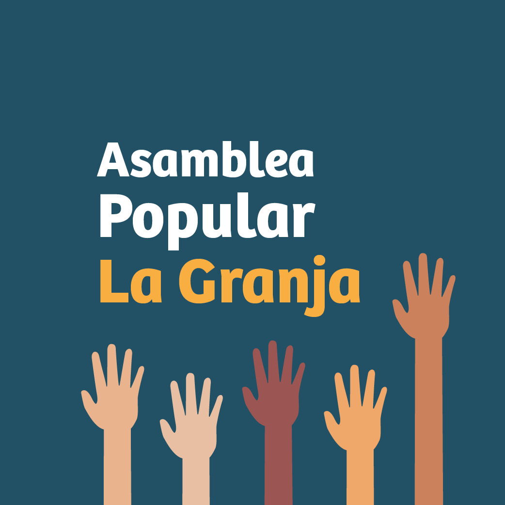

#### FOLIO: LAG02
# Asamblea Popular La Granja

[instagram](https://www.instagram.com/p/B7oE6Mtp5kg/)
[facebook](https://www.facebook.com/asamblea.popular.la.granja/)
[twitter]()
<correo@correo.cl>
---

### Representantes
#### (Nombres o emails de voceros o representantes).

---
### Interacciones frecuentes
#### (listar otras organizaciones que habitualmente)
* Asamblea Popular Metro La Granja
* Olla Común Ojos del Pueblo..
* Asamblea Goao Gulart
* Asamblea Popular VUSA
* Asamblea San Goyo con los Vilos
* Movimiento Salud en Resistencia 
* Colectivo Las Violetas Sur 
* [Comité de Emergencia Territorial La Granja](https://www.facebook.com/Cetmlg/)

### Redes sociales
#### ¿Para qué se utiliza la red social?
| Instagram | Facebook | Twitter | Otra 
|---|---|---|---|
|Difusión de información y actividades|Difusión de info y actividades (esta está activa|0| 0|

### **Instagram**
| seguidores | seguidos | publicaciones | hashtag 
|---|---|---|---|
|952|373|37| 0
### **Facebook**
|1366 seguidores  |

---

* **Actividad:**   

* Primera Publicación IG: 30 Octubre 2019 (Ig inactivo, facebook activo)
---
### Frecuencia de publicación.

Publicaciones: Semanales (continuas en facebook)
Actividades: Semanales

---
### Ubicación
* Sector de la comununa/ciudad: Plaza Ignacio Serrano, Metro La Granja

---
### Describir temas de interés y/o trabajo
* organización territorial, apoyo mutuo, autoformación, educación popular. Poder popular, mov. feminista
---
### Describir la imagen ideal por la cual se trabaja.
#### (El horizonte hacia el cual se quiere avanzar.)
* Mejor lugar para vivir, vida digna anti capitalista, justicia y liberación para presos políticos mapuches y de la revuelta 18O. Asamblea Constituyente Revolucionaria, articulación nacional de instancias de autoorganización dotados de un programa. Sistema único de salud, fin AFP, 
> "A derrocar a piñera y todo su sistema"

> "Por la disolución de las fuerzas del orden a fortalecer la primera línea"

> "Por la libertad de los prisioneros políticos."

> ¡LA LUCHA SIGUE!" (Ver pdf Balance y proyecciones anexo)
---
### ¿Que se hace?
#### (Manifestaciones, marchas, intervenciones, actividades culturales, conversatorios, intercambio de saberes, actividades solidarias o de apoyo mutuo, abastecimiento, contra información, emplazamiento a autoridades etc.)
* Marchas 
* Cacerolazos
* Asamblea Comunal 
* Ollas comunes
* completadas populares
* Onces comunitarias
* Velatón 
* Conversatorios
* Sesiones de autoformación (AFP, constitución, presos políticos, mov. sociales, etc. Contingencia)
* Peña Solidaria 
* Talleres artísticos (fotografía)
* Conversatorios en vivo por FB Live
* Feria de artes y oficios 
* 

---
### Describir y distinguir demandas más reivindicativas de espacios sin relación con lo contencioso o con lo político mas prefigurativo
#### (lo contencioso; demanda al Estado, a alguna autoridad, privados, etc), (prefigurativo, transformación desde lo cotidiano, etc.).
Se dirige a vecinxs y vecinxs a trabajar juntos para un mejor lugar para vivir. Se emplaza al gobierno a solucionar todas las temáticas que hacen de la vida actual, una vida no digna y capitalista, se exige la renuncia de piñera.
---
### Tipo de organización interna.
#### (Vocerías, asambleísmo, horizontalidad, etc.; *se entiende que esta dimensión es más difícil de captar vía análisis de redes sociales, pero quizás se puede vislumbrar a través de roles/cargos*)
* Asamblea, horizontalidad. Comités (ver anexo comité de emergencia territorial La Granja). 
---
### Describir los temas / imágenes- iconos / conceptos mas habitualmente presentes en sus publicaciones. Describir cambios/ transformaciones en los contenidos desde Octubre.

**Iconos:**

 

**Banderas:**

**Diseño estético:**

> Párrafo tipo cita 

---
### Percepciones que se tiene del Estado
#### (Aparato burocrático)
> Inoperancia del estado, rechazo. 

| Declaraciones | infografía | 
|---|---|
|¡Frente a un gobierno inoperante, el pueblo se organiza! | [Post Ig](https://www.instagram.com/p/B46Kn0Wp8yZ/) |

---
### Percepciones que se tiene de las Fuerzas de Orden
#### (Aparato represivo)
> resumen de lo encontrado

| Declaraciones | infografía | 
|---|---|
|Comunicado de la Asamblea Popular la Granja ante el secuestro e imputación falsa de delitos del joven José Luis Araya Vidal.| [Comunicado Hechos de violencia Marzo 2020](https://www.instagram.com/p/B9uOl_tJMzb/) |

----------------------------------

* Carta de Omar Jerez, prisionero político de La Granja, compartida por la Asamblea

> Carta abierta:
No estoy preso, preso están los delincuentes, los traficantes y los criminales. Yo estoy Prisionero, prisionero de un gobierno autoritario, fascista y opresor. Prisionero de un país donde el estado ha sido modelado por unos pocos. Donde vivimos bajo una constitucionalidad dictatorial.
Prisionero no por, -presuntamente “avivar” un incendio en una estación de metro o por “los daños calificados” de la misma-. Estoy prisionero porque para el gobierno SOY (somos) la personificación de ese enemigo al que el presidente declaro la guerra abiertamente, somos el fantasma de ese enemigo “grande y poderoso”. La materialización de la paranoia.
 No les importa dañar la vida de miles de jóvenes, jóvenes descontentos con el modelo impuesto de facto a punta de fusiles. Fantasean con ataviarse de verde oliva y buscar enemigos inexistentes. 
Ahora tienen miedo, se asustaron con la potencia de los movimientos sociales que lograron derribar los muros del miedo.
Por eso necesitan prisioneros, para canalizar de nuevo esos miedos – para inocularlos en la conciencia de los que aún siguen luchando-. Necesitan también chivos expiatorios para justificar su inoperancia, reaccionaron al estallido social con manotazos de ahogados. Y a quienes nos sorprendieron en lugares vandalizados nos acusan de pseudo terroristas organizados contra el Estado, para mantenerlos prisioneros, en casos donde la participación de los hechos de que se nos acusa es mínima o nula, y en otros derechamente falsa.
Somos Prisioneros Políticos directamente por nuestras posiciones frente a hechos que son evidentes; desigualdad, abusos y corrupción. Por manifestarnos contrarios a estos vicios amparados en la legalidad construida a medida por y para quienes se benefician y sacan provecho al alero de Estado.
Si miramos a nuestro pasado, solo un par de décadas vemos los abusos y aberraciones cometidos por el gobierno cívico- militar hacia la disidencia, operando y sometiendo con mecanismos opresores “legales” para acallar a la ciudadanía. Y no mucho más tiempo atrás la legalidad era aún más despiadada, fusilados o colgados en público para “Ejemplificar” y “Educar” a los opositores. No me cabe duda que si la ley lo permitiera-y que deben hasta extrañar-; muchos de nosotros estaríamos balanceándonos del cuello bajo una viga.
Las nuevas ideas nos sacaran de la prisión en la que estamos como país. Porque todos los que diferimos con el modelo somos prisioneros de este estado Opresor y Autoritario. Prisioneros del modelo político-social impuesto bajo amenaza, prisioneros de sistemas e instituciones mercantilizados a favor de élites económicas y políticas que son los dueños y celadores de Ésta prisión construida por ellos mismos y que pusieron cerrojo y tiraron la llave. Prisioneros del Estado, de empresarios y latifundistas dueños de nuestra libertad. 
Chile Despertó, y aunque somos cientos de Prisioneros Por Luchar, son millares los que siguen afuera dando cara contra las injusticias y quieren liberarse del yugo del neo-liberalismo y la Constitución militar.
Ya nos liberamos del miedo, y aunque por ahora este sometido a presidio “preventivo” y por añadidura mi familia, Estoy Tranquilo, sé que se hará justicia en mi caso y en los cientos mas que estamos pagando por el susto del gobierno, injustamente.
Dispararon a la bandada y los que caímos estamos encabezando el parte. Pero no estamos solos, tenemos apoyos, tenemos familias. Y la revolución esta recién comenzando. La balanza del poder se inclinará a nuestro favor y el poder volverá al Pueblo Soberano.
Omar Jerez Meza, Prisionero Político. Por la autodeterminación del pueblo, por la soberanía indígena, por la diversidad, pluralidad y libertad.
Prisionero del Estallido Social.
---
### Incorporar aca notas, citas textuales, links, etc. extra a los ya incorporados, que sean de interés para comprender tanto la forma como los contenidos asociados a la organización
* Declaración "Apaga tu tele este 18 y 19 Septiembre" a raíz de Chiletón "Chile ayuda a Chile": https://www.facebook.com/asambleametro/photos/pcb.186309113007900/186309029674575/ 
* Declaración ante la cuenta pública (video): https://www.facebook.com/asambleametro/videos/301815427581229/ 
* Balance y proyecciones a un año del levantamiento popular 18 Octubre - Documento PDF: https://drive.google.com/file/d/1LJBXT8fDBkR2-Lu9ZEV4jYgrjPplko7M/view?fbclid=IwAR0Wcidlm0VndDFHxjhocjEaE4QJQaeRcQV61H18XERXGC2Py6vrp9qx2oU 
* Cuenta pública 31 Julio junto a organizaciones del territorio: https://www.facebook.com/asambleametro/photos/pcb.170914877880657/170914764547335/ 