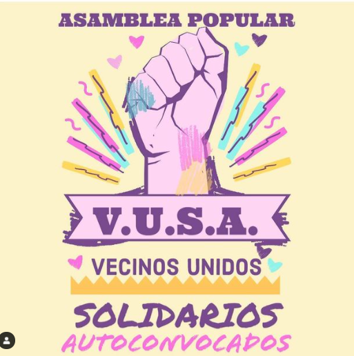

#### FOLIO: LAG04
# Asamblea Popular Vecinos Unidos Solidarios (VUSA)

[instagram](https://www.instagram.com/vusa_lagranja/)
[facebook]()
[twitter]()
<correo@correo.cl>
---

### Representantes
#### (Nombres o emails de voceros o representantes).
dm al Ig. 
---
### Interacciones frecuentes
#### (listar otras organizaciones que habitualmente)
* Aasamblea Popular la Granja
* Asamblea Metro La Granja 
* Asamblea Granja Sur 
* Asamblea Yungay 
* Asamblea San Gregorio los Vilos

### Redes sociales
#### ¿Para qué se utiliza la red social?
| Instagram | Facebook | Twitter | Otra 
|---|---|---|---|
|Difusión de información y actividades|0|0| 0|

### **Instagram**
| seguidores | seguidos | publicaciones | hashtag 
|---|---|---|---|
|143|42|21| 0

---

* **Actividad:**   

* Primera Publicación IG: 22 Junio 2020 (última publicación Octubre 2020)
---
### Frecuencia de publicación.

Publicaciones: semanales (2,3)

Actividades: semanales (1,2 veces)

---
### Ubicación
* Sector de la comununa/ciudad: Población Joao Goulart
---
### Describir temas de interés y/o trabajo
* feminismo, ayuda mutua, solidaridad, coordinación entre asambleas (adscribe a la Coordinadora Asambleas Territoriales). Se alinea a principios de la CAT. Autonomía, democracia participativa y directa, educación popular, poder local. 
---
### Describir la imagen ideal por la cual se trabaja.
#### (El horizonte hacia el cual se quiere avanzar.)
* Feminismo, np + AFP, no + abusos, postnatal de emergencia, libertad a los presos políticos. Wallmapu libre, convención constitucional, nueva consticional. 

### ¿Que se hace?
#### (Manifestaciones, marchas, intervenciones, actividades culturales, conversatorios, intercambio de saberes, actividades solidarias o de apoyo mutuo, abastecimiento, contra información, emplazamiento a autoridades etc.)
* Ollas comunes
* Asambleas 
* Cacerolazo
* Once solidaria
* Celebración día del niño popular
* Muralismo
---
### Describir y distinguir demandas más reivindicativas de espacios sin relación con lo contencioso o con lo político mas prefigurativo
#### (lo contencioso; demanda al Estado, a alguna autoridad, privados, etc), (prefigurativo, transformación desde lo cotidiano, etc.).
* Se dirige a todxs los vecinxs de la población, sin discriminación alguna, a ayudarse entre ellos en tiempos de crisis, ya que sólo el pueblo ayuda al pueblo. 
---
### Tipo de organización interna.
#### (Vocerías, asambleísmo, horizontalidad, etc.; *se entiende que esta dimensión es más difícil de captar vía análisis de redes sociales, pero quizás se puede vislumbrar a través de roles/cargos*)
* horizontal
---
### Describir los temas / imágenes- iconos / conceptos mas habitualmente presentes en sus publicaciones. Describir cambios/ transformaciones en los contenidos desde Octubre.

**Iconos:**

**Banderas:**

**Diseño estético:**

> Párrafo tipo cita 

---
### Percepciones que se tiene del Estado
#### (Aparato burocrático)
> "Gobierno genocida"

| Declaraciones | infografía | 
|---|---|
|"ABAJO PIÑERA , LADRON , ASESINO Y DICTADOR " |  |

---
### Percepciones que se tiene de las Fuerzas de Orden
#### (Aparato represivo)
> resumen de lo encontrado

| Declaraciones | infografía | 
|---|---|
|Anotar los comunicados |  |

---
### Incorporar aca notas, citas textuales, links, etc. extra a los ya incorporados, que sean de interés para comprender tanto la forma como los contenidos asociados a la organización