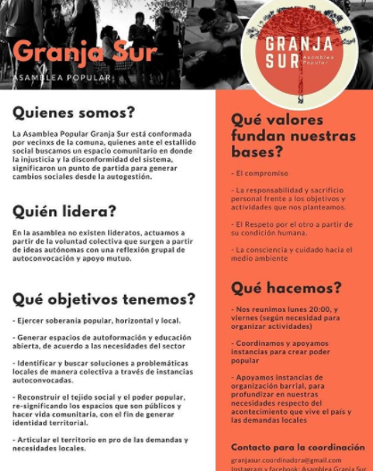
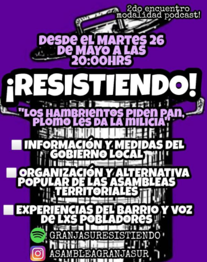
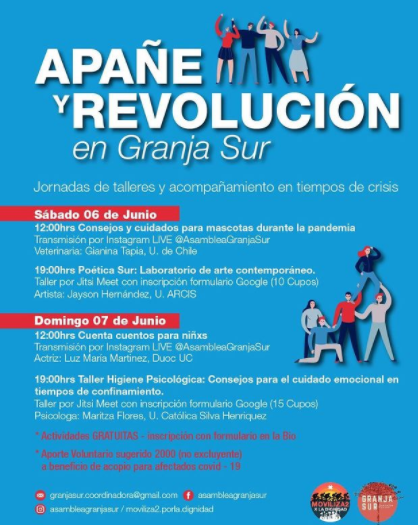
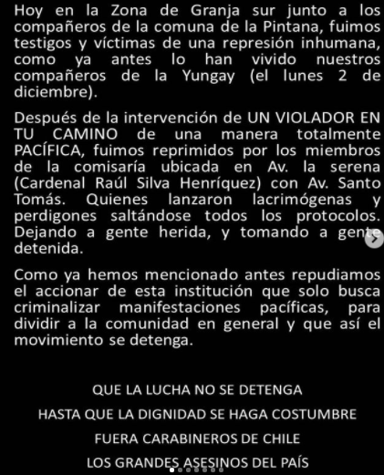

#### FOLIO: LAG05
# Asamblea Granja Sur

[instagram](https://www.instagram.com/asambleagranjasur/)
[facebook](https://www.facebook.com/AsambleaGranjaSur/)
[twitter]()
<granjasurcoordinadora@gmail.com>
---

### Representantes
#### (Nombres o emails de voceros o representantes).
* Gmail
---
### Interacciones frecuentes
#### (listar otras organizaciones que habitualmente)
* Asamblea metro la granja
* Asamblea popular la Granja
* Asamblea Territorial San Goyo Los vilos
* Asamblea Popular VUSA
* Colectivo Las Violetas Sur
* Del otro lado de la capucha 
* La olla movilizada
*

### Redes sociales
#### ¿Para qué se utiliza la red social?
| Instagram | Facebook | Twitter | Otra 
|---|---|---|---|
|Difusión de info y actividades|ídem Ig|0| Utilizan https://linkbit.me/AsambleaGranjaSur|

* Tienen spotify: "Granjasuresistiendo"

### **Instagram**
| seguidores | seguidos | publicaciones | hashtag 
|---|---|---|---|
|1,520|1,049|202| 0

---

* **Actividad:**   

* Primera Publicación IG: 1 Diciembre 2019 

---
### Frecuencia de publicación.

Publicaciones: Semanales (1,2)

Actividades: Semanales

---
### Ubicación
* Sector de la comununa/ciudad: La serena con pedro lira (zona sur ) / diversos sectores, plaza de los muertos /plaza poeta neruda

---
### Describir temas de interés y/o trabajo
* autogestión, apoyo mutuo, vida comunitaria y política, autoformación y educación popular, articulación del territorio, memoria histórico, ddhh y justicia presos políticos. 
---
### Describir la imagen ideal por la cual se trabaja.
#### (El horizonte hacia el cual se quiere avanzar.)
* "formar comunidad, encontrar una identidad, y tomar los espacios públicos. Liberación de presos políticos. ¡Cara a la pandemia con organización popular! Sólo el pueblo ayuda al pueblo! ¡Apoyo mutuo por la autonomía de los territorios! 
---
### ¿Que se hace?
#### (Manifestaciones, marchas, intervenciones, actividades culturales, conversatorios, intercambio de saberes, actividades solidarias o de apoyo mutuo, abastecimiento, contra información, emplazamiento a autoridades etc.)
* Charlas
* Cabildos
* Jornadas artísticas e informativas (pasacalles,muralismo y música)
* Cacerolazo
* Once comunitaria
* Completada popular
* Talleres (constitución, formación, ginecología)
* Cicletada La Granja
* Actividades para niñes 
* Taller de boxeo 
* Jornadas de deporte
* Cine popular 
* Carnaval por la dignifad la granja
* Mapeo colectivo
* Apoyo mutuo - red de ayuda pandemia / red a abastecimientos (información de productos y números de contacto)
* Brigada sanitaria poblacional (limpieza auotgestionada de la ciuda a raíz de covid)
* Podcasts (spotify)
* Biblioteca popular
* Talleres acompañamientos PTU
* Ayuno rotativo por presos políticos 

---
### Describir y distinguir demandas más reivindicativas de espacios sin relación con lo contencioso o con lo político mas prefigurativo
#### (lo contencioso; demanda al Estado, a alguna autoridad, privados, etc), (prefigurativo, transformación desde lo cotidiano, etc.).
* Se dirige a todos lxs granjinos/as, para ¡Seguir creando poder popular! Emplaza a piñera, a que renuncie. 
---
### Tipo de organización interna.
#### (Vocerías, asambleísmo, horizontalidad, etc.; *se entiende que esta dimensión es más difícil de captar vía análisis de redes sociales, pero quizás se puede vislumbrar a través de roles/cargos*)
horizontal, comisiones 
---
### Describir los temas / imágenes- iconos / conceptos mas habitualmente presentes en sus publicaciones. Describir cambios/ transformaciones en los contenidos desde Octubre.

**Iconos:**

 

 

## Campaña durante pandemia 
#### Se realizaron diversos talleres y actividades en línea (talleres niñes, artísiticos, huerta, ayuda psicológica, etc)
 

> Párrafo tipo cita 

---
### Percepciones que se tiene del Estado
#### (Aparato burocrático)
> Lo culpan de todas las situaciones de indignidad que se viven en los territorios. 

| Declaraciones | infografía | 
|---|---|
|"Por culpa del gobierno estamos muriendo", "La culpa es del gobierno, no del pueblo, nos han mentido" | [publicación en Ig](https://www.instagram.com/p/CBmW-FVJx2G/) |

---
### Percepciones que se tiene de las Fuerzas de Orden
#### (Aparato represivo)
> Repudio a carabineros

| Declaraciones | infografía | 
|---|---|
|"Repudiamos todo el accionar que la institución de carabineros sobre todo lo ocurrido el día lunes en Yungay y hoy en Av. La Serena "|  |

---
### Incorporar aca notas, citas textuales, links, etc. extra a los ya incorporados, que sean de interés para comprender tanto la forma como los contenidos asociados a la organización
* Publicación 29 Abril:
>El día sábado 25 de abril, nos levantamos en una brigada sanitaria poblacional, esta reune a las poblaciones santa Eduviges y Padre Hurtado, pertenecientes a la ASAMBLEA GRANJA SUR, con el fin de sanitizar nuestros espacios comunes, plazas, y almacenes.
.
Entendemos que el pueblo en su conjunto es el único que ayudará, apoyará y resolverá los problemas existentes en nuestro territorio, como la pandemia que nos afecta directamente, sobre todo cuando el gobierno de turno ejecuta soluciones insuficientes para nuestra clase.
.
Saludamos a las demás iniciativas organizadas que surgen en el contexto de pandemia en la granja, y agradecemos el apoyo existente de las otras asambleas.
.
SÓLO EL PUEBLO AYUDA AL PUEBLO!
La lucha sigue!

> "Mascarilla no es bozal, la lucha sigue!" 

* Invitación (publicación) para iniciativa "Tejiendo Memorias en Granja Sur"
>TEJIENDO MEMORIAS GRANJASUR 🕸 A partir del contexto actual de pandemia en donde nos vemos más distanciados y nuestro núcleo familiar resulta ser el soporte y el lazo más cercano que tenemos, aumenta la necesidad por tejer y mantener nuestros lazos comunitarios con el territorio de Granja Sur ya que las distancias física no puede anular nuestros lazos comunitarios. Es bajo esta necesidad que invitamos a las y los vecinos a tejer nuestras memorias enviandonos sus fotos de cuando llegaron a la Comuna. Esta foto puede ser acompañada de un relato donde nos describas cómo fueron los inicios de la población. Por ejemplo: “Llegamos en 1995 a la población padre Hurtado y las calles eran de tierra y habían plantaciones, etc” Puedes enviarnos las fotos más el relato en mensaje directo o adjuntarlas en el link que aparece en los comentarios. Abrimos esta convocatoria para rescatar la memoria popular de Granja sur.

* Declaración 11 Septiembre "el legado del gobierno populary la conmemoración de lxs compañeroxs caídxs": https://www.instagram.com/p/CFKbuxip3b4/ 