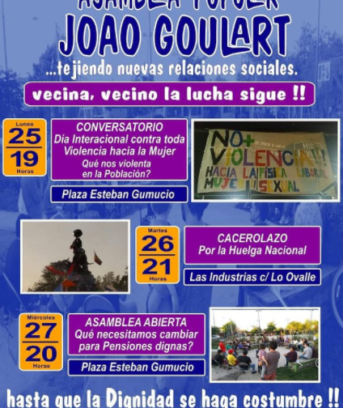
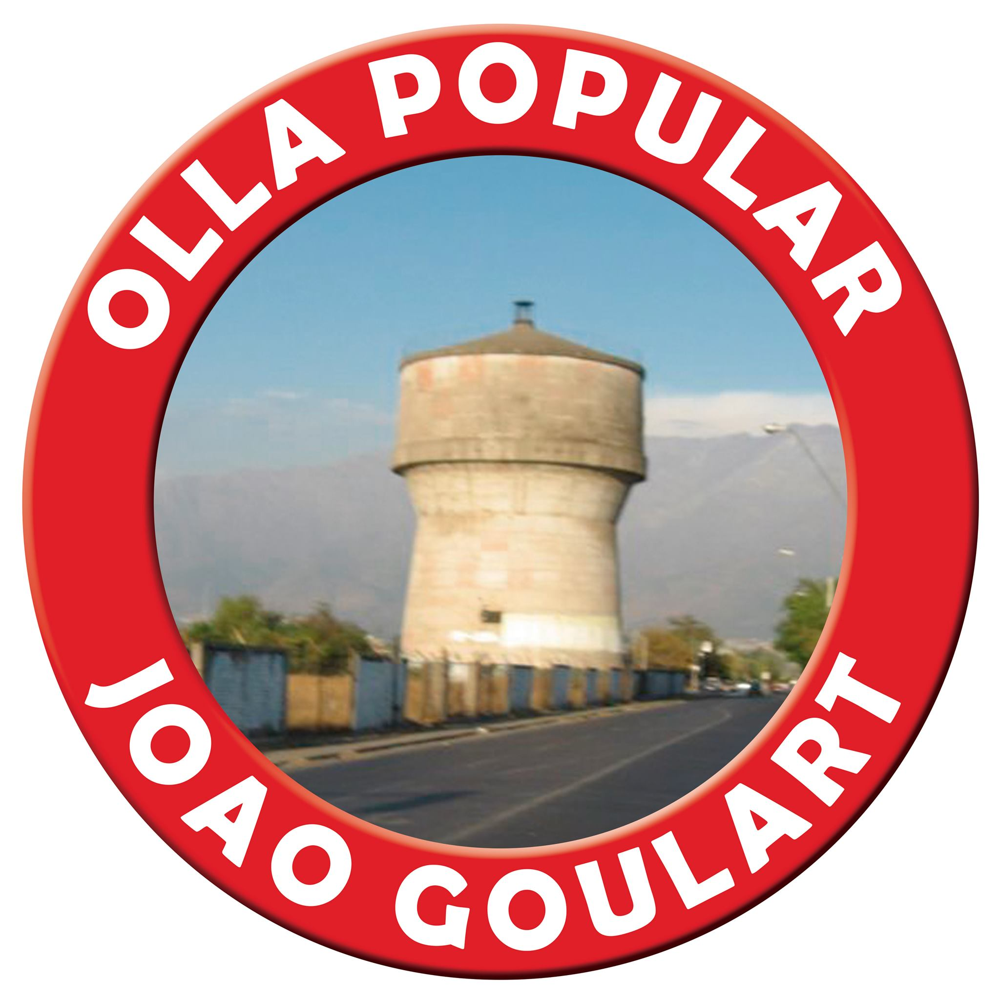
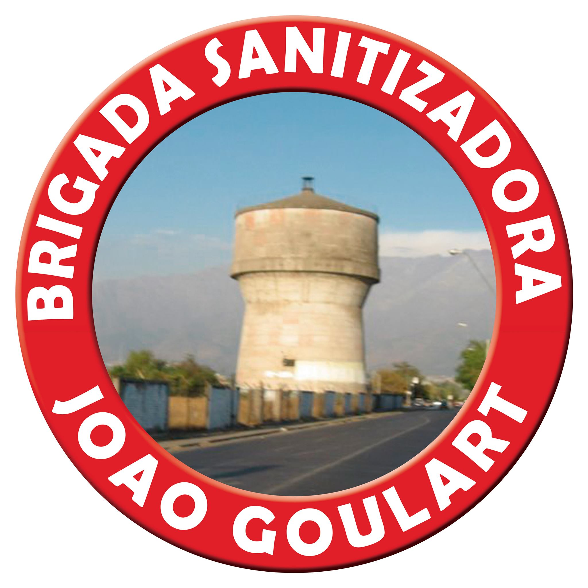
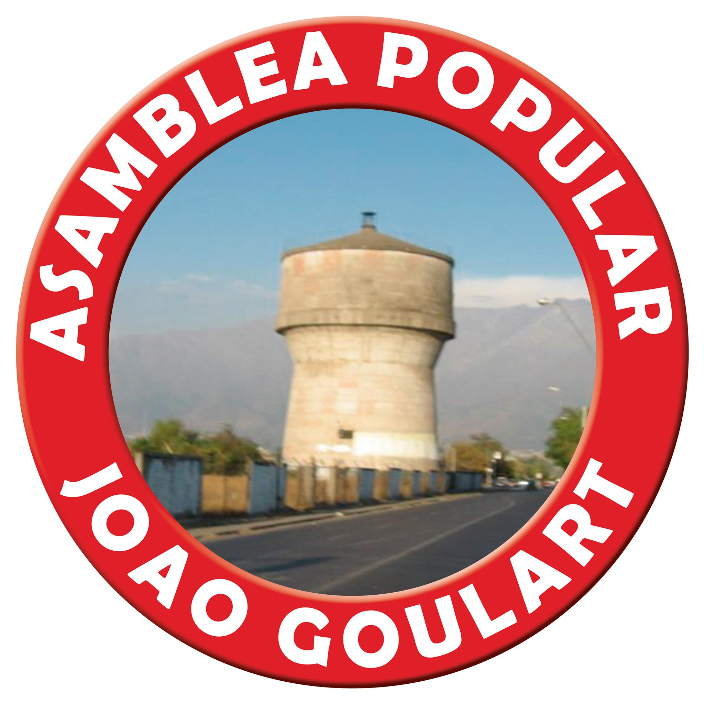

#### FOLIO: LAG06
# Asamblea Joao Goulart

[instagram](https://www.instagram.com/asambleajoaogoulart/)
[facebook](https://www.facebook.com/Asamblea-Popular-Jo%C3%A3o-Goulart-109756427473014/)
[twitter]()
<correo@correo.cl>
---

### Representantes
#### (Nombres o emails de voceros o representantes).
patricioponce1967@gmail.com

---
### Interacciones frecuentes
#### (listar otras organizaciones que habitualmente)
* Asamblea Territorial San Gregorio con los Vilos
* Coordinadora de Asambleas territoriales
* Asamblea Territorial Pudahuel Sur
* Escuela Constituyente Callejera
* Movimiento salud en resistencia
* 

### Redes sociales
#### ¿Para qué se utiliza la red social?
| Instagram | Facebook | Twitter | Otra 
|---|---|---|---|
|Difusión de info y actividades|Ídem iG|0| 0|

### **Instagram**
| seguidores | seguidos | publicaciones | hashtag 
|---|---|---|---|
|654|557|51| 0

---

* **Actividad:**   

* Primera Publicación IG: 29 Noviembre 2019

---
### Frecuencia de publicación.

Publicaciones: semanales (2,3) Sostenido de noviembre a junio. (Actualmente inactiva en RRSS) 

Actividades: semanales (1,2)

---
### Ubicación
* Sector de la comununa/ciudad: Población Joao Goulart 

---
### Describir temas de interés y/o trabajo
* apoyo mutuo, solidaridad, autoformación, educación popular, proceso constituyente
---
### Describir la imagen ideal por la cual se trabaja.
#### (El horizonte hacia el cual se quiere avanzar.)
* Crear poder popular, erradicar violencia, NO+ AFP, nueva constitución, ¡Hasta que la dignidad se haga costumbre! ¡Tejiendo nuevas relaciones sociales! 
---
### ¿Que se hace?
#### (Manifestaciones, marchas, intervenciones, actividades culturales, conversatorios, intercambio de saberes, actividades solidarias o de apoyo mutuo, abastecimiento, contra información, emplazamiento a autoridades etc.)
* Bingos a beneficios
* Asambleas 
* Pasacalles
* Marchas 
* Taller de autoformación (constitución, violencia de género)
* Navidad popular (actividades niñes)
* Olla común
* Brigada de emergencia 
* Donación de insumos médicos y limpieza 

 
---
### Describir y distinguir demandas más reivindicativas de espacios sin relación con lo contencioso o con lo político mas prefigurativo
#### (lo contencioso; demanda al Estado, a alguna autoridad, privados, etc), (prefigurativo, transformación desde lo cotidiano, etc.).
Se dirige a vecinxs a seguir luchando por una vida digna, libre de violencias y de normalización de la miseria. 
---
### Tipo de organización interna.
#### (Vocerías, asambleísmo, horizontalidad, etc.; *se entiende que esta dimensión es más difícil de captar vía análisis de redes sociales, pero quizás se puede vislumbrar a través de roles/cargos*)
horizontalidad 
---
### Describir los temas / imágenes- iconos / conceptos mas habitualmente presentes en sus publicaciones. Describir cambios/ transformaciones en los contenidos desde Octubre.
Noviembre - marzo, enfocado en actividades comunitarias en el espacio público para generar conocimiento sobre constitución, protestas y poder popular, por pandemia se gesta brigada de emergencia. 

**Iconos:**

 
 
 
**Banderas:**

**Diseño estético:**

> Párrafo tipo cita 

---
### Percepciones que se tiene del Estado
#### (Aparato burocrático)
> Lo homologan al empresariado, rechazo e incredulidad. 

| Declaraciones | infografía | 
|---|---|
|"El estado solo protega al capital" | [Publicación Ig - original de CAT](https://www.instagram.com/p/CAWFh_Ypj2V/) |

---
### Percepciones que se tiene de las Fuerzas de Orden
#### (Aparato represivo)
> Rechazo absoluto. 

| Declaraciones | infografía | 
|---|---|
|"Carabineros de Chile verguenza nacional!| [Declaración](https://www.instagram.com/p/B5sZvQVAFMB/) |

---
### Incorporar aca notas, citas textuales, links, etc. extra a los ya incorporados, que sean de interés para comprender tanto la forma como los contenidos asociados a la organización
* Segunda publicación en Ig, presentación:
> 1era marcha donde nos juntamos con asambleas populares de toda la comuna. Nuestro primer encuentro, primera mirada, con vecinas y vecinos que no conocíamos. Que pensábamos vivían otras realidades. Pero que nos fuimos dando cuenta que compartimos más de lo que pensamos.
Mismas violencias cuando soportamos las listas de espera; misma miseria reflejada en las pensiones de quienes por largos años dieron parte de sus vidas sin una retribución justa; misma inseguridad en las calles al volver de noche, más violento aún siendo mujeres; mismos sueldos con los que no nos alcanza para fin de mes y recurrimos a la deuda que nos agobia hasta el suicidio. Nos juntamos, nos unimos. Estamos tejiendo juntas/os este camino nuevo, lleno de emociones, de pena por las y los caídos, de alegría por quienes seguimos luchando.Desde acá saludamos toda la organización popular por transformar esta sociedad por y para todas y todos!

* Publicación sobre Navidad Popular
> [Navidad Popular en la Joao Goulart] Ayer logramos avanzar en ir tejiendo nuevas formas de relacionarnos dentro de la población, donde la solidaridad entre las y los vecinos es el valor fundamental para avanzar, donde nos apoyamos entre nosotros y nosotras para levantar trabajo cultural con pasacalles, con esta hermosa Navidad Popular, de autoformación sobre el proceso Constituyente que estamos viviendo, de reflexión sobre las violencias que sufrimos, de apoyo con las y los caídos y presos por luchar contra este sistema injusto en el cual la impunidad y la miseria son lo "natural". Ya despertamos. No vamos a volver a cerrar los ojos ni nuestras voces volverán al silencio con el que vivimos tantos años. Chile despertó y seguiremos avanzando en la conquista de nuestros sueños por una vida Digna.

* LLamado a brigada de emergencia popular por pandemia
> Vecina! Vecino! en tiempos de crisis solo el Pueblo ayuda al Pueblo se hace realidad, ya que el gobierno y el Estado dejan que esta crisis la paguemos nosotras y nosotros cuando nos despiden por "necesidades de la empresa" o cuando no hay insumos en los CESFAM ni en los centros de salud pública. Por eso, estamos organizando una Brigada de Emergencia que aporte en dar solución a nuestras demandas inmediatas en higiene, salud y abastecimiento, siempre tomando todos los resguardos posibles para no seguir infectando a más gente. Nos hemos puesto en contacto con trabajadoras/es del CESFAM para que nos orienten técnicamente en lo que podemos apoyar en sus labores que hoy son la primera línea en la batalla contra la pandemia y que nos necesitan para algunas tareas urgentes de la población.Dentro de las posibles tareas están: construir mascarillas, sanitizar pasajes, distribuir medicamentos, realizar encuestas, elaborar y difundir boletines, etc.