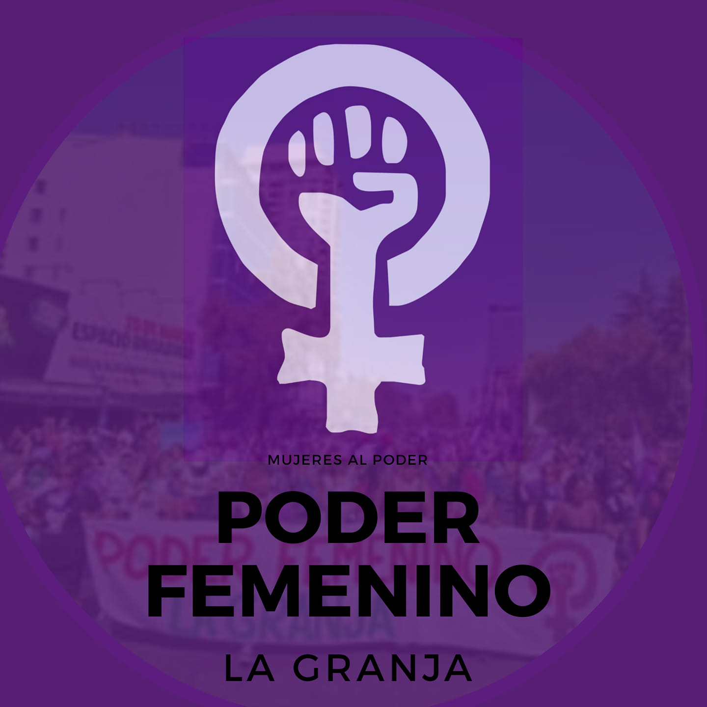

#### FOLIO: LAG07
# Poder femenino La Granja

[instagram](https://www.instagram.com/poderfemeninolagranja/)
[facebook](https://www.facebook.com/poderfemenino.lagranja)
[twitter]()
<correo@correo.cl>
---

### Representantes
#### (Nombres o emails de voceros o representantes).
Escribir dm al Ig. 
---
### Interacciones frecuentes
#### (listar otras organizaciones que habitualmente)
* Mujeres en red La Cisterna 
* Movimiento femenino Bahía Catalina 
* Mujeres ciclobike La Granja 
* Colectivo Las Violetas Sur (Coordinadora - articuladora feminista zona sur) https://www.instagram.com/p/B56u778gVkL/ 

### Redes sociales
#### ¿Para qué se utiliza la red social?
| Instagram | Facebook | Twitter | Otra 
|---|---|---|---|
|Difusión de información y de actividades|Difusión de info y actividades|0| 0|

### **Instagram**
| seguidores | seguidos | publicaciones | hashtag 
|---|---|---|---|
|447|98|86| 0

---

* **Actividad:**   

* Primera Publicación IG: 20 Febrero (activa)

---
### Frecuencia de publicación.

Publicaciones: semanal 

Actividades: semanal 

---
### Ubicación
* Sector de la comununa/ciudad: plaza yungay, la granja

---
### Describir temas de interés y/o trabajo
feminismo, apoyo mutuo, colaboración, solidaridad, proceso constituyente. 
---
### Describir la imagen ideal por la cual se trabaja.
#### (El horizonte hacia el cual se quiere avanzar.)
sociedad feminista, no+ femicidios, Nueva constitución 
---
### ¿Que se hace?
#### (Manifestaciones, marchas, intervenciones, actividades culturales, conversatorios, intercambio de saberes, actividades solidarias o de apoyo mutuo, abastecimiento, contra información, emplazamiento a autoridades etc.)
* Acopio, jornadas solidarias
* Intervenciones artísticas
* completadas pro fondos 
* Marchas 
* Caravanas
* Cacerolazos 
* Canastas solidarias
* Olla común 
* 
---
### Describir y distinguir demandas más reivindicativas de espacios sin relación con lo contencioso o con lo político mas prefigurativo
#### (lo contencioso; demanda al Estado, a alguna autoridad, privados, etc), (prefigurativo, transformación desde lo cotidiano, etc.).
* Se dirige a mujeres granjinas (trans, madres, trabajadoras, compañeras, luchadoras, etc.),a seguir luchando, no se ha ganado nada! ¡Primero mujeres, madre, amiga, esposa. 
---
### Tipo de organización interna.
#### (Vocerías, asambleísmo, horizontalidad, etc.; *se entiende que esta dimensión es más difícil de captar vía análisis de redes sociales, pero quizás se puede vislumbrar a través de roles/cargos*)
asamblea
---
### Describir los temas / imágenes- iconos / conceptos mas habitualmente presentes en sus publicaciones. Describir cambios/ transformaciones en los contenidos desde Octubre.

**Iconos:**
 

**Banderas:**

**Diseño estético:**

> Párrafo tipo cita 

---
### Percepciones que se tiene del Estado
#### (Aparato burocrático)
> resumen de lo encontrado

| Declaraciones | infografía | 
|---|---|
|Anotar los comunicados |  |

---
### Percepciones que se tiene de las Fuerzas de Orden
#### (Aparato represivo)
> resumen de lo encontrado

| Declaraciones | infografía | 
|---|---|
|Anotar los comunicados |  |

---
### Incorporar aca notas, citas textuales, links, etc. extra a los ya incorporados, que sean de interés para comprender tanto la forma como los contenidos asociados a la organización