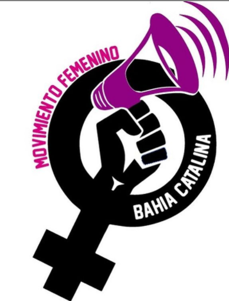

#### FOLIO:LAG08
# Movimiento Femenino Bahía Catalina 

[instagram](https://www.instagram.com/p/CDwpHMGJwv4/)
[facebook]()
[twitter]()
<correo@correo.cl>
---

### Representantes
#### (Nombres o emails de voceros o representantes).
Dm al Ig
---
### Interacciones frecuentes
#### (listar otras organizaciones que habitualmente)
* Colectivo las violetas sur (coordinadora feminista Stgo-Sur)
* @poderfemeninolagranja 
* @feministas.lapintana 
* @colectiva.teresaflores
* Mujeres ciclo bike la granja
* 

### Redes sociales
#### ¿Para qué se utiliza la red social?
| Instagram | Facebook | Twitter | Otra 
|---|---|---|---|
|Difusión de información y actividades|-|-| -|

### **Instagram**
| seguidores | seguidos | publicaciones | hashtag 
|---|---|---|---|
|360|70|40| 0

---

* **Actividad:**   

* Primera Publicación IG: 11 Agosto 2020

---
### Frecuencia de publicación.

Publicaciones: Semanales

Actividades:

---
### Ubicación
* Sector de la comununa/ciudad: pedro lira con bahía catalina

---
### Describir temas de interés y/o trabajo
feminismo, justicia para feminicidios, niñez y adolesencia
---
### Describir la imagen ideal por la cual se trabaja.
#### (El horizonte hacia el cual se quiere avanzar.)
No + sename, justicia para ambar, no + feminicidios ¡Vivas nos queremos! "Abajo el patriarcado". Nueva constitución feminista y paritaria. Aborto libre, seguro y gratuito. 

---
### ¿Que se hace?
#### (Manifestaciones, marchas, intervenciones, actividades culturales, conversatorios, intercambio de saberes, actividades solidarias o de apoyo mutuo, abastecimiento, contra información, emplazamiento a autoridades etc.)
* Marchas
* Intervenciones artísticas
* Velatones
* Cacerolazos
* Afiches informativos zonas inseguras 
* Emplazar a autoridades y sociedad por feminicidios
* Campañas solidarias 

---
### Describir y distinguir demandas más reivindicativas de espacios sin relación con lo contencioso o con lo político mas prefigurativo
#### (lo contencioso; demanda al Estado, a alguna autoridad, privados, etc), (prefigurativo, transformación desde lo cotidiano, etc.).
* Se dirige a mujeres del sector, planteando que ninguna mujer está sola "somos manada", hermana no estás sola. 
---
### Tipo de organización interna.
#### (Vocerías, asambleísmo, horizontalidad, etc.; *se entiende que esta dimensión es más difícil de captar vía análisis de redes sociales, pero quizás se puede vislumbrar a través de roles/cargos*)
horizontal
---
### Describir los temas / imágenes- iconos / conceptos mas habitualmente presentes en sus publicaciones. Describir cambios/ transformaciones en los contenidos desde Octubre.

**Iconos:**

**Banderas:**

**Diseño estético:**

> Párrafo tipo cita 

---
### Percepciones que se tiene del Estado
#### (Aparato burocrático)
> Estado es patriarcal y violento. 

| Declaraciones | infografía | 
|---|---|
|"El estado es un macho violado"| [Intervención - lienzo en pasarela Vespucio](https://www.instagram.com/p/CFSLhgQHLeT/) |

---
### Percepciones que se tiene de las Fuerzas de Orden
#### (Aparato represivo)
> resumen de lo encontrado

| Declaraciones | infografía | 
|---|---|
|Anotar los comunicados |  |

---
### Incorporar aca notas, citas textuales, links, etc. extra a los ya incorporados, que sean de interés para comprender tanto la forma como los contenidos asociados a la organización

* Adscripción a declaración sobre partidos políticos y aprovechamiento organizaciones territoriales 
> En La Granja no hay mano con organizaciones o partidos oportunistas que se quieren hacer representantes del pueblo y en todos estos meses álgidos no los vimos en ningún lado. Les informamos desde ya, que a la derecha le vamos a declarar la guerra en el territorio, a los traidores del pueblo de los partidos tradicionales de centro e izquierda, que acá nunca estuvieron, los vamos a virar de nuestros espacios, a los faranduleros que su único trabajo ha sido decir cosas bonitas en la tele no les vamos a dar ningún margen de participación y a todos esos que se andan haciendo los simpáticos en las redes sociales con un discurso oportunista y sintiéndose, de la nada, representantes del pueblo, sepan de antemano que acá no les vamos a comprar su basura. Nosotros sabemos quienes estuvieron en las calles, sabemos quienes dieron su tiempo y esfuerzo por ayudar al pueblo en estos meses de pandemia, ustedes falsos profetas no tienen cabida y sepan desde ya que se les viene entero pesada la mano acá en La Granja. Levantaremos la política de base con fundamentos, desde la teoría y desde la calle, porque creemos en los cambios, pero aún más importante, somos parte del cambio”

> Hacemos un llamado a todos los movimientos sociales de la comuna de la granja a compartir lo escrito, para que ningún partido político se quiera hacer representante del pueblo, ya que fuimos nosotr@s quienes estuvimos en la calle en estos meses de pandemia ayudando a la gente y ollas comunes. Y ahora que vienen las elecciones ellos aparecen colgandose de nuestro trabajo en la calle.

> (Copiado de @moviliza2.porla.dignidad)