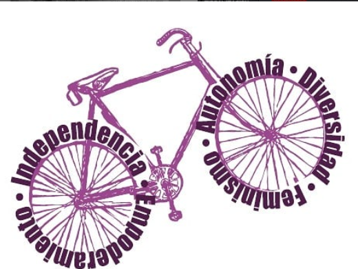

#### FOLIO: LAG09
# Mujeres CicloBike La Granja

[instagram](https://www.instagram.com/p/CHgdYpMH2FP/)
[facebook]()
[twitter]()
<correo@correo.cl>
---

### Representantes
#### (Nombres o emails de voceros o representantes).
dm al Ig
---
### Interacciones frecuentes
#### (listar otras organizaciones que habitualmente)
* Colectivo Violetas Sur
* El boske resiste
* Colectiva hijas de obrera (performances feministas zona sur)
* Poder femenino la granja
* ciclo sororas 
### Redes sociales
#### ¿Para qué se utiliza la red social?
| Instagram | Facebook | Twitter | Otra 
|---|---|---|---|
|Difusión de información y actividades|0|0| 0|

### **Instagram**
| seguidores | seguidos | publicaciones | hashtag 
|---|---|---|---|
|400|355|36| 0

---

* **Actividad:**   

* Primera Publicación IG: 12 de Noviembre (activa)

---
### Frecuencia de publicación.

Publicaciones: diarias

Actividades: semanales

---
### Ubicación
* Sector de la comununa/ciudad: La Granja

---
### Describir temas de interés y/o trabajo
ciclismo urbano, feminismo, apoyo mutuo, empoderamiento y autonomía femenina. 
---
### Describir la imagen ideal por la cual se trabaja.
#### (El horizonte hacia el cual se quiere avanzar.)
Feminismo, ciudad pedaleable, ciclovías seguras y continuas, seguridad y convivencia vial- 
---
### ¿Que se hace?
#### (Manifestaciones, marchas, intervenciones, actividades culturales, conversatorios, intercambio de saberes, actividades solidarias o de apoyo mutuo, abastecimiento, contra información, emplazamiento a autoridades etc.)
* Cicletadas 
* Protestas
* Rifas solidarias
---
### Describir y distinguir demandas más reivindicativas de espacios sin relación con lo contencioso o con lo político mas prefigurativo
#### (lo contencioso; demanda al Estado, a alguna autoridad, privados, etc), (prefigurativo, transformación desde lo cotidiano, etc.).
* Se dirige a mujeres y discidencias a encontrarse, vincularse para poder ir juntas a ciclo marchas y acompañarse, y a subirse a la bicicleta para salir del sistema capitalista. 

---
### Tipo de organización interna.
#### (Vocerías, asambleísmo, horizontalidad, etc.; *se entiende que esta dimensión es más difícil de captar vía análisis de redes sociales, pero quizás se puede vislumbrar a través de roles/cargos*)
* horizontalidad 
---
### Describir los temas / imágenes- iconos / conceptos mas habitualmente presentes en sus publicaciones. Describir cambios/ transformaciones en los contenidos desde Octubre.

**Iconos:**

 
**Banderas:**

**Diseño estético:**

> Párrafo tipo cita 

---
### Percepciones que se tiene del Estado
#### (Aparato burocrático)
> resumen de lo encontrado

| Declaraciones | infografía | 
|---|---|
|Anotar los comunicados |  |

---
### Percepciones que se tiene de las Fuerzas de Orden
#### (Aparato represivo)
> resumen de lo encontrado

| Declaraciones | infografía | 
|---|---|
|Anotar los comunicados |  |

---
### Incorporar aca notas, citas textuales, links, etc. extra a los ya incorporados, que sean de interés para comprender tanto la forma como los contenidos asociados a la organización

* Declaración NO + CICLISTAS MUERTOS
> En menos de tres días, un asesinato más.
El odio y la desinformación abunda en las redes sociales. Que tenemos ciclovías para andar, que andamos por la vereda, que andamos por la calle.
Lo concreto es que de todas las ciclovías, ninguna es continua ¿les ha pasado que se cortan y quedan sin ruta? ¿Les pasa que a veces es preferible ir por la calle a ir por la ciclovia llena de desniveles que solo amenazan con pinchar la bici o descentrar la rueda y más de un accidente? Ni mencionar el dolor en las manos que causa cada desnivel.
Queremos seguridadvial, convivencia vial y que no nos sigan matando. Que la supremasia de una vida por sobre otra en respuesta a "salir del sistema capitalista" deje de existir (si, al decidir subirnos a la bici y dejar el transporte público atentamos contra su sistema, su capital)
Queremos que no nos acosen cuando vamos en la bici, que no nos discriminen ni violenten por nuestras/es/xs cuerpas.
Queremos andar libres, al pedalear nos sentimos libres y nadie nos achicara la calle!!!