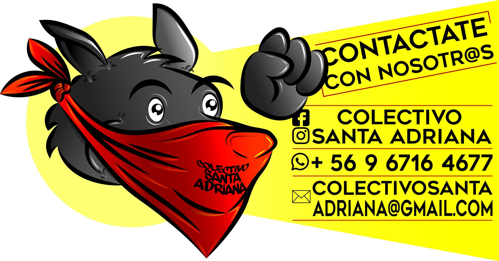
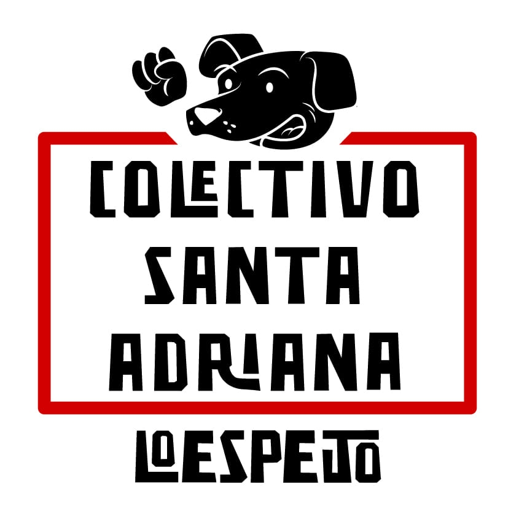

#### FOLIO: LOE01
# Colectivo Santa Adriana

[instagram](https://www.instagram.com/colectivosantaadriana/)
[facebook](https://www.facebook.com/Colectivo-Santa-Adriana-105123157643362/)
[twitter]()
<colectivosantaadriana@gmail.com>
---

### Representantes
#### (Nombres o emails de voceros o representantes).
+569 6716 4677

  

---
### Interacciones frecuentes
#### (listar otras organizaciones que habitualmente)
* Recuperemos Lo Espejo (pre 18-O pero muy activa)
* Colectiva feminista lo espejo (desde mov feminista 2018)
* Coordinadora invade
* Lo espejo Solidario (red apoyo vecinal surgida pandemia)
* Lo espejo en resistencia (medio-contra información)
* Club Deportivo Jorge Muñoz - Población Sta Adriana
* 

### Redes sociales
#### ¿Para qué se utiliza la red social?
| Instagram | Facebook | Twitter | Otra 
|---|---|---|---|
|0|0|0| 0|

### **Instagram**
| seguidores | seguidos | publicaciones | hashtag 
|---|---|---|---|
|607|245|90| 0

---

* **Actividad:**   

* Primera Publicación IG: 5 Diciembre 2019 (activa)

---
### Frecuencia de publicación.

Publicaciones: Semanales (2,3 veces)

Actividades: Semanales

---
### Ubicación
* Sector de la comununa/ciudad: Junta de Vecinos 24-AVilla Las Palmeras, población Santa Adriana

---
### Describir temas de interés y/o trabajo
* Asamblea constituyente, diálogo social, educación popular, niñez y adolesencia, actividades mediaomabientales, comunitarias, culturales, movimiento sociales - luchas. Apoyo mutuo, solidaridad. 

---
### Describir la imagen ideal por la cual se trabaja.
#### (El horizonte hacia el cual se quiere avanzar.)
* ¡Libertad presos políticos revuelta! 
* Gestar red solidaridad y apoyo mutuo territorial 
* Sociedades en que personas se apoyen mutuamente, sean solidarias y no discriminadoras. 
> "ante el abuso empresarial a derribar el modelo con organización comunitaria"
* Nueva constitución 
---
### ¿Que se hace?
#### (Manifestaciones, marchas, intervenciones, actividades culturales, conversatorios, intercambio de saberes, actividades solidarias o de apoyo mutuo, abastecimiento, contra información, emplazamiento a autoridades etc.)
* Talleres de Verano para niñxs
* Consultas ciudadanas 
* Talleres artísticos (graffitis, danza) -"Escuelita popular Sta Adriana"
* Puntos de reciclaje 
* Futbol - Campeonato "poblacional, rebelde y solidario"
* Cacerolazo 
* Murales
* Pasacalles 
* Teatro
* Mini libro para colorear en pandemia 
* Plaza Los Ojos de santa Adriana: https://www.instagram.com/p/B-qNehTJzzo/
* Actividades solidarias: Lucazos por los presos 
* Instructivos (videos) en línea sobre cuidados en pandemia
* Cuarentena en 99 palabras 
* Sanitización 
* Campañas solidarias: acopio y campañas de canastas familiares
* Banderazo Apruebo 
* Jardín y Huerta La Revuelta
* Torneo de Baby Futbol la revuelta 
---
### Describir y distinguir demandas más reivindicativas de espacios sin relación con lo contencioso o con lo político mas prefigurativo
#### (lo contencioso; demanda al Estado, a alguna autoridad, privados, etc), (prefigurativo, transformación desde lo cotidiano, etc.).
> Se dirige a vecinxs y vecinxs de la población a organizarse, cooperar con el otro y generar/ejercer poder popular y soberanía en el territorio. "La Santa Adriana, ayuda a la Santa Adriana". "El pueblo ayuda al pueblo" "nos unimos nos cuidamos"
---
### Tipo de organización interna.
#### (Vocerías, asambleísmo, horizontalidad, etc.; *se entiende que esta dimensión es más difícil de captar vía análisis de redes sociales, pero quizás se puede vislumbrar a través de roles/cargos*)
* horizontal 
---
### Describir los temas / imágenes- iconos / conceptos mas habitualmente presentes en sus publicaciones. Describir cambios/ transformaciones en los contenidos desde Octubre.
Mantiene estilos, gráficas y línea editorial, difusión de información, y actividades. La pandemia enfoca el contenido en actividades de carácter solidario y protesta remota, además se realiza actividad arsístico - cultural a distancia (escritura.). 

**Iconos:**

**Banderas:**c

**Diseño estético:**

>Rojo, blanco, negro, perro mata pacos, tipografía BRP.  

---
### Percepciones que se tiene del Estado
#### (Aparato burocrático)
> resumen de lo encontrado

| Declaraciones | infografía | 
|---|---|
|Anotar los comunicados |  |

---
### Percepciones que se tiene de las Fuerzas de Orden
#### (Aparato represivo)
> resumen de lo encontrado

| Declaraciones | infografía | 
|---|---|
|Anotar los comunicados |  |

---
### Incorporar aca notas, citas textuales, links, etc. extra a los ya incorporados, que sean de interés para comprender tanto la forma como los contenidos asociados a la organización
* Micro Libro Relatos de Pandemia . "Cuerentena 99 palabras" (se debe descargar PDF): https://mega.nz/file/fw5wla4b#gazOjUHhpAu4pIw6BSqy1FQuiC9-N0BwPVAb5LYpzLU 
* Declaración 16 Abril
> Nuestra querida Población Santa Adriana surge a través de la organización comunitaria, dinámicas fundadas principalmente en la solidaridad de clase, entendiendo que solo el pueblo ayuda al pueblo. 🔴

* Declaración sobre Relatos: 
> Alegremente informamos el éxito de “La Cuarentena en 99 Palabras”
.
La totalidad de relatos suman 767 likes, tal impacto lo significamos como una señal potente de organización comunitaria, en resistencia y lucha contra el abuso sistemático estatal/empresarial, esta vez, desde la tribuna que nos ofrece el arte y la cultura
.
Mantente atent@, surgirán muy pronto nuevas actividades relacionadas a la CONFECCION DEL MINI-LIBRO “LA CUARENTENA, RELATOS ESCRITOS Y GRAFICOS”, el cual constara con una convocatoria abierta para ilustrador-s, quienes podrán ilustrar/dibujar un relato, o su percepción de la cuarentena. Cuéntale a tu familia y amig@s
.
Los reconocimientos serán entregados durante el transcurso de la próxima semana, debido a complicaciones propias del contexto sanitario
.
Muchas gracias a quienes participaron de diversas formas en la actividad, ya sea, enviando relatos, dando like, compartiendo, comentando y/o leyendo
.
Con afecto y rebeldía, Colectivo Santa Adriana
 
 > La violencia y precarización del modelo neoliberal intento coartar la solidaridad vecinal, sin embargo, no fue capaz de romper lazos tan profundos en la cultura de nuestra población. Mucho menos lo será hoy, donde como pueblo unido hemos despertado. ⚫

> Invitamos y llamamos a potenciar y/o reactivar nuestra solidaridad en todo nuestro territorio, mediante el apoyo mutuo entre vecin@s, pues en esta crisis sanitaria ¡nadie esta sol@!. 🔴 ❗Es por eso que hacemos el llamado a ¡PARTICIPAR como DELEGAD@ de tu CALLE, PASAJE O BLOCK!, con el objetivo de articular una red de apoyo mutuo, orientada al abastecimiento alimentario, insumos médicos y resguardo vecinal❗. 

* Declaración sobre creación Huerta "La revuelta" 30 Octubre 2020
Ver aquí imágenes: https://www.instagram.com/p/CG_YWJbpFXP/ 
>Proceso del levantamiento del jardin y huerta la revuelta, ubicada en panamericana (jj prieto) con el pasaje 29.
El levantamiento de la huerta es una de las primeras acciones llevadas por vecinxs en colaboracion con el colectivo, para poder recuperar y embellecer nuestro territorio. Es importante ejercer soberania sobre nuestros territorios y empoderarnos para asi generar, en este caso especifico un lugar mas comodo para el encuentro comunitarios entre familias y pobladores, alejados de la droga, el alcohol y las logicas capitalistas, como tambien acercar los saberes de la tierra, los alimentos y las hierbas a la comunidad. xigimos la liberación inmediata de todxs lxs presxs de la revuelta. Nadie ni nada esta olvidado
Libertad a nuestro vecino matias fuentes. Con afecto y rebeldía colectivo santa adriana