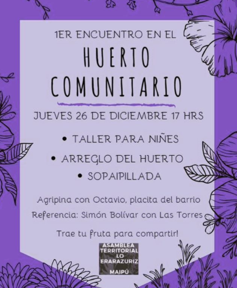
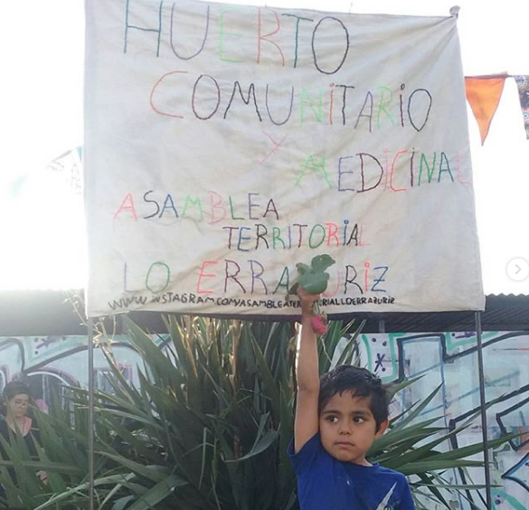
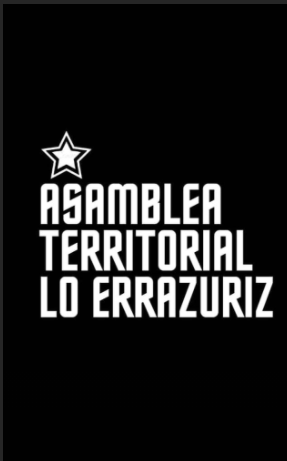
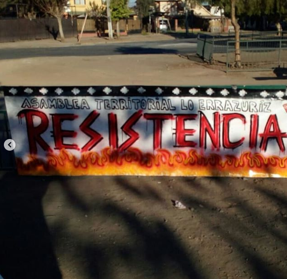
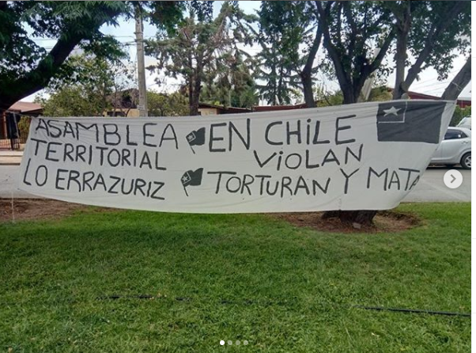

#### FOLIO: MAI05
# Asamblea Lo Errazuriz

[instagram](https://www.instagram.com/asambleaterritorialloerrazuriz/)
[facebook](https://www.facebook.com/pages/category/Community/Asamblea-Territorial-Barrio-Lo-Err%C3%A1zuriz-102351867874185/)
[twitter]()
<asambleaterritorialloerrazuriz@gmail.com>
---

### Representantes
#### (Nombres o emails de voceros o representantes).
Ubicar a Rolando Serrano en el correo de la Asamblea (encargado de transferencias) 

---
### Interacciones frecuentes
#### (listar otras organizaciones que habitualmente) 
* Asamblea villa Los Héroes
* La (r)esistencia Maipú
* Asamblea general cerrillos 
* Vecinos movilizados Maipú 
* Asamblea Las Parcelas

### Redes sociales
#### ¿Para qué se utiliza la red social?
| Instagram | Facebook | Twitter | Otra 
|---|---|---|---|
|Convocatoria asambleas, a jornadas de protesta, ayuda de acopio de alimentos y/o campañas solidarias "lukatón", compartir imágenes conmemoración caídos de la revuelta (Fredes, Acuña, etc)|ídem Ig |No aplica | No aplica|

### **Instagram**
| seguidores | seguidos | publicaciones | hashtag 
|---|---|---|---|
|1940|436|82| 0

---

* **Actividad:**   

* Primera Publicación IG: 13 Noviembre 2019

---
### Frecuencia de publicación.

Publicaciones: Semanal/2 - 4veces por semana al comienzo

Actividades: semanales 

---
### Ubicación
* Sector de la comununa/ciudad: Villa Errázuriz, Maipú

---
### Describir temas de interés y/o trabajo:
Asamblea constituyente, organización territorial y democracia directa. Huerta comunitaria (soberanía alimentaria y redes de consumo). 

---
### Describir la imagen ideal por la cual se trabaja.
#### (El horizonte hacia el cual se quiere avanzar.)
"Organización horizontal con el objetivo de conocernos y organizarnos entre vecines del sector de Villa Lo Errázuriz, Maipú.
La lucha continúa!!" (Descripción perfil de instagram). Desde el comienzo se vincula (aún que no explícitamente, pero se deja entrever por las temáticas de los conversatorios y jornadas) la creación de una nueva constitución y asamblea constituyente. 
Además se conmemora a todxs los presos y asesinados por luchas y se aboga por la liberación de lxs presxs políticos de la revuelta. 

---
### ¿Que se hace?
#### (Manifestaciones, marchas, intervenciones, actividades culturales, conversatorios, intercambio de saberes, actividades solidarias o de apoyo mutuo, abastecimiento, contra información, emplazamiento a autoridades etc.)
* Marchas territoriales
* Asambleas barriales
* Velatones (Jornadas de protesta popular)
* Cacerolazos (Jornadas de protesta popular)
* Huerto Comunitario
* Jornadas artísiticas - comunitarias "del barrio para el barrio"
* Jornadas feministas y discidentes (7 Marzo primera)
* Acopios "pueblo para el pueblo" (contexto covid)
* Lucatón conciente 
* Asambleas virtuales 
---
### Describir y distinguir demandas más reivindicativas de espacios sin relación con lo contencioso o con lo político mas prefigurativo
#### (lo contencioso; demanda al Estado, a alguna autoridad, privados, etc), (prefigurativo, transformación desde lo cotidiano, etc.).
* _Alimentación conciente, soberanía alimentaria y redes de consumo_ : La creación de la huerta comunitaria se visualiza como bandera de lucha (simbólica y física) para éstas temáticas y otras. 
"Siembra consciencia, y cosecha libertad" (Texto en publicación del 28 Abril, 2020)

Primer Afiche encuentro en la Huerta

##### Fuente: Publicación Ig 25 diciembre 2019

##### Fuente: Publicación Ig 5 Enero 2020

### Tipo de organización interna.
#### (Vocerías, asambleísmo, horizontalidad, etc.; *se entiende que esta dimensión es más difícil de captar vía análisis de redes sociales, pero quizás se puede vislumbrar a través de roles/cargos*)
Horizontalidad y asambleísmo 

---
### Describir los temas / imágenes- iconos / conceptos mas habitualmente presentes en sus publicaciones. Describir cambios/ transformaciones en los contenidos desde Octubre.

**Iconos:**

 
##### Fuente: foto de perfil Ig

**Banderas:**

##### Fuente: publicación Ig 15 de Mayo 2020

**Diseño estético:**

> Párrafo tipo cita 

---
### Percepciones que se tiene del Estado
#### (Aparato burocrático)
> resumen de lo encontrado

| Declaraciones | infografía | 
|---|---|
|"Como Asamblea nos posicionamos en total rechazo a cualquier artimañana por la institucionalidad que avala las muertes y viola sistemáticamente los derechos humanos" (Declaración sobre consulta ciudadana, 12 diciembre 2019)|  |

---
### Percepciones que se tiene de las Fuerzas de Orden
#### (Aparato represivo)
> La policia, amparada por el estado "avala las muertes y viola sistemáticamente los derechos humanos" (Declaración sobre consulta ciudadana, 12 diciembre 2019)

| Declaraciones | infografía | 
|---|---|
|"Por todxs nuestrxs muertxs !!! Juicio y castigo para los asesinos del pueblo , pacos asesinosCompañero neco presente! Asesinado por la policía chilenas" (publicación Ig 30 enero 2020) | [video barricada ](https://www.instagram.com/p/B77c8qSpetU/)

---
### Incorporar aca notas, citas textuales, links, etc. extra a los ya incorporados, que sean de interés para comprender tanto la forma como los contenidos asociados a la organización