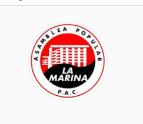

#### FOLIO: PAC01
#  ASAMBLEA TERRITORIAL LA MARINA EN RESISTENCIA (ex cabildo)

[instagram](https://www.instagram.com/asamblealamarina/)
[facebook]()
[twitter]()
<asamblea.lamarina@gmail.com>
---

### Representantes
#### (Nombres o emails de voceros o representantes).
Mandar dm al  / correo gmail
---
### Interacciones frecuentes
#### 
* Asamblea Popular PAC en la lucha
* Asamblea población dávila 
* Asamblea el Peñón Oriente - Puente Alto
* Coordinadora de Asambleas Territoriales - CAT
* Huerta dávila Wexipantu
* Pobladoras Feministas PAC
* La Pac Pedalea

### Redes sociales
#### ¿Para qué se utiliza la red social?
| Instagram | Facebook | Twitter | Otra 
|---|---|---|---|
|Difusión de información, difusión de actividades|No aplica|No aplica| No aplica|

### **Instagram**
| seguidores | seguidos | publicaciones | hashtag 
|---|---|---|---|
|895|246|246| 0

---

* **Actividad:**   

* Primera Publicación IG: 11 Noviembre 2019 
Actualmente inactiva - quiebre por razones políticas - orgánicas (falta de horizontalidad y problemas de tratos patriarciales)
 [Ver aquí publicación 14 Agosto](https://www.instagram.com/p/CD41smRpCHq/). Se mantiene funcionando la Olla Común. 
> "No podemos seguir naturalizando las malas prácticas del viejo orden que queremos desconstituir"
---
### Frecuencia de publicación.

Publicaciones: Semanal (3-4 veces al inicio)
hasta marzo. Entre marzo-mayo baja, junio vuelve semanal.

#### Actividades: Semanales (2-3 actividades inicio) por pandemia (colectas, olla común semanak)
---
### Ubicación
* Sector de la comununa/ciudad: Territorio entre S. Allende - Panamericana - Lazo - Félix Mendhelson. Plaza de Avenida La Marina con Marqués de Ovando 

---
### Describir temas de interés y/o trabajo
### Nueva Constitución, educación popular, vinculación vecinal y territorial, solidaridad, poder popular.
---
### Describir la imagen ideal por la cual se trabaja.
#### (El horizonte hacia el cual se quiere avanzar.)
Somos vecinas y vecinos organizados que nos convocamos para movilizarnos por una Nueva Constitución a través de Cabildos Populares y Asambleas. Creemos en el Poder Popular y en la educacion para y por el pueblo, queremos fomentar y fortalecer las herramientas de las y los vecinos de la Villa Centenario y alrededores para transformar esta sociedad individualista en un lugar ameno, solidario y abierto para todas las personas.

Invitamos a todas y todos a sumarse a las movilizaciones históricas que ocurren en nuestro país y a poner todo nuestro talento y creatividad al servicio de la comunidad. 
> "¡Por una Nueva Constitución mediante una Asamblea Constituyente!"

> "¡ASAMBLEA CONSTITUYENTE PARA UN ESTADO PLURINACIONAL!"

> "Sigamos luchando x una Nueva Constitución!"

> Por el derecho a la vida digna 

> "¡La dignidad y la solidaridad sólo la da el pueblo!"
---
### ¿Que se hace?
#### (Manifestaciones, marchas, intervenciones, actividades culturales, conversatorios, intercambio de saberes, actividades solidarias o de apoyo mutuo, abastecimiento, contra información, emplazamiento a autoridades etc.)
* Escuela Constituyente popular 
* Cacerolazos
* Marchas 
* Velatón 
* Onces comunitarias
* Talleres (constitución, salud para adultos mayores, pensiones, primeros auxilios, igualdad de género)
* Cabildos Populares 
* Pintatones
* Intervenciones Artísticas
* Festival por la constitución 
* Mural junto a la BRP-PAC
* Cine Popular
* Campaña solidaria por pandemia "la solidaridad es el virus al que le teme el capitalismo" (colecta comidas, insumos, etc.)
* Olla común Pandemia
* Fotografías de la protesta social

---
### Describir y distinguir demandas más reivindicativas de espacios sin relación con lo contencioso o con lo político mas prefigurativo
#### (lo contencioso; demanda al Estado, a alguna autoridad, privados, etc), (prefigurativo, transformación desde lo cotidiano, etc.).
Se dirigen a los vecinos y vecinas del territorio, emplazan también al estado, a carabineros de chile, y al sistema neoliberal "la solidaridad es el virus que le tema al capitalismo"
---
### Tipo de organización interna.
#### (Vocerías, asambleísmo, horizontalidad, etc.; *se entiende que esta dimensión es más difícil de captar vía análisis de redes sociales, pero quizás se puede vislumbrar a través de roles/cargos*)
Asambleísmo /horizontalidad / comisiones - quiebre por sistema autoritario.

---
### Describir los temas / imágenes- iconos / conceptos mas habitualmente presentes en sus publicaciones. Describir cambios/ transformaciones en los contenidos desde Octubre.
Desde octubre a marzo se concentró en proceso constituyente, educación popular en torno a pensiones, constitución, género, primeros auxilios. Desde mayo se concentran als publicaciones en campañas de acopio y olla común semanal. 

**Iconos:**

 

**Banderas:**

**Diseño estético:** Rojo, negro, blanco. 

> Párrafo tipo cita 

---
### Percepciones que se tiene del Estado
#### (Aparato burocrático)
> resumen de lo encontrado

| Declaraciones | infografía | 
|---|---|
|"Este jueves se cumple un año del asesinato del weichafe Camilo Catrillanca a manos del Estado Chileno a través de las Fuerzas Especiales de Carabineros. Camilo sufrió la represión asesina del Estado que hoy día vemos en las movilizaciones que ocurren en todo el país y que violan los Derechos Humanos de chilenos y mapuches"| [Publicación 13 Noviembre 2019 - Conmemoración asesinato Camilo Catrillanca](https://www.instagram.com/p/B40B92oBZH3/) |
|(...)"fue un momento de reflexión y protesta por la represión asesina que viola los derechos fundamentales del Pueblo Mapuche y de chilenas y chilenos que son asesinados por un Estado asesino.|Publicación 15 Noviembre|
---
### Percepciones que se tiene de las Fuerzas de Orden
#### (Aparato represivo)
> resumen de lo encontrado

| Declaraciones | infografía | 
|---|---|
|"Más de 230 personas con traumas oculares. Denuncias de torturas y violaciones sexuales en comisarías y centros de detención ilegales. 2800 heridos en manifestaciones y protestas. Dos informes de organismos internacionales con pruebas irrefutables de la violación a los Derechos Humanos cometidas por agentes del Estado como Carabineros y FFAA. Y la represión sigue... Invitamos a todas y todos los vecinos a conversar y reflexionar sobre las violaciones a los Derechos Humanos durante estos tiempos de revuelta social. "| [Publicación Ig 29 Noviembre 2019](https://www.instagram.com/p/B5c2O4GFHLw/) |

---
### Incorporar aca notas, citas textuales, links, etc. extra a los ya incorporados, que sean de interés para comprender tanto la forma como los contenidos asociados a la organización
* _Declaración contra el Acuerdo de Paz_:

> "Como vecinas y vecinos de la Asamblea La Marina rechazamos enérgicamente el Acuerdo por la Paz y la Nueva Constituvion" alcanzado entre Chile Vamos, la ex Concertación y algunos partidos del Frente Amplio. Creemos que una clase política deslegitimizada no puede atribuirse ser la solución a la crisis menos aún cuando no se hace participe a las organizaciones sociales, sindicatos, y al pueblo movilizado en este acuerdo entre "gallos y medianoche". Rechazamos este acuerdo en sus aspectos técnicos como el quorum de 2/3, el voto voluntario del plebiscito de Entrada, y la inexistente información respecto a cómo se zanjaran los acuerdos que no logren el quorum establecido, sino que también en sus aspectos políticos como la no incorporación de cuotas para Pueblos Originarios y minorías, que no garantiza paridad de género ni igualdad de condiciones para independientes, además creemos que ante un poder financiero, comunicacional y político en manos de la derecha, provocará que el pueblo soberano y democrático no se vea representado en la "Convención Constituyente" mientras que la derecha será sobreprepresentada. 
El camino del Pueblo demanda que la nueva Constitución se haga mediante una Asamblea Constituyente originada desde el pueblo movilizado y sus organizaciones sociales, donde la expresión de todas las personas sea reconocida en igualdad de condiciones y oportunidades.
Rechazamos además que se nos quiera imponer la Paz cuando aún no existe justicia por los 24 muertos que existen en nuestro país, los más de 200 mutilados y otros cientos torturados y violados sexualmente por las Fuerzas Armadas y de Orden. El gobierno de Piñera tiene sus manos manchadas con sangre y debe responder por las violaciones a los Derechos Humanos que han cometido los agentes del Estado.
Exijimos al Congreso a que resuelva y avance de una vez por todas en las urgencias sociales que tienen al pueblo en la precariedad y la miseria. Mejoras en el salario mínimo y pensiones, rebaja en medicamentos y seguro universal de salud, condonación deudas por Educación, trasporte estatal y gratuito, Nacionalización de recursos naturales estratégicos como el Cobre, Litio y Agua.
Seguimos luchando
El camino del Pueblo demanda que la nueva Constitución se haga mediante una Asamblea Constituyente originada desde el pueblo movilizado y sus organizaciones sociales, donde la expresión de todas las personas sea reconocida en igualdad de condiciones y oportunidades.
Rechazamos además que se nos quiera imponer la Paz cuando aún no existe justicia por los 24 muertos que existen en nuestro país, los más de 200 mutilados y otros cientos torturados y violados sexualmente por las Fuerzas Armadas y de Orden. El gobierno de Piñera tiene sus manos manchadas con sangre y debe responder por las violaciones a los Derechos Humanos que han cometido los agentes del Estado.
Exijimos al Congreso a que resuelva y avance de una vez por todas en las urgencias sociales que tienen al pueblo en la precariedad y la miseria. Mejoras en el salario mínimo y pensiones, rebaja en medicamentos y seguro universal de salud, condonación deudas por Educación, trasporte estatal y gratuito, Nacionalización de recursos naturales estratégicos como el Cobre, Litio y Agua.
Seguimos luchando