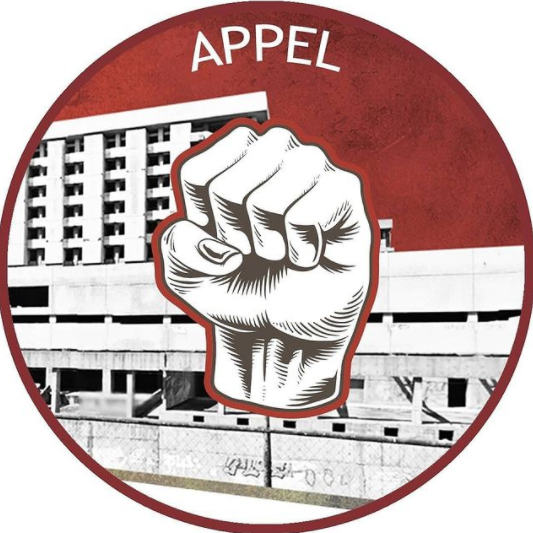

#### FOLIO: PAC02
# ASAMBLEA POPULAR EN LA LUCHA (APPEL)

[instagram](https://www.instagram.com/asambleapopularpacenlucha/)
[facebook](https://www.facebook.com/Asambleapopularpacenlucha/)
[twitter]()
<contacto.appel@gmail.com>
---

### Representantes
#### (Nombres o emails de voceros o representantes).
Gmail o dm al instagram
---
### Interacciones frecuentes
#### (listar otras organizaciones que habitualmente)
* Asamblea territorial la marina en resitencia
* Pobladoras Feministas PAC 
* Asamblea Población Dávila
* La Pac pedalea 
* Asamblea territorial población San Joaquín
* Coordinadora 18 Octubre 
### Redes sociales
#### ¿Para qué se utiliza la red social?
| Instagram | Facebook | Twitter | Otra 
|---|---|---|---|
|Difusión de información y difusión de actividades|Idem Ig|No aplica| No aplica|

### **Instagram**
| seguidores | seguidos | publicaciones | hashtag 
|---|---|---|---|
|1,115|205|161| 0

---

* **Actividad:**   

* Primera Publicación IG: 12 de Noviembre 2019 (actualmente activa)

---
### Frecuencia de publicación.

Publicaciones: diarias (hasta marzo)
, luego semanales (1 vez)
Actividades: semanales hasta marzo, luego mensuales, esporádicas (solidarias-pandemia)

---
### Ubicación
* Sector de la comununa/ciudad: Población San Joaquín, Pedro Lira 3591

---
### Describir temas de interés y/o trabajo
### Asamblea constituyente, nueva constitución, solidaridad, apoyo mutuo. Protesta, lucha popular. Liberación presos políticos.
---
### Describir la imagen ideal por la cual se trabaja.
#### (El horizonte hacia el cual se quiere avanzar.)
#### 
> "Asamblea constituyente para una nueva constitución" "Pac no suelta la calle" "seguimos en pie de lucha" "No más presos por luchar" "Es momento de decirles en la cara que con el pueblo todo, sin el pueblo nada." "Ya no más, vamos por todo."
---
### ¿Que se hace?
#### (Manifestaciones, marchas, intervenciones, actividades culturales, conversatorios, intercambio de saberes, actividades solidarias o de apoyo mutuo, abastecimiento, contra información, emplazamiento a autoridades etc.)
* Cabildos populares
* Marchas
* Jornadas solidarias 
* Asambleas territoriales
* Jornadas de documentales 
* Velatones / conmemoraciones 
* Cicletada popular PAC
* Biblioteca virtual 
* Cicletada por la libertad de los presos
---
### Describir y distinguir demandas más reivindicativas de espacios sin relación con lo contencioso o con lo político mas prefigurativo
#### (lo contencioso; demanda al Estado, a alguna autoridad, privados, etc), (prefigurativo, transformación desde lo cotidiano, etc.).
### Se dirige a los vecinos y vecinas, a organizarse y unirse, "informate, organizate, lucha" emplaza a políticos por su hipocrecía. Emplaza a los vecinos a la recuperación y apropiación de espacios públicos "recuperemos el parque las moscas".  Y se emplaza al gobierno por la liberación de presos políticos. 
---
### Tipo de organización interna.
#### (Vocerías, asambleísmo, horizontalidad, etc.; *se entiende que esta dimensión es más difícil de captar vía análisis de redes sociales, pero quizás se puede vislumbrar a través de roles/cargos*)
Asambleísmo / horizontalidad
---
### Describir los temas / imágenes- iconos / conceptos mas habitualmente presentes en sus publicaciones. Describir cambios/ transformaciones en los contenidos desde Octubre.
Desde octubre - marzo 2020 muchísima más difusión de actividades, convocatoria a marchas y asambleas. Desde marzo, más información, foco en la liberación presos políticos. 
**Iconos:**

**Banderas:**

**Diseño estético:**

> Párrafo tipo cita 

---
### Percepciones que se tiene del Estado
#### (Aparato burocrático)
> Estado "hipócrita y genocida" Ver declaración sobre covid adjunta.
| Declaraciones | infografía | 
|---|---|
|Anotar los comunicados |  |

---
### Percepciones que se tiene de las Fuerzas de Orden
#### (Aparato represivo)
> Desconfianza y rechazo absoluto a la violencia y el abuso de la cárcel para manifestantes.

| Declaraciones | infografía | 
|---|---|
|Anotar los comunicados |  |

---
### Incorporar aca notas, citas textuales, links, etc. extra a los ya incorporados, que sean de interés para comprender tanto la forma como los contenidos asociados a la organización
[Declaración pública covid - 26 Marzo](https://www.instagram.com/p/B-NdZnEJ8DJ/)