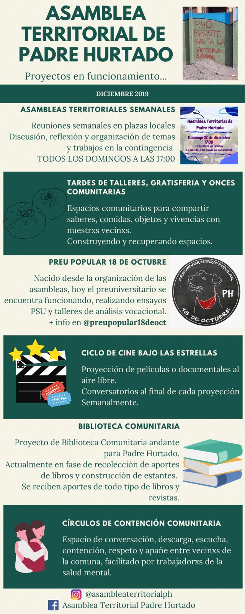
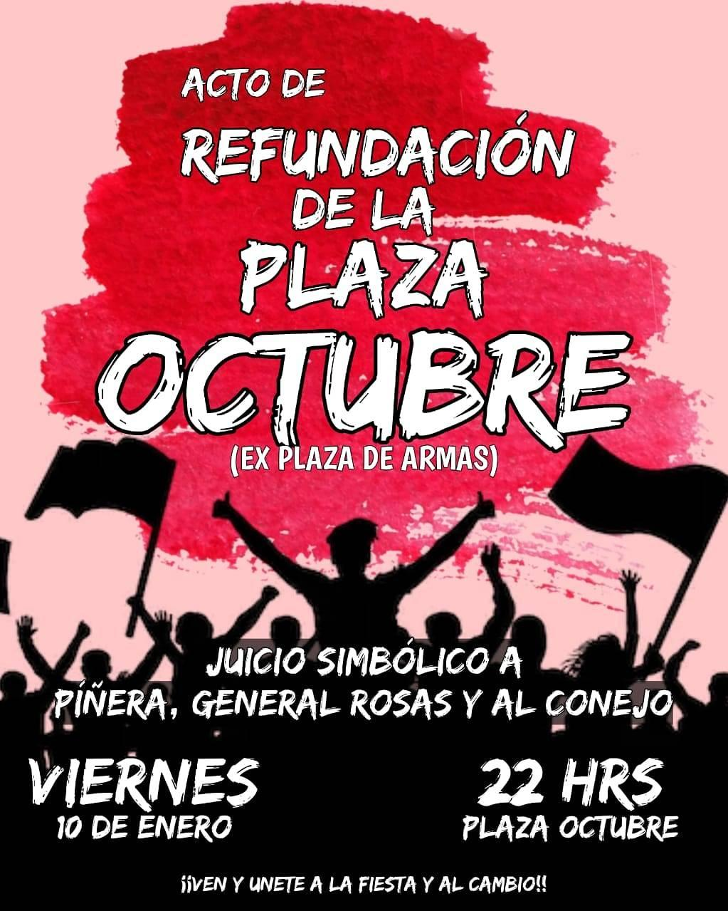

#### FOLIO: PH01
# Asamblea Territorial Padre Hurtado

[instagram]
[facebook](https://www.facebook.com/asambleaterritorialph/)
[twitter]()
<correo@correo.cl>
---

### Representantes
#### (Nombres o emails de voceros o representantes).
* Escribir mensaje a facebook o contactar vía Preu popular 18 de Octubre. 
---
### Interacciones frecuentes
#### (listar otras organizaciones que habitualmente)
* Colectivo Octubre combativo
* Preu popular 18 Octubre 
* Poniente Feminista 

### Redes sociales
#### ¿Para qué se utiliza la red social?
| Instagram | Facebook | Twitter | Otra 
|---|---|---|---|
|Ya no existe el perfil|Difusión de actividades, difusión de información|No aplica| No aplica |

### **Facebook** 
| seguidores | seguidos | publicaciones | hashtag 
|---|---|---|---|
|331||| 0

---

* **Actividad:**   

* Primera Publicación FB: 17 Noviembre 2019. Ultima públicación en Septiembre 2020. 

---
### Frecuencia de publicación.

Publicaciones:Semanal (2/3)

Actividades: Semanal 

---
### Ubicación
* Sector de la comununa/ciudad: Parque el Manzano 
---
### Describir temas de interés y/o trabajo
### Apoyo mutuo, solidaridad, fortalecer la organización comunitaria - territorial (vecinal), autonomía, proceso constituyente con poder popular. 
---
### Describir la imagen ideal por la cual se trabaja.
#### (El horizonte hacia el cual se quiere avanzar.)
#### "Por la unidad de Padre Hurtado" "Por un Padre Hurtade Rebelde y Organizado". "Fortalecer la organización comunitaria desde la horizontalidad es un desafío pero también una oportunidad para pensar y construir una nueva sociedad". "Queremos constitución, queremos un plebiscito pero sin condiciones impuestas por la clase política". 
---
### ¿Que se hace?
#### (Manifestaciones, marchas, intervenciones, actividades culturales, conversatorios, intercambio de saberes, actividades solidarias o de apoyo mutuo, abastecimiento, contra información, emplazamiento a autoridades etc.)
* Protestas
* Marchas 
* Cacerolazo 
* Refundación plaza de armas: "Plaza Octubre" 
* Conversatorio
* Asambleas semanales
* Talleres artísticos y oficios
* Preuniversitario Popular 18 Octubre
* Ciclo de Cine 
* Biblioteca comunitaria
* Círculo de contención/cuidado comunitario 

---
### Describir y distinguir demandas más reivindicativas de espacios sin relación con lo contencioso o con lo político mas prefigurativo
#### (lo contencioso; demanda al Estado, a alguna autoridad, privados, etc), (prefigurativo, transformación desde lo cotidiano, etc.).
Se dirigue a las y los vecinos de Padre Hurtado, transformación de la comuna, refundación de la plaza de armas, "Un acto simbólico que marca una nueva etapa en la historia de la comuna" (Publicación 9 Enero 2020). También emplaza a medios de comunicación, al gobierno y a carabineros de chile por estar coludidos en la criminalización y represión desmedida de la protesta

 #### Fuente: Facebook, 9 Enero 2020
---
### Tipo de organización interna.
#### (Vocerías, asambleísmo, horizontalidad, etc.; *se entiende que esta dimensión es más difícil de captar vía análisis de redes sociales, pero quizás se puede vislumbrar a través de roles/cargos*)
### Vocería, asamblea. 
---
### Describir los temas / imágenes- iconos / conceptos mas habitualmente presentes en sus publicaciones. Describir cambios/ transformaciones en los contenidos desde Octubre.

**Iconos:**

**Banderas:**

**Diseño estético:**

> Párrafo tipo cita 

---
### Percepciones que se tiene del Estado
#### (Aparato burocrático)
> Estado negligente, violento que no resguarda a la ciudadanía y actúa en contra ella a través de su aparato represivo (carabineros de Chile)

| Declaraciones | infografía | 
|---|---|
|"Para lo único que ha salido el gobierno y Marcela Cubillos es para amenazar y criminalizar el movimiento social" (publicación fb 9 enero)|  |
|"Nuestras piedras, fogatas, y capuchas expresan nuestro más sincero rechazo a este modelo Capitalista Neoliberal y su Estado Terrorista que nos empobrece, dispara, tortura y mata" |Ver declaración Aneza (3 Diciembre 2020)|

---
### Percepciones que se tiene de las Fuerzas de Orden
#### (Aparato represivo)
> resumen de lo encontrado

| Declaraciones | infografía | 
|---|---|
|Anotar los comunicados |  |

---
### Incorporar aca notas, citas textuales, links, etc. extra a los ya incorporados, que sean de interés para comprender tanto la forma como los contenidos asociados a la organización
* [Declaración de la Asamblea sobre el "Acuerdo por la Paz y la Nueva constitución" - 18 Noviembre 2020](https://www.facebook.com/asambleaterritorialph/photos/pcb.108707087262897/108706607262945)
* [Declaración pública sobre los medios de comunicaciones, instituciones y criminalización de la movilización - 3 Diciembre 2020](https://www.facebook.com/asambleaterritorialph/photos/a.107442127389393/121029286030677/)
>