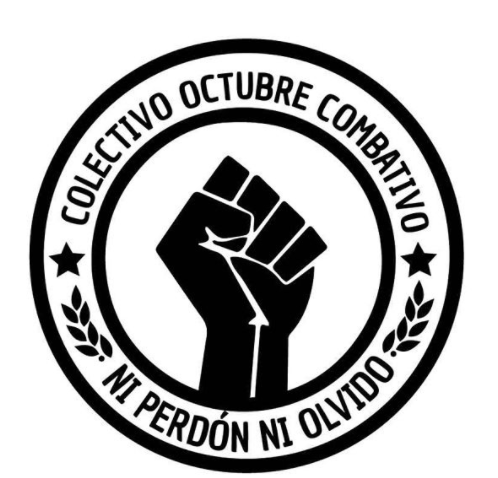

#### FOLIO: PG03
# Colectivo Octubre Combativo

[instagram](https://www.instagram.com/p/CFcU2cCH26f/)
[facebook](https://www.facebook.com/octubre.combativo.3)
[twitter]()
<colectivo.octubre.combativo.ph@gmail.com>
---

### Representantes
#### (Nombres o emails de voceros o representantes).

---
### Interacciones frecuentes
#### (listar otras organizaciones que habitualmente)
* Asamblea Territorial las Mercedes - Puente Alto
* Vecinos Mar de Drake - Pudahuel 
* Revolución Cerrillos (página de contrainformación y difusión)
*  Colectivo propaganda Padre Hurtado (propaganda -información)
* Asamblea villa Frei
* Asamblea mujeres y discidencias Maipú

### Redes sociales
#### ¿Para qué se utiliza la red social?
| Instagram | Facebook | Twitter | Otra 
|- |-| ---|---|
|Difusión de actividades, y difusión de información / contra información |Idem Ig|No aplica| No aplica|

### **Instagram**
| seguidores | seguidos | publicaciones | hashtag 
|---|---|---|---|
|700|164|367 publicaciones| 0

---

* **Actividad:**   

* Primera Publicación IG: 17 de Mayo 2020

---
### Frecuencia de publicación.

Publicaciones: Diarias 

Actividades: Semanales (3 veces por semana: lunes, miércoles y Viernes Ollas común)

---
### Ubicación
* Sector de la comununa/ciudad: Plazas/villas de Padre Hurtado - Itinerante: Villa Las Aralias, Villa Chiloé, Villa Río, Villa Padre Hurtado 2, Villa Newen

---
### Describir temas de interés y/o trabajo
#### Apoyo mutuo, organización y resistencia vecinal y territorial (cordón sur poniente), solidaridad, autonomía territorial. Proceso constituyente desde abajo/popular. 
---
### Describir la imagen ideal por la cual se trabaja.
#### (El horizonte hacia el cual se quiere avanzar.)
### "Gestiona tu propio territorio, la soberanía reside en el pueblo" "El pueblo ayuda al pueblo"
 > "Seguimos organizando solidaridad y resistencia Popular sin que el virus nos separe, nos meta en una sede o nos vincule al municipio.
OLLA COMÚN LIBRE Y SIN PERMISO". "Asamblea constituyente libre y soberana" 
---
### ¿Que se hace?
#### (Manifestaciones, marchas, intervenciones, actividades culturales, conversatorios, intercambio de saberes, actividades solidarias o de apoyo mutuo, abastecimiento, contra información, emplazamiento a autoridades etc.)
* Olla común itinerante 
* Panadería combativa
* Actividades solidarias: rifas
* Cacerolazos
* Onces comunes
* Protestas, marchas
* Celebración día del niñx
* Cabildo constituyente (Octubre) --> Ver declaración Anexa

---
### Describir y distinguir demandas más reivindicativas de espacios sin relación con lo contencioso o con lo político mas prefigurativo
#### (lo contencioso; demanda al Estado, a alguna autoridad, privados, etc), (prefigurativo, transformación desde lo cotidiano, etc.).
### Se dirigue a los vecinos y vecinas, emplaza a las autoridades locales (municipio) y gobierno central, y se desmarcan de cualquier institucionalidad o partido político. 
---
### Tipo de organización interna.
#### (Vocerías, asambleísmo, horizontalidad, etc.; *se entiende que esta dimensión es más difícil de captar vía análisis de redes sociales, pero quizás se puede vislumbrar a través de roles/cargos*)
 ### Horizontalidad 
---
### Describir los temas / imágenes- iconos / conceptos mas habitualmente presentes en sus publicaciones. Describir cambios/ transformaciones en los contenidos desde Octubre.

**Iconos:**
 

**Banderas:**

**Diseño estético:**

> Párrafo tipo cita 

---
### Percepciones que se tiene del Estado
#### (Aparato burocrático)
> resumen de lo encontrado

| Declaraciones | infografía | 
|---|---|
|"El peor virus es este gobierno criminal"|[Post - rayado en Ig](https://www.instagram.com/p/CAW2pM7HPcr/) |
|"No tenemos alcalde, gestiona tu propio territorio, la soberanía reside en el pueblo|---|

---
### Percepciones que se tiene de las Fuerzas de Orden
#### (Aparato represivo)
> resumen de lo encontrado

| Declaraciones | infografía | 
|---|---|
|Anotar los comunicados |  |

---
### Incorporar aca notas, citas textuales, links, etc. extra a los ya incorporados, que sean de interés para comprender tanto la forma como los contenidos asociados a la organización
[Declaración sobre Cabildo Constituyente](https://www.instagram.com/p/CGv5Xh3JZTw/)
> "CONVOCATORIA TERRITORIAL: Convocamos a todos aquellos y aquellas compas, vecinos y vecinas, a la primera reunión del Cabildo Constituyente Territorial, con objeto de entregar información a todo el territorio de Padre Hurtado en lo referido al proceso Asambleísta de construcción de una nueva Constitución Política que sea resultado de un proceso, realmente democrático, participativo, desde los barrios y poblaciones e incluyente de las problemáticas territoriales que nos afectan.
Sabemos que hay compas que han optado por votar y anhelan luchar por la Constituyente en la calle una vez conocida la victoria de la opción "apruebo". ¡Bien! Nosotrxs consideramos que ha llegado el momento de hacer valer su palabra y restarse de apoyar a los candidatos de partidos políticos que monopolizarán las listas de candidatos a convencionales en la elección de abril.
Como Colectivo nunca hemos renunciado a la lucha en las calles, la solidaridad de clase en los barrios y la conformación de redes territoriales e interterritoriales de organización popular. Nuestra disposición a la autoeducación popular ha fortalecido nuestra convicción de que la organización y la resistencia en las calles son elementos indispensables para conseguir las demandas que han estado en el corazón de la Insurrección Popular.
La gran diferencia que ostentamos con respecto a otras organizaciones sociales de Padre Hurtado es que nunca hemos aceptado intervención de ninguna clase por parte de instacias municipales, estatales o partidistas. Nuestro trabajo territorial se sustenta en la dignidad, independencia y capacidad de autogestión. Se nos han acercado los partidos políticos con ofrecimientos de candidaturas, ayudas a nuestras ollas comunes y panadería popular, la respuesta tajante del Octubre Combativo ha sido "a otro perro con ese hueso".
Nos restamos de utilizar el levantamiento popular con fines, egoístas y electorales. Sin embargo no nos cansaremos en denunciar a aquellos que levantan campañas municipales en medio de la crisis sanitaria, ocupando el proceso constitucional de Piñera y los partidos políticos para consagrar rostros desconocidos en los escenarios de protesta"