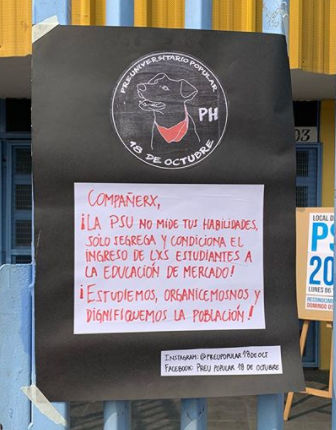

#### FOLIO:PH04
# Preu Popular 18 de Octubre

[instagram](https://www.instagram.com/preupopular18deoct/?hl=es-la)
[facebook]()
[twitter]()
<preu18deoctubre@gmail.com>
---

### Representantes
#### (Nombres o emails de voceros o representantes).
Escribir dm ig o al correo
---
### Interacciones frecuentes
#### (listar otras organizaciones que habitualmente)
* Asamblea Territorial Padre Hurtado
* Colectiva Madre Hurtade
* Colectivo propaganda padre hurtado 
* Colectivo Octubre Combativo 
* Red ayuda padre hurtado

### Redes sociales
#### ¿Para qué se utiliza la red social?
| Instagram | Facebook | Twitter | Otra 
|---|---|---|---|
|Difusiónd de información y actividades|No aplica|No aplica | No aplica|

### **Instagram**
| seguidores | seguidos | publicaciones | hashtag 
|---|---|---|---|
|461|142|19| 0

---

* **Actividad:**   

* Primera Publicación IG: 11 diciembre 2019

---
### Frecuencia de publicación.

Publicaciones: Semanales (cesa en Febrero y Julio vacaciones)

Actividades:Diarias (lunes a viernes) 18:00 - 21:00

---
### Ubicación
* Sector de la comununa/ciudad:  Junta de Vecinos El Renacer Villa Rio Aconcagua, dirección Los Silos 1396.

---
### Describir temas de interés y/o trabajo
Ayuda mutua, educación popular, diálogo, reflexión, autoconocimiento. Organización y vinculación territorial

---
### Describir la imagen ideal por la cual se trabaja.
#### (El horizonte hacia el cual se quiere avanzar.)
"NO + PSU" ¡Estudiemos  y organizémonos y dignifiquemos la población!
> "Nuestra misión como Preuniversitario Popular no es el de validar este nefasto método de selección universitaria que solo frustra, estandariza y segrega a lxs estudiantes en base a sus oportunidades socioeconómicas. NO QUEREMOS PSU, pero mientras ella exista nuestro objetivo será dar las herramientas necesarias para hacer del acceso a la educación y a las oportunidades un proceso más igualitario y accesible para nuestra gente"

> "El levantamiento de espacios educativos autónomos y autogestionado fuera de los márgenes de la educación convencional es un primer paso para revertir la segregación que nos afecta directamente."

 
---
### ¿Que se hace?
#### (Manifestaciones, marchas, intervenciones, actividades culturales, conversatorios, intercambio de saberes, actividades solidarias o de apoyo mutuo, abastecimiento, contra información, emplazamiento a autoridades etc.)
* Jornadas de ensayos gratuitos PSU
* Formación - preu online (zoom)
* Conversatorios y charlas
* Taller Vocacional 
* Foro dudas PSU - facebook
* Material PSU
* Talleres de contención emocional 
* Tutoría 
* "la revuelta Padre Hurtado en 200 palabras": Narraciones insurrectas de padre hurtado
---
### Describir y distinguir demandas más reivindicativas de espacios sin relación con lo contencioso o con lo político mas prefigurativo
#### (lo contencioso; demanda al Estado, a alguna autoridad, privados, etc), (prefigurativo, transformación desde lo cotidiano, etc.).
### Se dirigue a jóvenes de PH, emplaza al sistema educativo y al sistema neoliberal en el que se sostiene. 
---
### Tipo de organización interna.
#### (Vocerías, asambleísmo, horizontalidad, etc.; *se entiende que esta dimensión es más difícil de captar vía análisis de redes sociales, pero quizás se puede vislumbrar a través de roles/cargos*)
Horizontalidad 
---
### Describir los temas / imágenes- iconos / conceptos mas habitualmente presentes en sus publicaciones. Describir cambios/ transformaciones en los contenidos desde Octubre.

Perro mata pacos 
**Iconos:**

**Banderas:**

**Diseño estético:**

> Párrafo tipo cita 

---
### Percepciones que se tiene del Estado
#### (Aparato burocrático)
> resumen de lo encontrado

| Declaraciones | infografía | 
|---|---|
|Anotar los comunicados |  |

---
### Percepciones que se tiene de las Fuerzas de Orden
#### (Aparato represivo)
> resumen de lo encontrado

| Declaraciones | infografía | 
|---|---|
|Anotar los comunicados |  |

---
### Incorporar aca notas, citas textuales, links, etc. extra a los ya incorporados, que sean de interés para comprender tanto la forma como los contenidos asociados a la organización
* [Datos e infografía sobre situación educacional en PH](https://www.instagram.com/p/B7MNQcknpQ2/)
* [Video - discurso preuniversitario popular](https://www.instagram.com/p/CGiIDH7n0p-/)