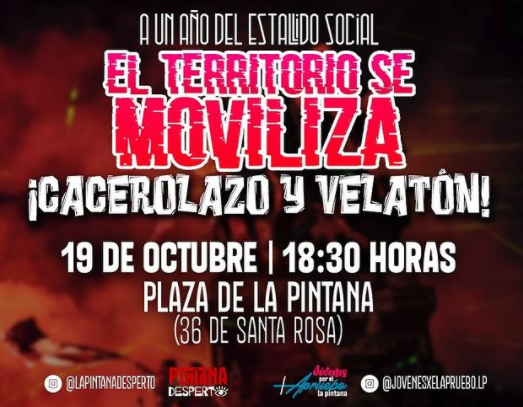
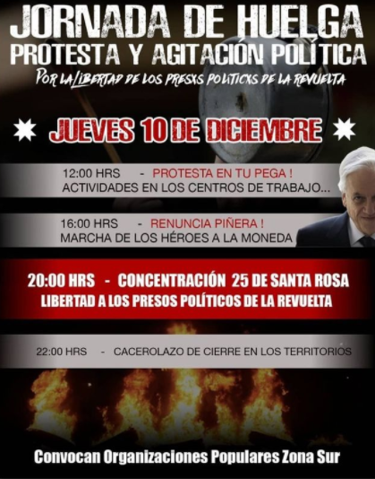
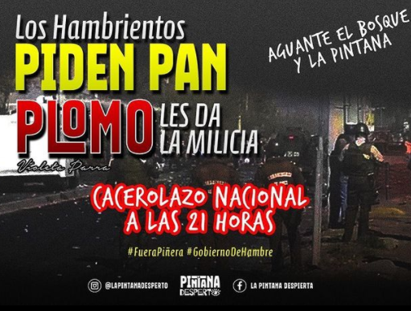
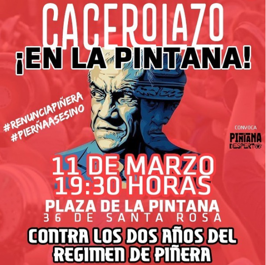

#### FOLIO: PIN01
# La Pintana Desperto

[instagram](https://www.instagram.com/lapintanadesperto/?hl=es-la)
[facebook]()
[twitter]()
<correo@correo.cl>
---

### Representantes
#### (Nombres o emails de voceros o representantes).
dm al Ig 
---
### Interacciones frecuentes
#### (listar otras organizaciones que habitualmente)
* La Granja Movilizada 
* Niñxs y Cabrxs en resistencia Puente Alto
* Capuchas revolucionarios 
* Feministas La Pintana 
* El Bosque resiste

### Redes sociales
#### ¿Para qué se utiliza la red social?
| Instagram | Facebook | Twitter | Otra 
|---|---|---|---|
|DIFUSIÓN DE INFO Y ACTIVIDADES|0|0| 0|

### **Instagram**
| seguidores | seguidos | publicaciones | hashtag 
|---|---|---|---|
|1999|680|60| 0

---

* **Actividad:**   

* Primera Publicación IG:4  Noviembre 2019 (Enero y Febrero Inactiva, Junio Inactiva), actualmente activa 

---
### Frecuencia de publicación.

Publicaciones: SEMANAL

Actividades: SEMANAL 

---
### Ubicación
* Sector de la comununa/ciudad: Se juntan en Cúpula de La Plaza de Armas.  (Paradero 36 de Santa Rosa)

---
### Describir temas de interés y/o trabajo
* Proceso constituyente/Apruebo, feminismo, vinculación zona sur, DDHH, participación jóvenes y adolesencia en proceso constituyente.

---
### Describir la imagen ideal por la cual se trabaja.
#### (El horizonte hacia el cual se quiere avanzar.)
* Apruebo Nueva Constitución, acusación constitucional y renuncia de piñera, resistencia zona sur. Justicia para antonia, Ambar, y para todas las compañeras! ¡Chile Digno! ¡Vivienda digna y segura para todxs! Libertad a los presos políticos de la revuelta

---
### ¿Que se hace?
#### (Manifestaciones, marchas, intervenciones, actividades culturales, conversatorios, intercambio de saberes, actividades solidarias o de apoyo mutuo, abastecimiento, contra información, emplazamiento a autoridades etc.)
* Cabildos
* Velatones
* Cacerolazo
* Festivales de música
* Marchas 
* Conversatorios 
* Intervención artística (Las Tesis)
* Creación comando juvenil Chile Digno
* Banderazo por el apruebo 
* Jornada muralista por el apruebo 
---
### Describir y distinguir demandas más reivindicativas de espacios sin relación con lo contencioso o con lo político mas prefigurativo
#### (lo contencioso; demanda al Estado, a alguna autoridad, privados, etc), (prefigurativo, transformación desde lo cotidiano, etc.).
* Se dirige a vecinxs de la pintana a seguir manifestándose,  además emplaza al gobierno y a piñera por ser culpables de violación a ddhh. 

> ¡Vecinos y vecinas no hemos ganada, a manifestarsey gritar fuerte el descontento! 
---
### Tipo de organización interna.
#### (Vocerías, asambleísmo, horizontalidad, etc.; *se entiende que esta dimensión es más difícil de captar vía análisis de redes sociales, pero quizás se puede vislumbrar a través de roles/cargos*)
* Horizontal 
---
### Describir los temas / imágenes- iconos / conceptos mas habitualmente presentes en sus publicaciones. Describir cambios/ transformaciones en los contenidos desde Octubre.

**Iconos:**

 

**Banderas:**

**Diseño estético:**

> Párrafo tipo cita 

---
### Percepciones que se tiene del Estado
#### (Aparato burocrático)
> resumen de lo encontrado

| Declaraciones | infografía | 
|---|---|
|Anotar los comunicados |  |

---
### Percepciones que se tiene de las Fuerzas de Orden
#### 
> Reproche absoluto

| Declaraciones | infografía | 
|---|---|
|"No + día del paco culiao, no + parada militar, asesinos del pueblo! |  |

---
### Incorporar aca notas, citas textuales, links, etc. extra a los ya incorporados, que sean de interés para comprender tanto la forma como los contenidos asociados a la organización.