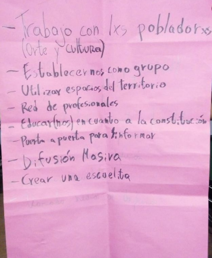
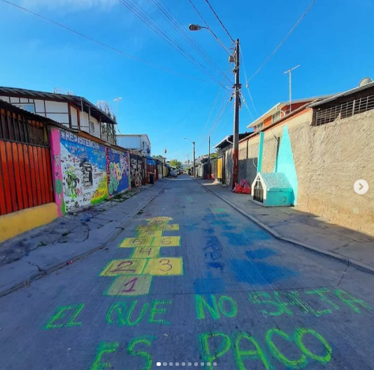
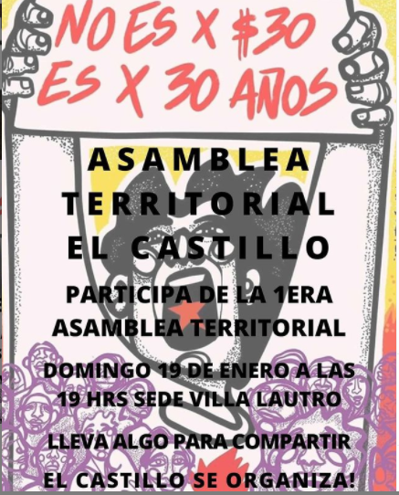
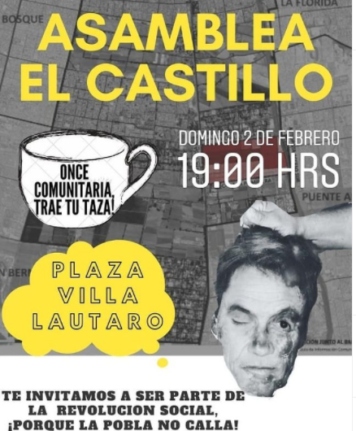
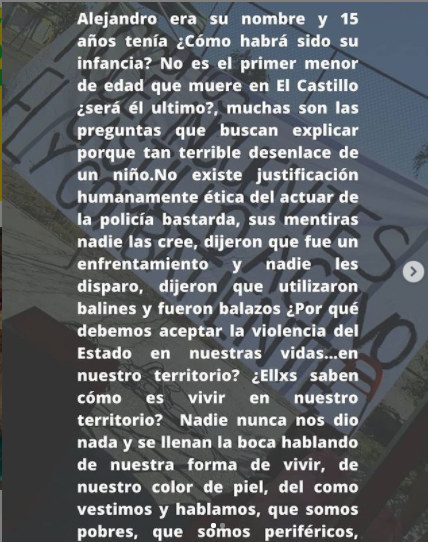
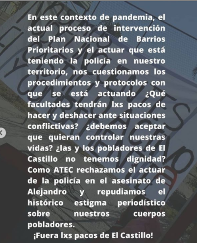

#### FOLIO: PIN03
# Asamblea El Castillo

[instagram](https://www.instagram.com/asambleaterritorialelcastillo/)
[facebook]()
[twitter]()
<asambleaterritorialelcastillo@gmail.com>
---

### Representantes
#### (Nombres o emails de voceros o representantes).
asambleaterritorialelcastillo@gmail.com 
---
### Interacciones frecuentes
#### (listar otras organizaciones que habitualmente)
* Colectiva feminista Teresa Flores
* Cordon Macul
* Cabildo la Alborada, La Florida
* Movimiento Salud en Resistencia
* Agrupación PopularAutónoma Quilicura (APAQ)
* Escuela Crítica de Salud(Conce y Valpo)

### Redes sociales
#### ¿Para qué se utiliza la red social?
| Instagram | Facebook | Twitter | Otra 
|---|---|---|---|
|DIFUSIÓN DE INFO Y ACTIVIDADES|0|0| 0|

### **Instagram**
| seguidores | seguidos | publicaciones | hashtag 
|---|---|---|---|
|712|160|53| 0

---

* **Actividad:**   

* Primera Publicación IG: 12 Enero 2020 (En junio estuvo inactiva), Inactiva desde 19 Octubre 2020

---
### Frecuencia de publicación.

Publicaciones: Semanal(1)

Actividades: Semanal 

---
### Ubicación
* Sector de la comununa/ciudad: Población El Castillo, Villa Lautaro. El Lingue 02849

---
### Describir temas de interés y/o trabajo
* organización territorial, trabajo entre pobladores, educación popular, autogestión. DDHH y memoria histórica. Feminismo
---
### Describir la imagen ideal por la cual se trabaja.
#### (El horizonte hacia el cual se quiere avanzar.)
* ¡El castillo se organiza y lucha! ¡Hasta que la dignidad se haga costumbre, Libertad a los presos políticos de la revuelta. Apruebo convención constituyente
No somos ni de derecha ni de izquierda, somos los de abajo y vamos por los de arriba" ¡Solo el pueblo ayuda al pueblo! 
> **"NO SOMOS DELINCUENTES,
LA PINTANA ACTIVA Y COMBATIENTE"** 

### primera Asamblea
---
### ¿Que se hace?
#### (Manifestaciones, marchas, intervenciones, actividades culturales, conversatorios, intercambio de saberes, actividades solidarias o de apoyo mutuo, abastecimiento, contra información, emplazamiento a autoridades etc.)
* Asamblea 
* Onces comunitarias 
* Creación de lienzos
* Jornada nocturna de intervención gráfica "los muros gritan lo que el pueblo oprimido calla" 
* Ciclo de Cine 
* Cacerolazos
* Conversaotrios
* Jornadas artísticas
* Recomendaciones y actividades para niñes en pandemia (afiches)
* Velatones 
* Relatos de revuelta
* Apoyo y acopio para ollas comunes
* Ayuda y difusión de emprendimientos de la comuna 

---
### Describir y distinguir demandas más reivindicativas de espacios sin relación con lo contencioso o con lo político mas prefigurativo
#### (lo contencioso; demanda al Estado, a alguna autoridad, privados, etc), (prefigurativo, transformación desde lo cotidiano, etc.).
* Se dirige a todxs lxs vecinxs, pobladores. ¡PORQUE LA POBLA NO CALLA Y SE ORGANIZA!
---
### Tipo de organización interna.
#### (Vocerías, asambleísmo, horizontalidad, etc.; *se entiende que esta dimensión es más difícil de captar vía análisis de redes sociales, pero quizás se puede vislumbrar a través de roles/cargos*)
horizontalidad, asamblea 
---
### Describir los temas / imágenes- iconos / conceptos mas habitualmente presentes en sus publicaciones. Describir cambios/ transformaciones en los contenidos desde Octubre.

**Iconos:**

**Banderas:**

**Diseño estético:**

> Párrafo tipo cita 

---
### Percepciones que se tiene del Estado
#### (Aparato burocrático)
> resumen de lo encontrado

| Declaraciones | infografía | 
|---|---|
|Anotar los comunicados |  |

---
### Percepciones que se tiene de las Fuerzas de Orden
#### (Aparato represivo)
> resumen de lo encontrado

| Declaraciones | infografía | 
|---|---|
|Anotar los comunicados |  |

---
### Incorporar aca notas, citas textuales, links, etc. extra a los ya incorporados, que sean de interés para comprender tanto la forma como los contenidos asociados a la organización.

* Comunicado 23 de Marzo:

> Hemos podido darnos cuenta que el gobierno sigue su inoperancia a lo largo de estos días con nefastas decisiones que mantienen al pueblo oprimido con medidas insuficientes que siguen precarizando más nuestras vidas día a día. Se asume tales acciones como una total falta de respeto al pueblo que ha salido a tomarse las calles. Después de 5 arduos meses de revuelta y resistencia por parte del pueblo, solo obtenemos soberbia y autoritarismo de este gobierno pseudodemocrático.
Día a día siguen naciendo más futuros jóvenes combatientes que defenderán al pueblo soberano sumido en violencia ejercida por el estado opresor, la sangre hierve por las venas de los que aún no han caído que mantienen la moral en alto contra el verde uniforme. El olor a caos, revuelta y barricada en la acera no es más que el perfume de la libertad que ha dejado nuestra revolución.
Por quienes han decidido no vivir arrodillados y han decidido morir de pie antes que ceder, jóvenes combatientes que hoy viven en nuestros corazones luchadores, reales ejemplos de valentía, es imposible olvidar vuestras acciones y el legado trazado.
Este 29 de Marzo será una fecha muy especial y diferente al común de los otros años, por autocuidado y de los demás convocamos a una manifestación cercana a sus hogares tomando las precauciones suficientes por la contingencia actual de la epidemia del coronavirus.
Prende una vela por los caídos, alza una bandera negra en luto, pon un cartel con una consigna de protesta o cacerolea desde la puerta de tu casa, instamos a generar un espacio de protesta dentro de nuestra población para no olvidar a quienes han luchado para hacer de este país un lugar mejor para cada uno de nosotros.

Invitamos también para que ese día graben su caceroleo y nos envíen su registro!

Asamblea Territorial El Castillo🔥
HASTA VENCER O VENCER

* Declaración pública ante donación de dinero Las Condes - La Pintana: 

> "Para transparencia y claridad: Los mil millones de pesos que donó la Municipalidad de Las Condes a La Pintana no han sido transferidos aún y no serán transferidos nunca, sino que financiarán proyectos de mejoramiento urbano en El Castillo, una vez que se ejecuten. Así reglamenta el convenio y así lo explica el alcalde de esa comuna, Joaquín Lavín. Esperamos que durante este año, pese a todas las dificultades, las obras puedan estar listas. 👍🏼" Palabras de la Alcaldesa Claudia Pizarro.
Ante esta situación declaramos lo siguiente:
DECLARACIÓN PÚBLICA ASAMBLEA TERRITORIAL EL CASTILLO ¿En qué parte está nuestra autonomía como comuna? ¿Por qué el dinero que nos corresponde debe ser manejado por quién no representa a la comuna? Y además por quién ni siquiera conoce la realidad en la que viven pobladores y pobladoras de la comuna y tampoco las necesidades que acá existen?
Cabe recordar que el dinero se donó con el fin de apaciguar el movimiento social iniciado el 18 de octubre, con gestiones de la cúspide económica chilena haciendo acción de "misericordia hacia los pobres". Las Condes, su municipio y el gobierno militar, cómplices de violencia estructural contra nuestra comunidad, expulsando y erradicando a personas con necesidades llevándolos a sectores con viviendas indignas con condiciones de hacinamiento, espacios públicos insuficientes.
Siendo nuestra comuna una de las que tiene más necesidades en este país, permitimos la burla de una de las cuales posee más ingresos y para más colmo el dinero es controlado por los mismos "donantes", consideramos el gesto como una expresión por remarcar la superioridad clasista de la comuna de las Condes por sobre la nuestra.
Por último, los recursos u obras públicas realizadas dentro de la comuna no deben ser administrados por quien ni conoce la comuna como lo es Lavín. Necesitamos desde ya una forma diferente de como realizar las cosas a través de la democratización de parte de los recursos que nos pertenecen como habitantes de la comuna, no queremos vivir más sometidos bajo el poder de los ricos de este país y por eso, lucharemos por nuestra autonomía.