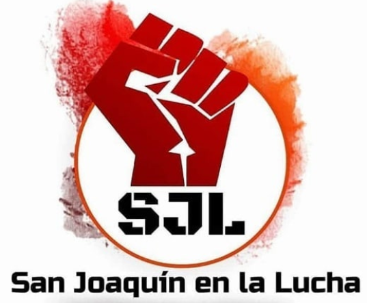

#### FOLIO: SAJ01
# San Joaquín en la Lucha

[instagram]()
[facebook]()
[twitter]()
<sanjoaquinenlalucha@gmail.com>
---

### Representantes
#### (Nombres o emails de voceros o representantes).
Enviar dm instagram o mail.
---
### Interacciones frecuentes
#### (listar otras organizaciones que habitualmente)
* Olla común mujeres de la legua 
* Coordinadora 18 de Octubre 
* 
### Redes sociales
#### ¿Para qué se utiliza la red social?
| Instagram | Facebook | Twitter | Otra 
|---|---|---|---|
|Difusión de información y difusión de actividades|0|0| 0|

### **Instagram**
| seguidores | seguidos | publicaciones | hashtag 
|---|---|---|---|
|6,229|2,429|938| 0

---

* **Actividad:**   

* Primera Publicación IG: 4 Febrero

---
### Frecuencia de publicación.

Publicaciones: Diarias

Actividades: Semanales

---
### Ubicación
* Sector de la comununa/ciudad: San Joaquín
Se juntan en monumento Salvador Allende
---
### Describir temas de interés y/o trabajo
#### Solidaridad, agitación popular, poder popular, protestas, libertad presos políticos de la revuelta
---
### Describir la imagen ideal por la cual se trabaja.
#### (El horizonte hacia el cual se quiere avanzar.)
> Cambiar por completo el "sistema nefasto". "Solo el pueblo ayuda al pueblo" "Unete y planifiquemos juntos sin politizar, solo luchar" "Amulepe Taiñ Weichan"
---
### ¿Que se hace?
#### (Manifestaciones, marchas, intervenciones, actividades culturales, conversatorios, intercambio de saberes, actividades solidarias o de apoyo mutuo, abastecimiento, contra información, emplazamiento a autoridades etc.)
* Cacerolazo comunal
* Cortes de rutas
* Evasión al transporte
* Onces comunitarias 
* Marchas
* Olla común libertaria
* Lucatón solidaria
* Entrega de canastas de alimentos
* Difusión de actividades y emprendimiento de vecinos durante pandemia
* Cicletada Territorial
* Asamblea territorial
* Talleres (primeros auxilios en protesta)

---
### Describir y distinguir demandas más reivindicativas de espacios sin relación con lo contencioso o con lo político mas prefigurativo
#### (lo contencioso; demanda al Estado, a alguna autoridad, privados, etc), (prefigurativo, transformación desde lo cotidiano, etc.). 
Se dirige a los vecinos a unirse en la lucha, que se sumen a participar, además emplaza a carabineros de chile como el brazo asesino del estado.
---
### Tipo de organización interna.
#### (Vocerías, asambleísmo, horizontalidad, etc.; *se entiende que esta dimensión es más difícil de captar vía análisis de redes sociales, pero quizás se puede vislumbrar a través de roles/cargos*)
Asamblea - horizontalidad
---
### Describir los temas / imágenes- iconos / conceptos mas habitualmente presentes en sus publicaciones. Describir cambios/ transformaciones en los contenidos desde Octubre.
Inician actividad en febrero, desde ahí ha sido sostenida, siguen la línea de difundir mucha información y actividades, de índole sobre todo combativa, territorial y solidaria (acopio, ollas, etc)
**Iconos:**

 
**Banderas:**

**Diseño estético:** rojo, naranjo, blanco. Fuego. 

> Párrafo tipo cita 

---
### Percepciones que se tiene del Estado
#### (Aparato burocrático)
> resumen de lo encontrado

| Declaraciones | infografía | 
|---|---|
|Anotar los comunicados |  |

---
### Percepciones que se tiene de las Fuerzas de Orden
#### (Aparato represivo)
> Odio hacia carabineros, uso de #ACAB.

| Declaraciones | infografía | 
|---|---|
|"Sicarios de Chile, tortura, violación, asesinato| [imagen - mural con la consigna, publicación Ig](https://www.instagram.com/p/CA6wzgfpQk2/) |

---
### Incorporar aca notas, citas textuales, links, etc. extra a los ya incorporados, que sean de interés para comprender tanto la forma como los contenidos asociados a la organización