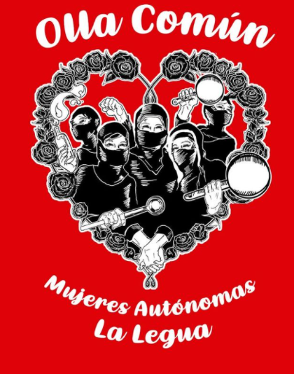

#### FOLIO: SAJ07
# Olla Mujeres de la Legua 

[instagram](https://www.instagram.com/olla_comujeresdelalegua/)
[instagram 2](https://www.instagram.com/alimentando.la.resistencia/)
[twitter]()
<correo@correo.cl>
---

### Representantes
#### (Nombres o emails de voceros o representantes).
Escribir dm al ig (el actual es alimentando la resistencia)
---
### Interacciones frecuentes
#### (listar otras organizaciones que habitualmente)
* San Joaquín en la lucha 

### Redes sociales
#### ¿Para qué se utiliza la red social?
| Instagram | Facebook | Twitter | Otra 
|---|---|---|---|
|Difusión de información y actividades|0|0| 0|

### **Instagram** (el antiguo)
| seguidores | seguidos | publicaciones | hashtag 
|---|---|---|---|
|334|109|22| 0

---

* **Actividad:**   

* Primera Publicación IG: 8 Marzo (activas, cambiaron página de instagram)

---
### Frecuencia de publicación.

Publicaciones: Inició mensual, con cambio de Ig ahora es semanal. 

Actividades: semanales 

---
### Ubicación
* Sector de la comununa/ciudad: La Legua 

---
### Describir temas de interés y/o trabajo
Alimentación comunitaria, autogestión territorial, apoyo mutuo, autonomía
---
### Describir la imagen ideal por la cual se trabaja.
#### (El horizonte hacia el cual se quiere avanzar.)
Autogestión territorial. 
---
### ¿Que se hace?
#### (Manifestaciones, marchas, intervenciones, actividades culturales, conversatorios, intercambio de saberes, actividades solidarias o de apoyo mutuo, abastecimiento, contra información, emplazamiento a autoridades etc.)
* Olla común 
* Recolección y acopio comida y artículos de aseo 
---
### Describir y distinguir demandas más reivindicativas de espacios sin relación con lo contencioso o con lo político mas prefigurativo
#### (lo contencioso; demanda al Estado, a alguna autoridad, privados, etc), (prefigurativo, transformación desde lo cotidiano, etc.).
Se dirige a mujeres pobladoras de la legua que quieran ayudar con cariño y cocina a la población. "Con cariño desde la legua"
---
### Tipo de organización interna.
#### (Vocerías, asambleísmo, horizontalidad, etc.; *se entiende que esta dimensión es más difícil de captar vía análisis de redes sociales, pero quizás se puede vislumbrar a través de roles/cargos*)
Horizontalidad, respeto.
---
### Describir los temas / imágenes- iconos / conceptos mas habitualmente presentes en sus publicaciones. Describir cambios/ transformaciones en los contenidos desde Octubre.

**Iconos:**

**Banderas:**

**Diseño estético:**

> Párrafo tipo cita 

---
### Percepciones que se tiene del Estado
#### (Aparato burocrático)
> resumen de lo encontrado

| Declaraciones | infografía | 
|---|---|
|Anotar los comunicados |  |

---
### Percepciones que se tiene de las Fuerzas de Orden
#### (Aparato represivo)
> resumen de lo encontrado

| Declaraciones | infografía | 
|---|---|
|Anotar los comunicados |  |

---
### Incorporar aca notas, citas textuales, links, etc. extra a los ya incorporados, que sean de interés para comprender tanto la forma como los contenidos asociados a la organización