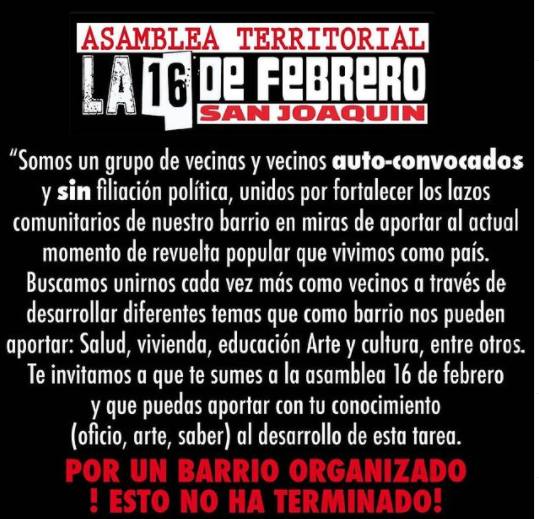

#### FOLIO: SAJ08
# Asamblea Territorial 16 de Febrero 

[instagram](https://www.instagram.com/aterritorial16defeb/)
[facebook]()
[twitter]()
<correo@correo.cl>
---

### Representantes
#### (Nombres o emails de voceros o representantes).
Escribir dm instagram 
---
### Interacciones frecuentes
#### (listar otras organizaciones que habitualmente)
* Stgo Norte Pedalea
* Difusión Territorial San Joaquín
* Asamblea Territorial San Miguel 3
* Frente Juvenil San Joaquín 
* San Joaquín en la Lucha
* San Joaquín Pedalea 

### Redes sociales
#### ¿Para qué se utiliza la red social?
| Instagram | Facebook | Twitter | Otra 
|---|---|---|---|
|Difusión de información y actividades|No aplica|No aplica| No aplica|

### **Instagram**
| seguidores | seguidos | publicaciones | hashtag 
|---|---|---|---|
|949|2,088|147| 0

---

* **Actividad:**   

* Primera Publicación IG: 27 Diciembre 2019 (actuamente activa, celebraron 1 año 13 noviembre)

---
### Frecuencia de publicación.

Publicaciones: Semanal (3 - 4 veces)

Actividades: Semanales (1, 2)- Continuas. 

---
### Ubicación
* Sector de la comununa/ciudad: Barrio 16 de Febrero y Villa Nueva, San Joaquín. Plaza Jarana, Ingeniero Budge con Diego Meza. 

---
### Describir temas de interés y/o trabajo
Autonomía Apoyo mutuo, solidaridad, vida en comunidad/ unión vecinal-barrial, NO + PSU, NUEVA CONSTITUCIÓN. Recuperación y memori histórica del barrio
---
### Describir la imagen ideal por la cual se trabaja.
#### (El horizonte hacia el cual se quiere avanzar.)
#### "Buscamos unirnos cada vez más como vecinos" Asamblea constituyente, nueva constitución, fortalecer lazos comunitarios, "que la exigencia del pueblo se convierta en realidad".   "Abajo el neoliberalismo" "Las calles son del pueblo" "apoya al capuchx de tu barrio"

 
---
### ¿Que se hace?
#### (Manifestaciones, marchas, intervenciones, actividades culturales, conversatorios, intercambio de saberes, actividades solidarias o de apoyo mutuo, abastecimiento, contra información, emplazamiento a autoridades etc.)
* Onces comunitarias 
* Festival cultural por la resistencia organizada 
* Conmemoraciones 
* Cicletadas
* Cacerolazos 
* Campañas de ayuda 
* Jornadas de acopio 
* Rifas Solidarias
* Olla común 
* Taller Mapeo colectivo para recuperación del barrio(Nov 2020) https://www.instagram.com/p/CHmNJRsJeau/

---
### Describir y distinguir demandas más reivindicativas de espacios sin relación con lo contencioso o con lo político mas prefigurativo
#### (lo contencioso; demanda al Estado, a alguna autoridad, privados, etc), (prefigurativo, transformación desde lo cotidiano, etc.).
Se dirige a vecinos y vecinas del barrio a involucrarse y unirse lo que más puedan como vecinos, y a generar lazos solidarios entre todxs.
---
### Tipo de organización interna.
#### (Vocerías, asambleísmo, horizontalidad, etc.; *se entiende que esta dimensión es más difícil de captar vía análisis de redes sociales, pero quizás se puede vislumbrar a través de roles/cargos*)
Asamblea, horizontalidad, comisiones salud, vivienda, educación, arte y cultura, etc. 
---
### Describir los temas / imágenes- iconos / conceptos mas habitualmente presentes en sus publicaciones. Describir cambios/ transformaciones en los contenidos desde Octubre.

**Iconos:**

**Banderas:**

**Diseño estético:**

> Párrafo tipo cita 

---
### Percepciones que se tiene del Estado
#### (Aparato burocrático)
> "Estado Asesino" (ver declaración anexa)

| Declaraciones | infografía | 
|---|---|
|"Apoyemonos entre nosotrxs ya que el gobierno brilla en su ausencia." |  |

---
### Percepciones que se tiene de las Fuerzas de Orden
#### (Aparato represivo)
> resumen de lo encontrado

| Declaraciones | infografía | 
|---|---|
|Anotar los comunicados |  |

---
### Incorporar aca notas, citas textuales, links, etc. extra a los ya incorporados, que sean de interés para comprender tanto la forma como los contenidos asociados a la organización
Declaración 16 Junio
> Es importante que nuestras próximas generaciones crescan con fuerza, que no teman, y que nunca les callen , que sus sueños no se vean troncados por un sistema capitalista, clasista y rasista.
Todoxs juntxs posterior a la pandemia seguiremos con nuestra lucha por generar un país y mundo más consiente.
Por la gente trabajadora pelearemos por su dignidad. Por los estudiantes pelearemos por su dignidad, Por los pensionadxs pelearemos por su dignidad.
Para un mundo mejor seguiremos peleando por justicia .Arriba las organizaciones territoriales y que Nasca luz y Esperanza para el pueblo trabajador, que bien lo merece.Atentamente: ASAMBLEA TERRITORIAL LA16 DE FEBRERO. DE SAN JOAQUIN ( $HIL€ ) .
Fuego al estado asesino.