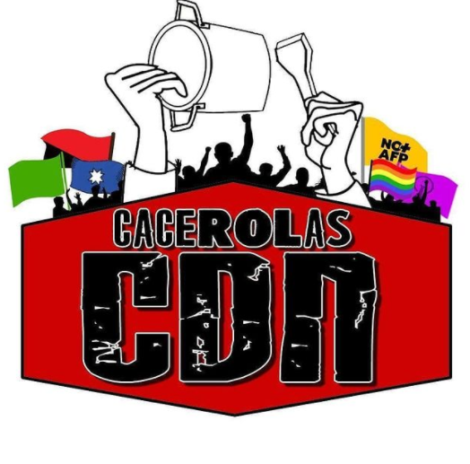

#### FOLIO: SAM01 
# SAN MIGUEL RESISTENTE 

[instagram]()
[facebook]()
[twitter]()
<correo@correo.cl>
---

### Representantes
#### (Nombres o emails de voceros o representantes).
Dm instagram
---
### Interacciones frecuentes
#### (listar otras organizaciones que habitualmente)
* Asamblea ciudad del niño San Miguel - territorio 6
* San joaquín en la lucha 
* la pac pedalea 
* Pedal Insurrecta San Miguel  

### Redes sociales
#### ¿Para qué se utiliza la red social?
| Instagram | Facebook | Twitter | Otra 
|---|---|---|---|
|Difusión de actividades, difusión de información|0|0| 0|

### **Instagram**
| seguidores | seguidos | publicaciones | hashtag 
|---|---|---|---|
|2,578|200|137| 0

---

* **Actividad:**   

* Primera Publicación IG: 23 Noviembre 2019 (activa)

---
### Frecuencia de publicación.

Publicaciones: Semanales (3,4 veces). Desde abril mensual (3,4 veces)

Actividades: Semanales hasta marzo. 

---
### Ubicación
* Sector de la comununa/ciudad: Barrio / Metro ciudad del niño 

---
### Describir temas de interés y/o trabajo
#### apoyo mutuo, organización territorial - vecinal, solidaridad, activisimo carcelario, feminismo, apoyo juventudes movilizadas. Nueva constitución Apruebo - convención constitucional. 
---
### Describir la imagen ideal por la cual se trabaja.
#### (El horizonte hacia el cual se quiere avanzar.)
* Les dejamos invitados a seguir resistiendo en esta lucha, hasta que la dignidad se haga costumbre. "Hasta que "Ciudad del niño barrio resistente". "La lucha como estilo de vida"
---
### ¿Que se hace?
#### (Manifestaciones, marchas, intervenciones, actividades culturales, conversatorios, intercambio de saberes, actividades solidarias o de apoyo mutuo, abastecimiento, contra información, emplazamiento a autoridades etc.)
* Cacerolazos permanentes
* Intervenciones artísticas 
* Marchas territoriales 
* Once comunitaria 
* Cicletada por San Miguel 
* Empapelado
* Velatón por lxs caídos 
* Colectta/Acopio para canastas 
---
### Describir y distinguir demandas más reivindicativas de espacios sin relación con lo contencioso o con lo político mas prefigurativo
#### (lo contencioso; demanda al Estado, a alguna autoridad, privados, etc), (prefigurativo, transformación desde lo cotidiano, etc.).

#### Se dirige a jóvenes y vecinos del barrio ciudad del niño, a que todos se organicen, y se sientan parte de la comuna de SM, como una comuna obrera y resistente. Se demanda resistencia y a no bajar los brazos frente a las exigencias hacia el estado. 
---
### Tipo de organización interna.
#### (Vocerías, asambleísmo, horizontalidad, etc.; *se entiende que esta dimensión es más difícil de captar vía análisis de redes sociales, pero quizás se puede vislumbrar a través de roles/cargos*)

### Asamblea / horizontalidad 
---
### Describir los temas / imágenes- iconos / conceptos mas habitualmente presentes en sus publicaciones. Describir cambios/ transformaciones en los contenidos desde Octubre.

**Iconos:**

**Banderas:**

**Diseño estético:**

> Párrafo tipo cita 

---
### Percepciones que se tiene del Estado
#### (Aparato burocrático)
> resumen de lo encontrado

| Declaraciones | infografía | 
|---|---|
|Anotar los comunicados |  |

---
### Percepciones que se tiene de las Fuerzas de Orden
#### (Aparato represivo)
> resumen de lo encontrado

| Declaraciones | infografía | 
|---|---|
|La 12 comiseria de San Miguel es la segunda comí con más apremios ilegitimos. Cabe decir que se supone que no se ocuparían más perdigones para reprimir. Hoy hubo una fuerte represión contra nosotrxs nuevamente, Aún así no bajaremos los brazos y seguiremos pero queremos mostrar como nos tratan los pacos de la 12. Pero sepan que aún así estaremos ahí resistiendo porque somos una generación que no tiene miedo, aguante vecinxs | [link publicación - imagen de perdigones](https://www.instagram.com/p/B6udx54JZs0/) |
"Ante la represión arriba la lucha y la organización." (Sobre caso Puente PIO NONO) | 

---
### Incorporar aca notas, citas textuales, links, etc. extra a los ya incorporados, que sean de interés para comprender tanto la forma como los contenidos asociados a la organización

> "ciudad del niño seguirá siendo zona de resistencia porque aún no se ha conseguido nada, así que amigxs los invito a empezar a motivarse y despertar más que nunca porque sigue muriendo gente, siguen llevándose a presxos por luchar. Arriba los que luchan con o sin capucha || San Miguel ciudad del niño presente|" - [link publicación 19 febrero 2020]( |https://www.instagram.com/p/B8xDuL0pHMH/) 

> _Declaración Octubre Combativo_: OCTUBRE CONMEMORATIVO Y COMBATIVO     
Comenzó el mes que ha marcado un antes y un después en las luchas por los derechos sociales que se nos negaron aún en la vuelta a la "democracia". Nos querían cansados y sobreviviendo a este Chile desigual. Llegó octubre, donde nos toca luchar por los que cayeron en dictadura luchando por ese Chile digno, por ese Chile construido por todos y todas. Octubre, un mes del despertar de los territorios y de Chile entero.  Gente no olviden que el proceso del plebicisito es el inicio de hacer y sentir la  lucha como estilo de vida. Nunca más sin los pueblos originarios, nunca más sin  presos y presas en la revuelta, nunca más sin las mujeres, nunca más sin lxs niñxs, nunca más sin los adultos mayores. "ARRIBA LOS Y LAS QUE LUXHAN CON Y SIN CAPUCHA".