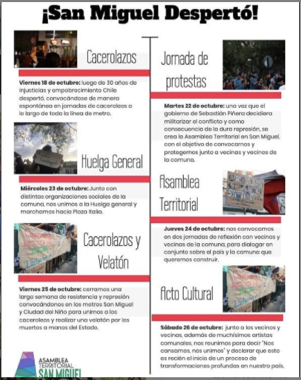
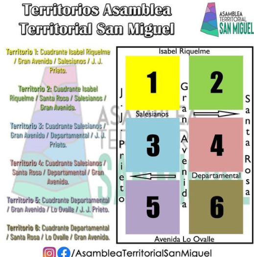

#### FOLIO: SAM03
# Asamblea Territorial San Miguel 

[instagram](https://www.instagram.com/asambleaterritorialsanmiguel/)
[facebook](https://www.facebook.com/asambleaterritorialsanmiguel/)
[twitter]()
<asambleaterritorialsanmiguel@gmail.com>
---

### Representantes
#### (Nombres o emails de voceros o representantes).
#### 
* escribir dm al ig, mail o a cada asamblea específica por unidad territorial. 
---
### Interacciones frecuentes
#### (listar otras organizaciones que habitualmente)
* Asamblea Territoal SM Territorio 1
* ASTM Unidad territorial 2
* Asamblea Territorial SM Territorio3
* ATSM Territorio 4
* ATSM Territorio 5
* Asamblea Ciudad del Niño Territorio 6
* San Miguel resistente - ciudad del niño

### Redes sociales
#### ¿Para qué se utiliza la red social?
| Instagram | Facebook | Twitter | Otra 
|---|---|---|---|
|Difusión de información, difusión de actividades|Ídem Ig|0| Youtube: Podcasts|

### **Instagram**
| seguidores | seguidos | publicaciones | hashtag 
|---|---|---|---|
|6,353|362|268| 0

---

* **Actividad:**   

* Primera Publicación IG: 23 Octubre 2019 (Activa)

---
### Frecuencia de publicación.

Publicaciones: Diarias

Actividades: Hasta marzo 2020 5 veces semana, martes sábado.

---
### Ubicación
* Sector de la comuna/ciudad: Plaza 12 de Octubre y Centro cultural la Minga, Carlos Edwards 1590 

---
### Describir temas de interés y/o trabajo
### 
*  Apoyo mutuo, educación popular, organización y unión vecinal,  recuperación y apropiación de espacios (ciclovías, parques, plazas). 
---
### Describir la imagen ideal por la cual se trabaja.
#### (El horizonte hacia el cual se quiere avanzar.)
* Se exige asamblea constituyente que integre a todos los sectores políticos y sociales, para transformar los pilares estructurales que propician la mercantilización de la vida social. (Ver declaración #1 anexa y ver demandas Comuna San Miguel)
---
### ¿Que se hace?
#### (Manifestaciones, marchas, intervenciones, actividades culturales, conversatorios, intercambio de saberes, actividades solidarias o de apoyo mutuo, abastecimiento, contra información, emplazamiento a autoridades etc.)
* Protesta
* Difusión de cancionero de protesta
* Olla común
* Actividades artísticas para niños 
* Cabildo abierto 
* Actos culturales
* Malón vecinal 
* Talleres (primeros auxilios, violencia sexual,)
* Cacerolazos 
* Corridad por la dignidad 
* Conversatorios
* Acto cultural el abrazo constituyente
* Velatón 
* Completada Popular 
* Campaña ayuda a tu vecino 
* Cine en la Plaza 

---
### Describir y distinguir demandas más reivindicativas de espacios sin relación con lo contencioso o con lo político mas prefigurativo
#### (lo contencioso; demanda al Estado, a alguna autoridad, privados, etc), (prefigurativo, transformación desde lo cotidiano, etc.).
* Se dirige a vecinxs de San Miguel a unirse, conseguir y mantener espacios comunitarios. Se exigen demandas históricas al estado como educación pública, fin al CAE, otras a privados, fin a inmobiliarias, y a municipio y gobierno central; ciclovías conectadas, etc. 
---
### Tipo de organización interna.
#### (Vocerías, asambleísmo, horizontalidad, etc.; *se entiende que esta dimensión es más difícil de captar vía análisis de redes sociales, pero quizás se puede vislumbrar a través de roles/cargos*)
#### 
* Asamblea , horizontalidad, vocerías rotativas y comisiones. *Durante noviembre 2020 se divide el trabajo más específico de la asamblea en 6 AT por unidades territoriales. 

 
---
### Describir los temas / imágenes- iconos / conceptos mas habitualmente presentes en sus publicaciones. Describir cambios/ transformaciones en los contenidos desde Octubre.
* Desde Octubre a Marzo se nota un funcionamiento propio de la Asamblea, principalmente convocando a actividades y difundiendo información útil a les vecinos, desde marzo-pandemia, sus publicaciones son generalmente republicaciones de las otras Asambleas, enfocadas en ayuda solidaria producto covid19. * Como ASTM, comenzaron a realizar podcast desde Agosto (Ver Canal de Youtube Anexo). 

**Iconos:**

**Banderas:**

**Diseño estético:**

> Párrafo tipo cita 

---
### Percepciones que se tiene del Estado
#### (Aparato burocrático)
> Ver declaración #1 anexa - estado vulnerador de derechos de ciudadanos.

| Declaraciones | infografía | 
|---|---|
|Anotar los comunicados |  |

---
### Percepciones que se tiene de las Fuerzas de Orden
#### (Aparato represivo)
> resumen de lo encontrado

| Declaraciones | infografía | 
|---|---|
|Anotar los comunicados |  |

---
### Incorporar aca notas, citas textuales, links, etc. extra a los ya incorporados, que sean de interés para comprender tanto la forma como los contenidos asociados a la organización
*  [Declaración #1 Asamblea Territorial - 24 Octubre 2019](https://www.instagram.com/p/B4BF0wTneA3/)
> "Por más de 30 años hemos presenciado como las lógicas estructurales correspondientes a un sistema capitalista, patriarcal, y colonial han avalado la constante vuñneración de derechos al pueblo. (...) Frente a esto queremos hacer énfasis en el reconocimiento de la fuerza del pueblo y las  manifiestaciones de una demanda social legítima que han acontecido desde el 14 de Octubre, revantando el 18 de Octubre..."

* [Demandas comuna de San Miguel](https://www.instagram.com/p/B4QAScbHXbJ/)

* [Comunicado por la muerte de Abel Acuña](https://www.instagram.com/p/B4-asfSpX7w/)

* [Podcast 1 - 11 Agosto "La historia de nuestra Asamblea" Link a Youtube](https://www.youtube.com/watch?v=ksANOjTkxMA)