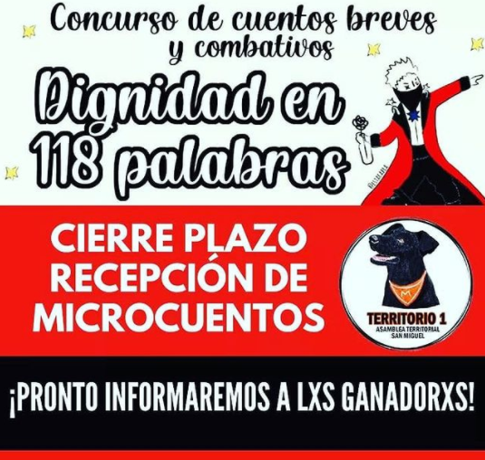
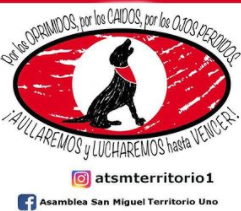

#### FOLIO: SAM03
# Asamblea Territorial San Miguel Territorio 1

[instagram](https://www.instagram.com/atsmterritorio1/)
[facebook](https://www.facebook.com/atsmterritorio1)
[twitter]()
<atsmterritorio1@gmail.com>
---

### Representantes
#### (Nombres o emails de voceros o representantes).
Escribir dm a ig o correo. atsmterritorio1@gmail.com
---
### Interacciones frecuentes
#### (listar otras organizaciones que habitualmente)
* Asamblea Territoal SM Territorio 1
* ASTM Unidad territorial 2
* Asamblea Territorial SM Territorio3
* ATSM Territorio 4
* ATSM Territorio 5
* Asamblea Ciudad del Niño Territorio 6
* San Miguel resistente - ciudad del niño

### Redes sociales
#### ¿Para qué se utiliza la red social?
| Instagram | Facebook | Twitter | Otra 
|---|---|---|---|
|Difusión de información y actividades|Ídem a |0| Sitio web https://www.at1.cl/|

### **Instagram**
| seguidores | seguidos | publicaciones | hashtag 
|---|---|---|---|
|986|327|250| 0

---

* **Actividad:**   

* Primera Publicación IG: 12 diciembre 2019 (activa)

---
### Frecuencia de publicación.

Publicaciones: Comenzaron diarias, ahora son semanales (3,4 veces) - Continua

Actividades: Semanales 

---
### Ubicación
* Sector de la comununa/ciudad: J.J Prieto - Salesianos - Gran Avenida - Isabel Riquelme. 

---
### Describir temas de interés y/o trabajo
* Apoyo mutuo, organización territorial, organizacional vecinal - barrio, derechos de la mujer

---
### Describir la imagen ideal por la cual se trabaja.
#### (El horizonte hacia el cual se quiere avanzar.)
* Fortalecer demandas del movimiento social. Revindicar la formación de comunidad, Promover la formación, el debate y la difusión por una nueva Constitución . Potenciar la articulación con todos los espacios  y territorios que persigan objetivos similares¡Por los oprimidos, por los caídos, y por los ojos perdidos! ¡Aulluaremos y lucharemos hasta vencer!  ¡Solo el pubelo ayuda al pueblo!
---
### ¿Que se hace?
#### (Manifestaciones, marchas, intervenciones, actividades culturales, conversatorios, intercambio de saberes, actividades solidarias o de apoyo mutuo, abastecimiento, contra información, emplazamiento a autoridades etc.)
      Ver página web "Actividades": https://www.at1.cl/actividades
* Talleres de Formación 
* Navidad constituyente
* Yoga constituyente 
* Asambleas (presenciales y virtuales)
* Acto cultural - Abrazo constituyente
* Actividades solidarias 
* Gran corrida por la mujer 
* Cine constituyente 
* Cacerolazo 
* Difusión de emprendimientos de vecinxs
* Club de cine en cuarentena (semanal)
* Plebiscito virtual 26 Abril - votación simbólica 
* Red de apoyo el pueblo ayuda al pueblo, vecinos de San Miguel. - Campañas de canastas familiares 
* Rifa Solidaria 
* Concursos de cuentos breves y combativos "dignidad en 118 palabras" 

---
### Describir y distinguir demandas más reivindicativas de espacios sin relación con lo contencioso o con lo político mas prefigurativo
#### (lo contencioso; demanda al Estado, a alguna autoridad, privados, etc), (prefigurativo, transformación desde lo cotidiano, etc.).
* Se dirige a los vecinos de esta unidad territorial específica, invitandolos a sumarse, a reinvidicar el desarrollo comunitario y los vinculos/apoyo vecinales. 
---
### Tipo de organización interna.
#### (Vocerías, asambleísmo, horizontalidad, etc.; *se entiende que esta dimensión es más difícil de captar vía análisis de redes sociales, pero quizás se puede vislumbrar a través de roles/cargos*)
* Asamblea / horizontalidad / comisiones / rotación de vocería. 

---
### Describir los temas / imágenes- iconos / conceptos mas habitualmente presentes en sus publicaciones. Describir cambios/ transformaciones en los contenidos desde Octubre.
Desde diciembre foco en proceso constituyente y actividades recreativas y comunitarias, luego las publicaciones están ligadas a la difusión de información, ayuda solidaria y emprendimientos de vecinos. 

**Iconos:**

 

**Banderas:**

**Diseño estético:**

> Párrafo tipo cita 

---
### Percepciones que se tiene del Estado
#### (Aparato burocrático)
> resumen de lo encontrado

| Declaraciones | infografía | 
|---|---|
|Anotar los comunicados |  |

---
### Percepciones que se tiene de las Fuerzas de Orden
#### (Aparato represivo)
> resumen de lo encontrado

| Declaraciones | infografía | 
|---|---|
|Anotar los comunicados |  |

---
### Incorporar aca notas, citas textuales, links, etc. extra a los ya incorporados, que sean de interés para comprender tanto la forma como los contenidos asociados a la organización
* Página web: https://www.at1.cl/sobre-nosotros
