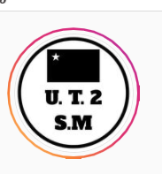
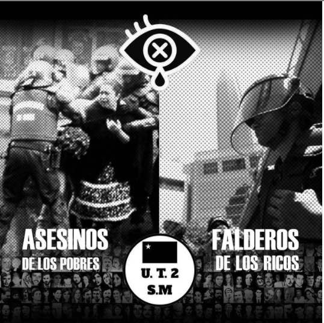

#### FOLIO: SAM04
# Asamblea territorial San Miguel U2

[instagram](https://www.instagram.com/Unidadterritorial2sanmiguel/)
[facebook]()
[twitter]()
<correo@correo.cl>
---

### Representantes
#### (Nombres o emails de voceros o representantes).
+ +569 8832 8791  y dm Ig
---
### Interacciones frecuentes
#### (listar otras organizaciones que habitualmente)
* Asamblea Territoal SM Territorio 1
* ASTM Unidad territorial 2
* Asamblea Territorial SM Territorio3
* ATSM Territorio 4
* ATSM Territorio 5
* Asamblea Ciudad del Niño Territorio 6
* San Miguel resistente - ciudad del niño

### Redes sociales
#### ¿Para qué se utiliza la red social?
| Instagram | Facebook | Twitter | Otra 
|---|---|---|---|
|Difusión de información y actividades|No aplica|No aplica | 0|

### **Instagram**
| seguidores | seguidos | publicaciones | hashtag 
|---|---|---|---|
|654|752|44| 0

---

* **Actividad:**   

* Primera Publicación IG: 4 Marzo 2020

---
### Frecuencia de publicación.

Publicaciones: Semanal (3-4)

Actividades: Semanales (1-2)

---
### Ubicación
* Sector de la comununa/ciudad: Unidar territorial 2 - Isabel Riquelme - gran avenida - santa rosa - salesianos.

---
### Describir temas de interés y/o trabajo
- Feminismo
- Anticapitalismo
- Defensa DDHH y medioambiente
-Activismo anticarcelario 
- Autonomía de los pueblos originarios
- Apoyo mutuo, organización territorial.
- Autoformación popular 
---
### Describir la imagen ideal por la cual se trabaja.
#### (El horizonte hacia el cual se quiere avanzar.)
* Avanzar hacia una sociedad anticapitalista y feminista. 
---
### ¿Que se hace?
#### (Manifestaciones, marchas, intervenciones, actividades culturales, conversatorios, intercambio de saberes, actividades solidarias o de apoyo mutuo, abastecimiento, contra información, emplazamiento a autoridades etc.)
* Cacerolazos 
* Velatones 
* Gran rifa solidaria 
* Abesticimiento comunitario - solo el pueblo ayuda al pueblo
* [Biblioteca virtual -cada semana una temática; feminista, medioambiente, etc.](https://www.instagram.com/p/CFfK5PKpvyI/)
* Acopio solidario 

---
### Describir y distinguir demandas más reivindicativas de espacios sin relación con lo contencioso o con lo político mas prefigurativo
#### (lo contencioso; demanda al Estado, a alguna autoridad, privados, etc), (prefigurativo, transformación desde lo cotidiano, etc.).
Se dirige a vecinos/as de la unidad territorial 2, a sumarse a las demandas sociales desde el territorio y apoyarse entre todos en tiempos de crisis. Se exige al estado la liberación de los presos políticos. 

---
### Tipo de organización interna.
#### (Vocerías, asambleísmo, horizontalidad, etc.; *se entiende que esta dimensión es más difícil de captar vía análisis de redes sociales, pero quizás se puede vislumbrar a través de roles/cargos*)
asamblea, horizontalidad (Junto con UT6 en Nov 2020 se desprenden de la ATSM por problemas en la orgánica - horizontalidad y x el levantamiento de candidatos constituyentes. Ver declaración)

---
### Describir los temas / imágenes- iconos / conceptos mas habitualmente presentes en sus publicaciones. Describir cambios/ transformaciones en los contenidos desde Octubre.

**Iconos:**

  
 

**Banderas:**

**Diseño estético:**

> Párrafo tipo cita 

---
### Percepciones que se tiene del Estado
#### (Aparato burocrático)
> resumen de lo encontrado

| Declaraciones | infografía | 
|---|---|
|Anotar los comunicados |  |

---
### Percepciones que se tiene de las Fuerzas de Orden
#### (Aparato represivo)
> resumen de lo encontrado

| Declaraciones | infografía | 
|---|---|
|"Asesinos de los pobres, falderos de los ricos" |  |

* Declaración sobre día del carabinero: 
> Hoy en el territorio nacional conocido como $hile, se celebra el 93° aniversario de Carabineros,
fuerza de control estatal y una de las pocas policías militarizadas de nuestro continente. Ante la conmemoración de tan
nefasta institución, como Asamblea Territorial de San Miguel n°2 declaramos que:

> 1. Esta institución nace como una fuerza de control netamente social, protectora de la seudo-democracia, pero que además vela sin duda alguna por los intereses de los reales
dueños de nuestro país: latifundistas y empresarios, quienes buscan aumentar su ganancia económica y controlar políticamente
toda participación que no les beneficie. Este control ha sido normalizado desde la institucionalidad a partir de instrumentos
discursivos que han buscado crear un "enemigo interno", que no es sino la gente pobre, racializada y fuera de la heteronorma,
todes quienes salen de la "normalidad" impuesta por los medios, escuela, y dispositivos culturales hegemónicos. ¿Por qué si no
se encarcela y se persigue a vendedores ambulantes, militantes, agitadores y disidencias sexuales, quienes sólo buscan una
existencia digna?
> 2. Carabineros de $hile es una institución clasista, que sólo permite el ascenso al alto mando a quienes pertenecen a la Elite
económica del país, manteniendo así el control total de la institución, adoptando las prácticas de violencia y represión, pero dónde incluso se genera dentro de su misma orgánica, discriminación y abuso. Con esta lectura, podemos entender que las personas que se integran a esta institución como "pacos rasos" solo son entes de manipulación y desechables, que en ningún caso podrán acceder a un mayor privilegio.

> 3. Que las violaciones a los DDHH. ocurridas en $hile han sido de EXCLUSIVA RESPONSABILIDAD del Presidente nefasto y sus ministrxs, pero también de los altos mandos de Carabineros y Militares, quienes
de forma totalmente psicópata, han enviado a sus subalternos a mutilar, asesinar, violar y secuestrar a los que son supuestamente sus mismxs compatriotas, quienes además, luchamos por una vida digna y más justa,
un país en el que todas y todos quepamos.
no olvidamos, ni perdonaremos esta traición, y que como tal, serán juzgados y recordados como los traidores de la clase trabajadora, y que prefirieron cuidar los intereses del enemigo empresarial.

>Hoy no hay NADA QUE CELEBRAR más que nuestra determinación de hacer de este territorio uno mas justo y equitativo.

---
### Incorporar aca notas, citas textuales, links, etc. extra a los ya incorporados, que sean de interés para comprender tanto la forma como los contenidos asociados a la organización

* Comunicado público sobre la salida de la Asamblea Territorial San Miguel (17 Noviembre 2020): https://www.instagram.com/p/CHtVC9rpetv/ 