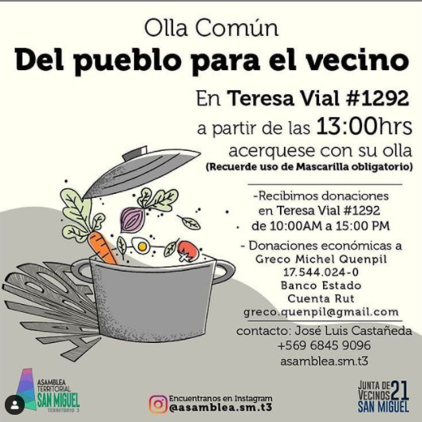

#### FOLIO: SAM05
# ASAMBLEA TERRITORIAL UNIDAD TERRITORIAL 3

[instagram](https://www.instagram.com/asamblea.sm.t3/)
[facebook]()
[twitter]()
<asamblea.sm.t3@gmail.com>
+569 6845 9096
---

### Representantes
#### (Nombres o emails de voceros o representantes).
asamblea.sm.t3@gmail.com>
+569 6845 9096
---
### Interacciones frecuentes
#### (listar otras organizaciones que habitualmente)
* Asambleas Territoriales SM (6 territorios + la General)
* La Minga San Miguel (organización pre 18 Oct)

### Redes sociales
#### ¿Para qué se utiliza la red social?
| Instagram | Facebook | Twitter | Otra 
|---|---|---|---|
|Difusión de información y difusión actividades|0|0| 0|

### **Instagram**
| seguidores | seguidos | publicaciones | hashtag 
|---|---|---|---|
|887|1049|49| 0

---

* **Actividad:**   

* Primera Publicación IG: 12 Marzo (actualmente activa)

---
### Frecuencia de publicación.

Publicaciones: Semanales (1 - 3)
Actividades: Semanales 

---
### Ubicación
* Sector de la comununa/ciudad: ▪️Av salesianos-gran avenida-panamericana-av departamental▪️ Se reunen todos los lunes en la plaza barros luco a las 19:00 hrs (calles angel guarello con monja alférez) 

---
### Describir temas de interés y/o trabajo
* Apoyo mutuo, proceso constituyente, redes contra la violencia machista, solidaridad, 
---
### Describir la imagen ideal por la cual se trabaja.
#### (El horizonte hacia el cual se quiere avanzar.)
* Fortalecer Organización vecinal Solidaridad, ayuda del vecino para el vecino. 

---
### ¿Que se hace?
#### (Manifestaciones, marchas, intervenciones, actividades culturales, conversatorios, intercambio de saberes, actividades solidarias o de apoyo mutuo, abastecimiento, contra información, emplazamiento a autoridades etc.)
* Marchas 
* Jornadas de conversación 
* Canastas familiares 
* Feria de las pulgas virtual 
* Olla común 
* Día del niño 
* Cacerolazo
* Velatón 

---
### Describir y distinguir demandas más reivindicativas de espacios sin relación con lo contencioso o con lo político mas prefigurativo
#### (lo contencioso; demanda al Estado, a alguna autoridad, privados, etc), (prefigurativo, transformación desde lo cotidiano, etc.).
Se dirige a vecinos de la unidad territorial 3, se convoca a cuidarse y apoyarse entre todos. 
---
### Tipo de organización interna.
#### (Vocerías, asambleísmo, horizontalidad, etc.; *se entiende que esta dimensión es más difícil de captar vía análisis de redes sociales, pero quizás se puede vislumbrar a través de roles/cargos*)

* Asamblea - horizontalidad. 

---
### Describir los temas / imágenes- iconos / conceptos mas habitualmente presentes en sus publicaciones. Describir cambios/ transformaciones en los contenidos desde Octubre.

Se inició la organización en marzo, desde allí la línea ha sido sobre todo solidaria y difusión de ollas comunes y actividades de ayuda por pandemia. No tiene tinte tan político y combativo como la UT2 y UT6. 

**Iconos:**

**Banderas:**

**Diseño estético:**

> Párrafo tipo cita 

---
### Percepciones que se tiene del Estado
#### (Aparato burocrático)
> resumen de lo encontrado

| Declaraciones | infografía | 
|---|---|
|Anotar los comunicados |  |

---
### Percepciones que se tiene de las Fuerzas de Orden
#### (Aparato represivo)
> resumen de lo encontrado

| Declaraciones | infografía | 
|---|---|
|Anotar los comunicados |  |

---
### Incorporar aca notas, citas textuales, links, etc. extra a los ya incorporados, que sean de interés para comprender tanto la forma como los contenidos asociados a la organización