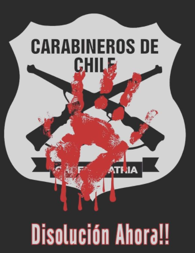

#### FOLIO: SAM06
# Asamblea Territorial Territorio 4 

[instagram](https://www.instagram.com/atsmterritorio4/)
[facebook]()
[twitter]()
<correo@correo.cl>
---

### Representantes
#### (Nombres o emails de voceros o representantes).
* Escribir dm al instagram 
---
### Interacciones frecuentes
#### (listar otras organizaciones que habitualmente)
* Asambleas territoriales SAN MIGUEL. 
### Redes sociales
#### ¿Para qué se utiliza la red social?
| Instagram | Facebook | Twitter | Otra 
|---|---|---|---|
|Difusión de actividades, difusión de información |No aplica|No aplica| No aplica|

### **Instagram**
| seguidores | seguidos | publicaciones | hashtag 
|---|---|---|---|
|296|229|55| 0

---

* **Actividad:**   

* Primera Publicación IG: 24 Diciembre 2019 (activo)

---
### Frecuencia de publicación.

Publicaciones: Semanal (marzo - mayo inactividad) A(gosto a Octubre Inactiva.) 

Actividades: Semanal 

---
### Ubicación
* Sector de la comununa/ciudad: Departamental, Santa Rosa, Gran avenida, Salesianos. Plaza Madeco. 

---
### Describir temas de interés y/o trabajo
* Autonomía, participación, vínculo vecinal, apoyo mutuo, activisimo anticarcelario, derechos de reos. 

---
### Describir la imagen ideal por la cual se trabaja.
#### (El horizonte hacia el cual se quiere avanzar.)Recuperación de espacios públicos a favor de la comunidad y vecinos. 
* Organización vecinal, adscribe a horizontes similares a la ATSM como nueva constitución. "Aprobar y no organizarse es igual que rechazar" 
---
### ¿Que se hace?
#### (Manifestaciones, marchas, intervenciones, actividades culturales, conversatorios, intercambio de saberes, actividades solidarias o de apoyo mutuo, abastecimiento, contra información, emplazamiento a autoridades etc.)
> En general adscribe a actividades de la ATSM 
* Actividades culturales 
* Cabildo de masculinidades 
* Pasacalles 
* Cine popular 
* Yoga Constituyente 
* Mural 
* Abrazo constituyente 
* Cine de elecciones 

---
### Describir y distinguir demandas más reivindicativas de espacios sin relación con lo contencioso o con lo político mas prefigurativo
#### (lo contencioso; demanda al Estado, a alguna autoridad, privados, etc), (prefigurativo, transformación desde lo cotidiano, etc.).
* Se dirige a los vecinos de esta unidad territorial, los emplaza a la solidaridad vecinal y a mantener la organización vecinal. 
---
### Tipo de organización interna.
#### (Vocerías, asambleísmo, horizontalidad, etc.; *se entiende que esta dimensión es más difícil de captar vía análisis de redes sociales, pero quizás se puede vislumbrar a través de roles/cargos*)
Asamblea, horizontalidad / vocerías. 
---
### Describir los temas / imágenes- iconos / conceptos mas habitualmente presentes en sus publicaciones. Describir cambios/ transformaciones en los contenidos desde Octubre.

**Iconos:**

**Banderas:**

**Diseño estético:**

> Párrafo tipo cita 

---
### Percepciones que se tiene del Estado
#### (Aparato burocrático)
> resumen de lo encontrado

| Declaraciones | infografía | 
|---|---|
|Anotar los comunicados |  |

---
### Percepciones que se tiene de las Fuerzas de Orden
#### (Aparato represivo)
> resumen de lo encontrado

| Declaraciones | infografía | 
|---|---|
|"Disolución Ahora" (Noviembre 2020)|  |

---
### Incorporar aca notas, citas textuales, links, etc. extra a los ya incorporados, que sean de interés para comprender tanto la forma como los contenidos asociados a la organización