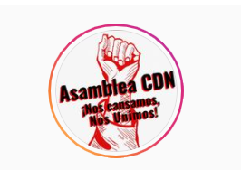

#### FOLIO: SAM08
# Asamblea Autoconvocada Ciudad del Niño (Ex Unidad Territorial 6)

[instagram](https://www.instagram.com/asamblea_cdn_san_miguel/)
[facebook](https://www.facebook.com/territorio6.atsm)
[twitter]()
<territorio6.atsm@gmail.com>
>
---

### Representantes
#### (Nombres o emails de voceros o representantes).
correo o Dm ig. 
---
### Interacciones frecuentes
#### (listar otras organizaciones que habitualmente)
* Todas las asambleas San Miguel, más afinidad con Asamblea Unidad territorial 2. 

### Redes sociales
#### ¿Para qué se utiliza la red social?
| Instagram | Facebook | Twitter | Otra 
|---|---|---|---|
|Difusión de actividades e información |Difusión de actividades e información|No aplica| No aplics|

### **Instagram**
| seguidores | seguidos | publicaciones | hashtag 
|---|---|---|---|
|1182|866|217| 0

---

* **Actividad:**   

* Primera Publicación IG: 27 de diciembre 2019 

---
### Frecuencia de publicación.

Publicaciones: Semanal (3-4)

Actividades: Semanal (2)

---
### Ubicación
* Sector de la comununa/ciudad: gran avenida - lo ovalle - departamental - santa rosa. Plaza San José (ciudad del niño )

---
### Describir temas de interés y/o trabajo
* Libertad presos políticos (activismo anticarcelario),DDHH, organización vecinal, apoyo mutuo. Poder y organización popular. 

---
### Describir la imagen ideal por la cual se trabaja.
#### (El horizonte hacia el cual se quiere avanzar.)
* Sistema anticapitalista y realmente democrático que vele por la dignidad de los vecinos/as de los territorios.¡La lucha sigue porque no hemos ganado nada! ¡Solo la organización popular nos dará los que nos ha sido negado durante tanto tiempo! ¡Lo que empieza el estudiante movilizado lo termina el pueblo organizado!
---
### ¿Que se hace?
#### (Manifestaciones, marchas, intervenciones, actividades culturales, conversatorios, intercambio de saberes, actividades solidarias o de apoyo mutuo, abastecimiento, contra información, emplazamiento a autoridades etc.)
* Asamblea territorial
* Cacerolazos
* Día de juego para niñas y niños 
* Difusión de información sobre repesión policial
* Asambleas juveniles
* Olla común
* Feria de las pulgas 

---
### Describir y distinguir demandas más reivindicativas de espacios sin relación con lo contencioso o con lo político mas prefigurativo
#### (lo contencioso; demanda al Estado, a alguna autoridad, privados, etc), (prefigurativo, transformación desde lo cotidiano, etc.).
Se dirige a vecinos y vecinas de ese sector territorial, motivándolos a tomar el poder y la participación sin hacer del proceso constituyente (opción apruebo) la única bandera de lucha (se desmarcan de la ATSM). 
---
### Tipo de organización interna.
#### (Vocerías, asambleísmo, horizontalidad, etc.; *se entiende que esta dimensión es más difícil de captar vía análisis de redes sociales, pero quizás se puede vislumbrar a través de roles/cargos*)
Asamblea, horizontalidad, comisiones. 
---
### Describir los temas / imágenes- iconos / conceptos mas habitualmente presentes en sus publicaciones. Describir cambios/ transformaciones en los contenidos desde Octubre.

**Iconos:**

**Banderas:**

**Diseño estético:** negro, blanco, rojo

> Párrafo tipo cita 

---
### Percepciones que se tiene del Estado
#### (Aparato burocrático)
> resumen de lo encontrado

| Declaraciones | infografía | 
|---|---|
|Anotar los comunicados |  |

---
### Percepciones que se tiene de las Fuerzas de Orden
#### (Aparato represivo)
> resumen de lo encontrado

| Declaraciones | infografía | 
|---|---|
|Anotar los comunicados |  |

---
### Incorporar aca notas, citas textuales, links, etc. extra a los ya incorporados, que sean de interés para comprender tanto la forma como los contenidos asociados a la organización
* Comunicado público salida ATSM : https://www.instagram.com/p/CHtUnQyp7QK/ 