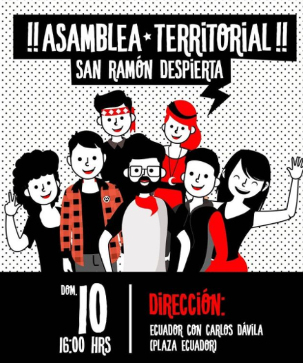
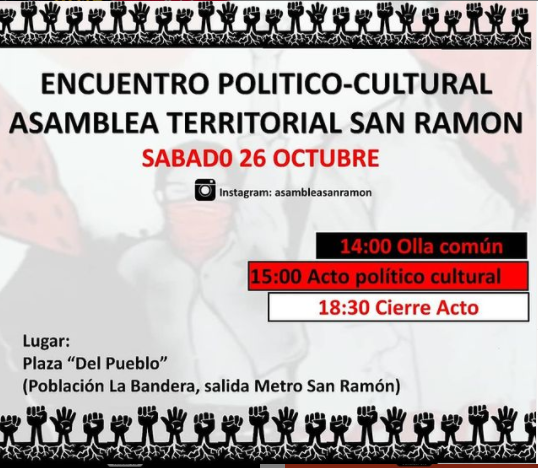

#### FOLIO: SAR01
# Asamblea Territorial San Ramón 

[instagram]()
[facebook]()
[twitter]()
<correo@correo.cl>
---

### Representantes
#### (Nombres o emails de voceros o representantes).
Mandar dm al Ig
---
### Interacciones frecuentes
#### (listar otras organizaciones que habitualmente)
* San Ramón Resiste 
* Mujeres San Ramón (pre 18 Octubre) 
* Contra Info San Ramón 
* San Miguel Resistente 
* Trawun 18 - La Cisterna 
* Capuchas Revolucionarios
* Resistencia Zona Sur 
* El Bosque Resiste 
* Movimiento Solidario Vida Digna

### Redes sociales
#### ¿Para qué se utiliza la red social?
| Instagram | Facebook | Twitter | Otra 
|---|---|---|---|
|Difusión de Información y difusión de actividades |0|0| 0|

### **Instagram**
| seguidores | seguidos | publicaciones | hashtag 
|---|---|---|---|
|1517|1093|109| 0

---

* **Actividad:**   

* Primera Publicación IG: 21 Octubre 2019 (activa)

---
### Frecuencia de publicación.

Publicaciones: Diarias al inicio (Octubre, Nov, Dic) luego semanal.

Actividades: Semanales (1,2 al menos)

---
### Ubicación
* Sector de la comununa/ciudad: Población La Bandera, Se juntan en la  Plaza "del pueblo" salida metro san ramón.  

---
### Describir temas de interés y/o trabajo
Ayuda mutua, solidaridad, memoria histórica, union y organización territorial (comunal y yzona sur), activismo anticarcerlario. 

---
### Describir la imagen ideal por la cual se trabaja.
#### (El horizonte hacia el cual se quiere avanzar.)
* Desmilitarización de escuelas, poblaciones y wallmapu, sueldo mínimo y pensión básica 500.000, sistema pensiones de reparto solidario, estatización transporte público, farmacias populares, fin ley integración social, educación y salud digna y gratuita, fin saqueo empresarial agua y naturaleza. (Ver declaración)
---
### ¿Que se hace?
#### (Manifestaciones, marchas, intervenciones, actividades culturales, conversatorios, intercambio de saberes, actividades solidarias o de apoyo mutuo, abastecimiento, contra información, emplazamiento a autoridades etc.)
* Marchas
* Cacerolazos
* Concentraciones
* Olla común 
* Tocatas 
* Actividades para niñxs
* Acto político cultural
* Jornadas de autocuidado mujeres y niñxs 
* Cicletadas 
* Conversatorios
* Once comunitaria
* Ferias Libres 
* Carnavales 
* Intervenciones artísticas 
* Talleres deportivos 
* Velatones

---
### Describir y distinguir demandas más reivindicativas de espacios sin relación con lo contencioso o con lo político mas prefigurativo
#### (lo contencioso; demanda al Estado, a alguna autoridad, privados, etc), (prefigurativo, transformación desde lo cotidiano, etc.).
* Se dirige a pobladorxs, niñxs, vecinxs, a luchar y organizarse. Además emplaza a la renuncia de Piñera. ¡Evade el miedo, San Ramón se organiza! 
---
### Tipo de organización interna.
#### (Vocerías, asambleísmo, horizontalidad, etc.; *se entiende que esta dimensión es más difícil de captar vía análisis de redes sociales, pero quizás se puede vislumbrar a través de roles/cargos*)
* Asamblea, horizontalidad. Comisiones
---
### Describir los temas / imágenes- iconos / conceptos mas habitualmente presentes en sus publicaciones. Describir cambios/ transformaciones en los contenidos desde Octubre.
Desde Octubre a Marzo, se convocaba a asambles territoriales, actividades culturales, talleres, todas las semanas, luego comenzaron a compartir actividades en línea deotras agrupaciones, principalmente el movimiento solidario vida digna. 

**Iconos:**

**Banderas:**

**Diseño estético:**

> Párrafo tipo cita 

---
### Percepciones que se tiene del Estado
#### (Aparato burocrático)
> resumen de lo encontrado

| Declaraciones | infografía | 
|---|---|
|Anotar los comunicados |  |

---
### Percepciones que se tiene de las Fuerzas de Orden
#### Declaración 27 Octubre 2020 - 
> *Luego de las celebraciones por el apruebo, se registraron acciones de torturas contra 2 jóvenes de la comuna de san ramón en la madrugada del 26 de octubre* Nuestra mejor arma es la solidaridad, por ello, es que compartimos la cuenta de Luis, para darle un apoyo solidario en su rehabilitación.
Los hechos: Terminaba la jornada de manifestación en santa rosa con Américo Vespucio cuando llega inesperadamente la policía a echar a las personas que quedaban en el lugar.
De manera tranquila y ya dirigiéndose al interior de la población es que son intersectados
2 jóvenes de 23 y 31 años, por agentes sin identificación de carabineros de chile. Éstos,
hacen rugir el motor de las nuevas patrullas para causar pánico en los últimos
manifestantes, ellos arrancan temiendo por su integridad física, pero los alcanzan.
Los agarran por la espalda y los tiran a piso, sacan fierros y lumas para golpearlos en la cabeza, cara y costillas, hasta dejarlos inconscientes, son tirados a unos matorrales del sector. Ambos despiertan horas después. Una vecina los sube a su auto particular y los lleva al hospital
Padre hurtado, lugar donde sufren violencia médica, siendo discriminados por estar en un contexto de manifestación.
Luis, no tuvo la atención que necesitaba, lo sedaron y lo enviaron de alta, él estaba con su
madre; quien desde el primer momento asiste al hospital. A Luis, le fracturan la mandíbula con golpizas de fierros, le sacaron varias piezas dentales y hoy debe alimentarse con papilla durante todo 1 mes. 

> No más torturas por este gobierno "democrático" fascista de Sebastián Piñera, Fuera Mario Rozas*

| Declaraciones | infografía | 
|---|---|
|Anotar los comunicados |  |

---
### Incorporar aca notas, citas textuales, links, etc. extra a los ya incorporados, que sean de interés para comprender tanto la forma como los contenidos asociados a la organización
* Comunicado de la Asamblea, 21 Octubre 2019
https://www.instagram.com/p/B35DBACAfVe/