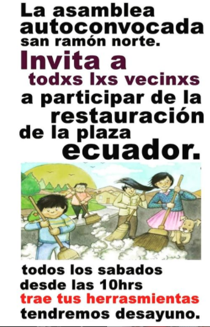
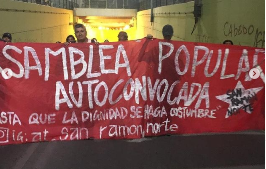
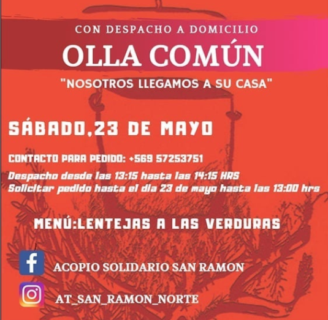

#### FOLIO: SAR02
# Asamblea Territorial San Ramón Norte

[instagram](https://www.instagram.com/at_san_ramon_norte/)
[facebook]()
[twitter]()
<correo@correo.cl>
---

### Representantes
#### (Nombres o emails de voceros o representantes)Dm al Ig 

---
### Interacciones frecuentes
#### (listar otras organizaciones que habitualmente)
* Colectivo Cultural Luchín (El bosque)
* Artistas San Ramón 

### Redes sociales
#### ¿Para qué se utiliza la red social?
| Instagram | Facebook | Twitter | Otra 
|---|---|---|---|
|Difusión de información y actividades|0|0| 0|

### **Instagram**
| seguidores | seguidos | publicaciones | hashtag 
|---|---|---|---|
|268|182|26| 0

---

* **Actividad:**   

* Primera Publicación IG: 23 enero (aún que se nota que había organización y acción previas, 19 Junio en Instagram)

---
### Frecuencia de publicación.

Publicaciones: semanales

Actividades: semanales

---
### Ubicación
* Sector de la comununa/ciudad: Plaza Ecuador

---
### Describir temas de interés y/o trabajo
apoyo mutuo, organización y coordinación territorial, lucha popular 
---
### Describir la imagen ideal por la cual se trabaja.
#### (El horizonte hacia el cual se quiere avanzar.)
¡Hasta que la dignidad se haga costumbre! ¡Con conciencia y organización se cuida a la población!
---
### ¿Que se hace?
#### (Manifestaciones, marchas, intervenciones, actividades culturales, conversatorios, intercambio de saberes, actividades solidarias o de apoyo mutuo, abastecimiento, contra información, emplazamiento a autoridades etc.)
* Asambleas
* Talleres
* Jornadas de Cine Latinoamericano
* Jornadas culturales
* Pasacalles
* Marcha territorial San Ramón 
* Velatón 
* Restauración Plaza ecuador
* Acopio solidario
* Olla común solidaria 
---
### Describir y distinguir demandas más reivindicativas de espacios sin relación con lo contencioso o con lo político mas prefigurativo
#### (lo contencioso; demanda al Estado, a alguna autoridad, privados, etc), (prefigurativo, transformación desde lo cotidiano, etc.).
Se dirige a vecinxs, a participar de actividades vecinales. Se repara y recupera el espacio público (plaza ecuador)

---
### Tipo de organización interna.
#### (Vocerías, asambleísmo, horizontalidad, etc.; *se entiende que esta dimensión es más difícil de captar vía análisis de redes sociales, pero quizás se puede vislumbrar a través de roles/cargos*)
Asamblea 
---
### Describir los temas / imágenes- iconos / conceptos mas habitualmente presentes en sus publicaciones. Describir cambios/ transformaciones en los contenidos desde Octubre.
La Asamblea se transformó en gestora de acopio y olla común a raíz del covid. 
**Iconos:**

**Banderas:**

**Diseño estético:**

> Párrafo tipo cita 

---
### Percepciones que se tiene del Estado
#### (Aparato burocrático)
> resumen de lo encontrado

| Declaraciones | infografía | 
|---|---|
|Anotar los comunicados |  |

---
### Percepciones que se tiene de las Fuerzas de Orden
#### (Aparato represivo)
> resumen de lo encontrado

| Declaraciones | infografía | 
|---|---|
|Anotar los comunicados |  |

---
### Incorporar aca notas, citas textuales, links, etc. extra a los ya incorporados, que sean de interés para comprender tanto la forma como los contenidos asociados a la organización