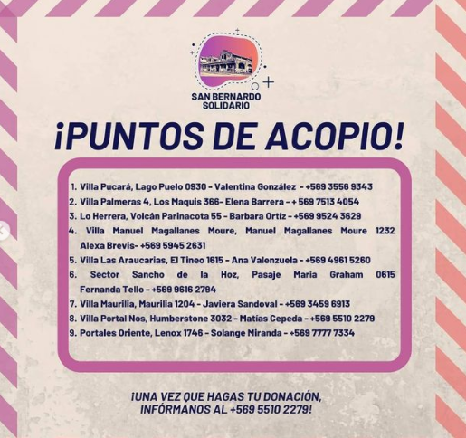
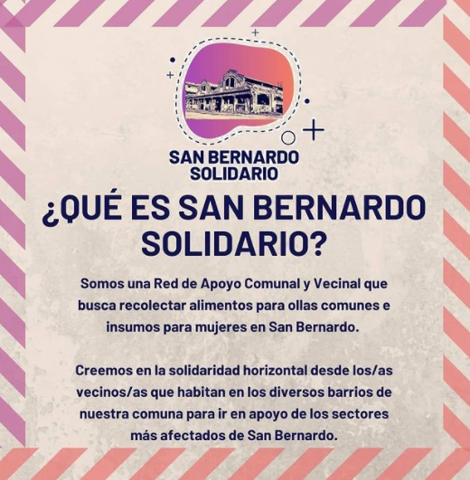

#### FOLIO: SBD01
# San Bernardo Solidario 

[instagram](https://www.instagram.com/sanbernardosolidario/)
[facebook]()
[twitter]()
<sanbernardosolidario@gmail.com>
---

### Representantes
#### (Nombres o emails de voceros o representantes).
* Gmail o DM al Instagram o +56967344212
---
### Interacciones frecuentes
#### (listar otras organizaciones que habitualmente)

### Redes sociales
#### ¿Para qué se utiliza la red social?
| Instagram | Facebook | Twitter | Otra 
|---|---|---|---|
|DIFUSIÓN DE INFO Y ACTIVIDADES|0|0| 0|

### **Instagram**
| seguidores | seguidos | publicaciones | hashtag 
|---|---|---|---|
|1222|2090|41| 0

---

* **Actividad:**   

* Primera Publicación IG: 5 Junio 2020 - HASTA 13 Octubre 2020, última donación 

---
### Frecuencia de publicación.

Publicaciones: SEMANALES (3-4)

Actividades: SEMANALES, CONTINUA

---
### Ubicación
* Sector de la comununa/ciudad: diversos Centros de acopio Villa Pucará, Villa Las Palmeras, Lo herrera, Villa Las Araucarias, Villa Maurinia, Villa Portal y Portales Oriente 

---
### Describir temas de interés y/o trabajo
apoyo mutuo, solidaridad, vinculación comunal, comercio local
---
### Describir la imagen ideal por la cual se trabaja.
#### (El horizonte hacia el cual se quiere avanzar.)
* Apoyar a los que lo están pasando peor. Generar una red de apoyo comunal 

---
### ¿Que se hace?
#### (Manifestaciones, marchas, intervenciones, actividades culturales, conversatorios, intercambio de saberes, actividades solidarias o de apoyo mutuo, abastecimiento, contra información, emplazamiento a autoridades etc.)
* Recolección de alimentos para ollas comunes
* Recolección de insumos para mujeres 
* Recolección de insumos para niñxs 
* Catastro y apoyo comercio local (formulario)
---
### Describir y distinguir demandas más reivindicativas de espacios sin relación con lo contencioso o con lo político mas prefigurativo
#### (lo contencioso; demanda al Estado, a alguna autoridad, privados, etc), (prefigurativo, transformación desde lo cotidiano, etc.).
* Se dirige a vecinxs de San Bernardo a apoyar
---
### Tipo de organización interna.
#### (Vocerías, asambleísmo, horizontalidad, etc.; *se entiende que esta dimensión es más difícil de captar vía análisis de redes sociales, pero quizás se puede vislumbrar a través de roles/cargos*)
* HORIZONTALIDAD Y VOLUNTARIADO 
---
### Describir los temas / imágenes- iconos / conceptos mas habitualmente presentes en sus publicaciones. Describir cambios/ transformaciones en los contenidos desde Octubre.

**Iconos:**

**Banderas:**

**Diseño estético:**

> Párrafo tipo cita 

---
### Percepciones que se tiene del Estado
#### (Aparato burocrático)
> resumen de lo encontrado

| Declaraciones | infografía | 
|---|---|
|Anotar los comunicados |  |

---
### Percepciones que se tiene de las Fuerzas de Orden
#### (Aparato represivo)
> resumen de lo encontrado

| Declaraciones | infografía | 
|---|---|
|Anotar los comunicados |  |

---
### Incorporar aca notas, citas textuales, links, etc. extra a los ya incorporados, que sean de interés para comprender tanto la forma como los contenidos asociados a la organización.