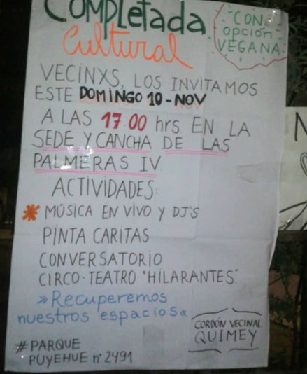
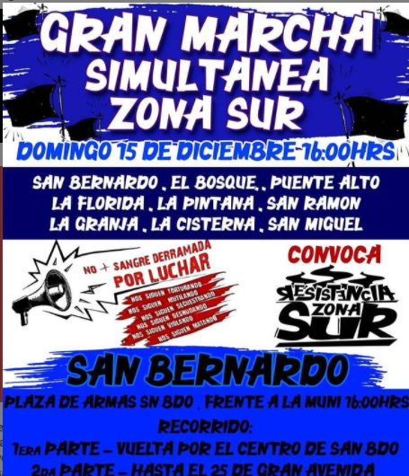
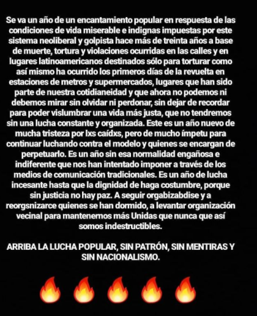

#### FOLIO:SBD02
# Cordon Vecinal Quimey

[instagram](https://www.instagram.com/cordonvecinalquimey/)
[facebook]()
[twitter]()
<correo@correo.cl>
---

### Representantes
#### (Nombres o emails de voceros o representantes).
dm Ig
---
### Interacciones frecuentes
#### (listar otras organizaciones que habitualmente)
* DDHH San Beka 
* Resistencia Zona Sur
* Periferia en resistencia 
* San Beca en la calle 
* Feminismos San Beka 
* Contra Info San Beka 
### Redes sociales
#### ¿Para qué se utiliza la red social?
| Instagram | Facebook | Twitter | Otra 
|---|---|---|---|
|DIFUSIÓN DE INFO Y ACTIVIDADES|no aplica|no aplica| No aplica |

### **Instagram**
| seguidores | seguidos | publicaciones | hashtag 
|---|---|---|---|
|1879|3,609|54| 0

---

* **Actividad:**   

* Primera Publicación IG: 6 Noviembre 2019 (última Octubre 2020)

---
### Frecuencia de publicación.

Publicaciones: SEMANAL (3-4), Febrero inactivA, mrazo-junio inactiva, luego publicaciones cada 1 mes, sobre protestas (no actividades)

Actividades: SEMANALES hasta marzo. 

---
### Ubicación
* Sector de la comununa/ciudad: Parque Puyehue, Plaza al lado de la sede Vecinal Villa San Antonio

---
### Describir temas de interés y/o trabajo
* protesta, organización comunitaria, memoria y justicia para muertos de la revuelta, memoria pueblo mapuche, DDHH, feminismo , justicia por feminicidios, niñez y adolescencia, educación popular 
---
### Describir la imagen ideal por la cual se trabaja.
#### (El horizonte hacia el cual se quiere avanzar.)
* Nueva constitución ¡Resistencia desde la pobla! ¡Aguante el pueblo, aguante la gente sanbernardina que esto recién empieza! ¡ Recordaremos a todxs los peñi y lamngen asesinadxs en democracia! ¡San bk presente, activa y combatiente, por lxs caídxs ahora y siempre ! "NO + SENAME" 

> "Organización vecinal del sector sur de San Bernardo agrupada por recuperación de nuestros espacios y la autonomía del pueblo" 

* **Vinculación zona sur/periferia**

> "Desde distintas comunas perifericas nos unimos para dejar en claro que no bajaremos los brazos, que no compraremos su falsa normalidad, ni sus pactos, ni sus migajas
hasta que la dignidad de nuestra gente se haga costu"
---
### ¿Que se hace?
#### (Manifestaciones, marchas, intervenciones, actividades culturales, conversatorios, intercambio de saberes, actividades solidarias o de apoyo mutuo, abastecimiento, contra información, emplazamiento a autoridades etc.)
* Completadas comunitarias 
* Cacerolazos 
* Marchas territoriales (zona sur) y simultáneas 
* Conversatorios 
* Jornadas culturales
* Conmemoraciones / velatones 
* Diseño y creación mural 
* Olla común Vegana 
* Intervenciones artísticas feministas ("a la hoguera el patriarcado)
* Talleres (de primeros auxilios, sexualidad
* Actividades solidarias incendios Valpo
* Campeonato futbolito a beneficio Fabiola Campillai y Gustavo Gatica 
* Funas

---
### Describir y distinguir demandas más reivindicativas de espacios sin relación con lo contencioso o con lo político mas prefigurativo
#### (lo contencioso; demanda al Estado, a alguna autoridad, privados, etc), (prefigurativo, transformación desde lo cotidiano, etc.).
Se dirige a lxs vecinxs a organizarse y seguir luchando. Emplaza al estado como terrotista y terrorista y el culpable de muertes y violación a DDHH. 
---
### Tipo de organización interna.
#### (Vocerías, asambleísmo, horizontalidad, etc.; *se entiende que esta dimensión es más difícil de captar vía análisis de redes sociales, pero quizás se puede vislumbrar a través de roles/cargos*)
horizontalidad 
---
### Describir los temas / imágenes- iconos / conceptos mas habitualmente presentes en sus publicaciones. Describir cambios/ transformaciones en los contenidos desde Octubre.

**Iconos:**

**Banderas:**

**Diseño estético:**

> Párrafo tipo cita 

---
### Percepciones que se tiene del Estado
#### (Aparato burocrático)
> Asocian al estado con racismo, terrorismo y el culpable de las violaciones a DDHH. 

| Declaraciones | infografía | 
|---|---|
|"EL ESTADO CHILENO ES EL RACISTA Y TERRORISTA, LIBERTAD A LXS PRESXS POLITICXS MAPUCHES Y DE LA REVUELTA!"|  |

---
### Percepciones que se tiene de las Fuerzas de Orden
#### (Aparato represivo)
> En contra de la violencia y represión desmedida. 

| Declaraciones | infografía | 
|---|---|
|REPRESION BRUTAL POR PARTE DE LOS PACOS, JOVEN ES ATROPELLADO POR 2 ZORRILOS EN EL MARCO DE LA RECUPERACION DE PLAZA DIGNIDAD!

A 2 meses de la mayor revuelta social en la historia de este país, estas son las respuestas que le da el estado a las demandas sociales, hace unos dias el intendente le declaró la guerra a las manifestaciones "no autorizadas" en plaza dignidad.

NOS SIGUEN MATANDO! A NO SOLTAR LAS CALLES, TRATARON DE SILENCIARNOS CON PACTOS, AHORA CON MAYOR REPRESION!| 

---
### Incorporar aca notas, citas textuales, links, etc. extra a los ya incorporados, que sean de interés para comprender tanto la forma como los contenidos asociados a la organización.

**Declaración 1 Enero 2020**

(la palabra "encantamiento = levantamiento")
