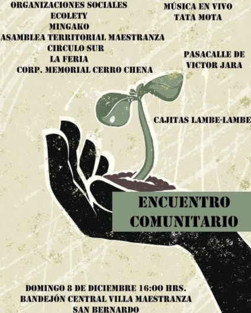
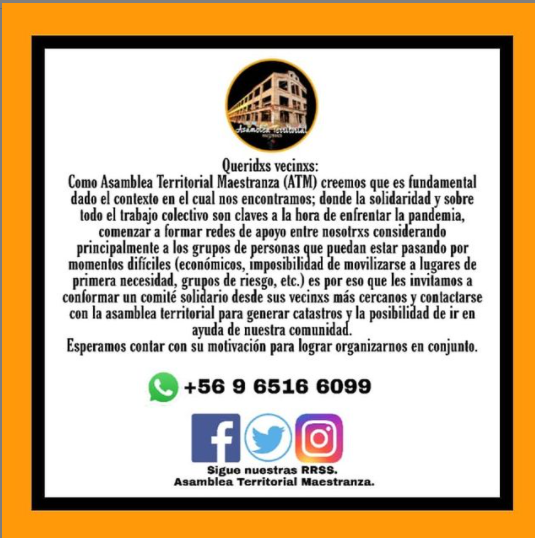
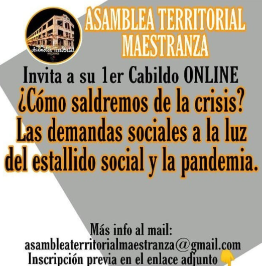
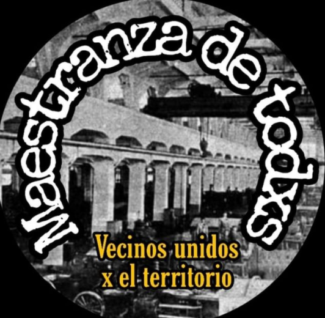
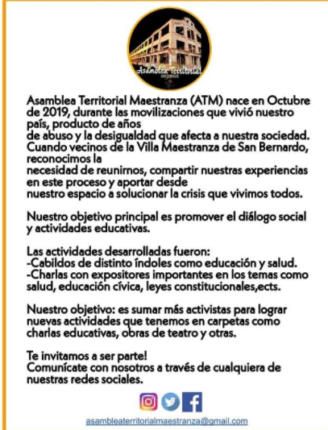

#### FOLIO: SBD03
# Asamblea Territorial Maestranza

[instagram](https://www.instagram.com/p/CIQoBe6JGMn/)
[facebook]()
[twitter]()
<correo@correo.cl>
---

### Representantes
#### (Nombres o emails de voceros o representantes).
* dm al Ig. 
---
### Interacciones frecuentes
#### (listar otras organizaciones que habitualmente)
* Fundación Mingako
* Corporación cultural Cerro Chena
* Círculo Sur 
* Unidad Social
* Dignidad para barrios en San Bernardo 
* Corporaicón Memorial cerro chena
* Asambleas Territoriales (CAT)
* Unidad Social San Bernardo 
### Redes sociales
#### ¿Para qué se utiliza la red social?
| Instagram | Facebook | Twitter | Otra 
|---|---|---|---|
|DIFUSIÓN DE INFO Y ACTIVIDADES|0|0| 0|

### **Instagram**
| seguidores | seguidos | publicaciones | hashtag 
|---|---|---|---|
|673|380|74| 0

---

* **Actividad:**   

* Primera Publicación IG: 21 Noviembre 2019, febrero inactiva, marzo - abril poca activida,d mayo reactiva continua y activa hasta hoy 

---
### Frecuencia de publicación.

Publicaciones: SEMANALES (2-3)

Actividades: SEMANALES 

---
### Ubicación
* Sector de la comununa/ciudad: Villa Maestranza (se juntan en el bandejón central)

---
### Describir temas de interés y/o trabajo
* unión territorial, proceso constituyente, solidaridad, apoyo mutuo,  memoria y DDHH, diálogo, educación popular
---
### Describir la imagen ideal por la cual se trabaja.
#### (El horizonte hacia el cual se quiere avanzar.)
* ¡Otra Mae es posible!, Asamblea Constituyente, construir una red de apoyo, ¡El pueblo ayuda al pueblo! ¡Justicia para Fabiola Campillai! 
---
### ¿Que se hace?
#### (Manifestaciones, marchas, intervenciones, actividades culturales, conversatorios, intercambio de saberes, actividades solidarias o de apoyo mutuo, abastecimiento, contra información, emplazamiento a autoridades etc.)
* Conversatorios
* Cabildos
* Actividades para niñxs 
* Ayuda a observadores de DDHH 
* Pasacalles 
* Cacerolazos 
* Act. solidarias (donaciones insumos a equipos médicos, campaña solidaria Valpo)
* Intervención artística feminista (las tesis, paraguas contra violencia estado)
* Simulacros asamblea constituyente 
* Charlas (educación, salud, constitiución )
* Velatón 
* Campaña "red de apoyo maestranza - covid" (acopio/donación)
* Cabildo Online
* Conversatorios (invitación a conversatorios universitaorios)

---
### Describir y distinguir demandas más reivindicativas de espacios sin relación con lo contencioso o con lo político mas prefigurativo
#### (lo contencioso; demanda al Estado, a alguna autoridad, privados, etc), (prefigurativo, transformación desde lo cotidiano, etc.).
* Se dirige a vecinxs, a participar y organizarse por una villa maestranza mejor, se les convoca a votar también 
---
### Tipo de organización interna.
#### (Vocerías, asambleísmo, horizontalidad, etc.; *se entiende que esta dimensión es más difícil de captar vía análisis de redes sociales, pero quizás se puede vislumbrar a través de roles/cargos*)
Asamblea, horizontalidad 
---
### Describir los temas / imágenes- iconos / conceptos mas habitualmente presentes en sus publicaciones. Describir cambios/ transformaciones en los contenidos desde Octubre.

**Iconos:**

 

**Banderas:**

**Diseño estético:**

> Párrafo tipo cita 

---
### Percepciones que se tiene del Estado
#### (Aparato burocrático)
> resumen de lo encontrado

| Declaraciones | infografía | 
|---|---|
|Anotar los comunicados |  |

---
### Percepciones que se tiene de las Fuerzas de Orden
#### (Aparato represivo)
> resumen de lo encontrado

| Declaraciones | infografía | 
|---|---|
|Anotar los comunicados |  |

---
### Incorporar aca notas, citas textuales, links, etc. extra a los ya incorporados, que sean de interés para comprender tanto la forma como los contenidos asociados a la organización.

