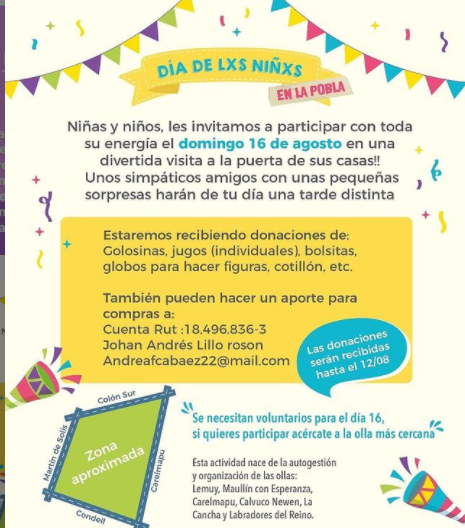
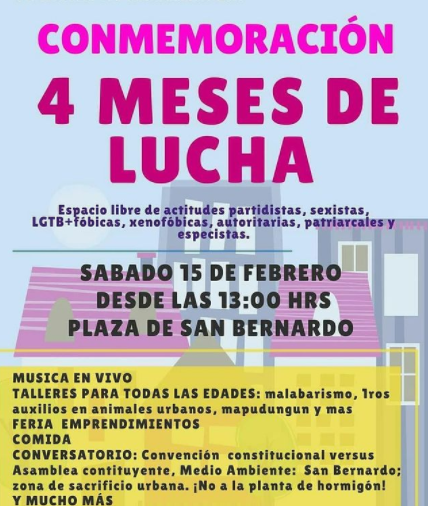
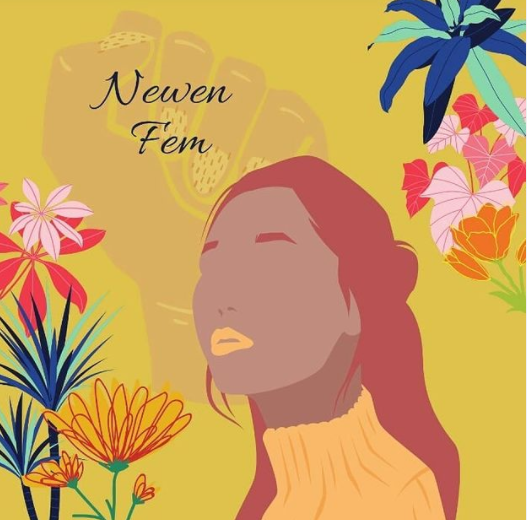
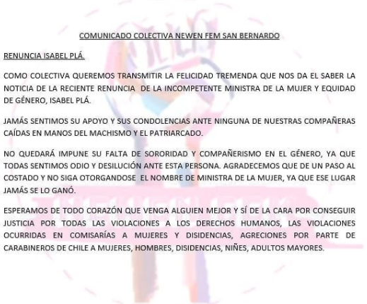

#### FOLIO: SBD05
# Colectiva Feminista Newen Fem, San Bernardo

[instagram](https://www.instagram.com/colectivanewenfem/)
[facebook]()
[twitter]()
<correo@correo.cl>
---

### Representantes
#### (Nombres o emails de voceros o representantes).

---
### Interacciones frecuentes
#### (listar otras organizaciones que habitualmente)
* Coordinadora 19 Diciembre (para hacer un día contra el feminicidio en Chile )
* @asamblea.feminista.san.bk
*  @ddhhsanbk 
* @feminismosanbeka 
* @sanbeca.enlacalle
* @colectivofemsanbernardo
* Cordón vecinal Quimey 
* Zorras del Chena 
* Coordinadora autoconvocada San Beka (Red de Ollas San beka)
* Resistencia zona sur 
### Redes sociales
#### ¿Para qué se utiliza la red social?
| Instagram | Facebook | Twitter | Otra 
|---|---|---|---|
|0|0|0| 0|

### **Instagram**
| seguidores | seguidos | publicaciones | hashtag 
|---|---|---|---|
|||| 0

---

* **Actividad:**   

* Primera Publicación IG: 4 Diciembre 2019

---
### Frecuencia de publicación.

Publicaciones: SEMANAL

Actividades: SEMANAL 

---
### Ubicación
* Sector de la comununa/ciudad: Se convocan en Plaza San Bernardo 

---
### Describir temas de interés y/o trabajo
Feminismo, sororidad, separatismo, protección animal/perros callejeros 
---
### Describir la imagen ideal por la cual se trabaja.
#### (El horizonte hacia el cual se quiere avanzar.)
* Vencer al patriarcado (Sociedad Feminista), no mas feminicidios, ¡todas juntas venceremos! ABORTO LEGAL, SEGURO Y GRATUITO YA! Renuncia de Isabel Plá (Ministra) ¡Sororidad nuestra mejor arma! ¡JUSTICIA PARA FABIOLA (CAMPILLAY)! 

---
### ¿Que se hace?
#### (Manifestaciones, marchas, intervenciones, actividades culturales, conversatorios, intercambio de saberes, actividades solidarias o de apoyo mutuo, abastecimiento, contra información, emplazamiento a autoridades etc.)
* Asambleas 
* Actos culturales con otras organizaciones feministas 
* Funas 
* Información sobre feminicidios 
* Información (afiches) sobre tipos de violencia
* Encuentros feministas (música, comida, conversatorios ) 
* Afiches sobre técnicas de masturbación femenina 
* Información sobre plantas medicinales 
* Campaña solidaria - acopio campamento Dignidad 
* Colaboración en red de Ollas San Beca 
* Día del niñx

 
---
### Describir y distinguir demandas más reivindicativas de espacios sin relación con lo contencioso o con lo político mas prefigurativo
#### (lo contencioso; demanda al Estado, a alguna autoridad, privados, etc), (prefigurativo, transformación desde lo cotidiano, etc.).
* Se dirige a las compañeras San Bernardinas, hacen un llamado de sororidad, convocan a alzar la voz y seguir luchando por las que ya no pueden! 
---
### Tipo de organización interna.
#### (Vocerías, asambleísmo, horizontalidad, etc.; *se entiende que esta dimensión es más difícil de captar vía análisis de redes sociales, pero quizás se puede vislumbrar a través de roles/cargos*)
horizontalidad, sororidad 
---
### Describir los temas / imágenes- iconos / conceptos mas habitualmente presentes en sus publicaciones. Describir cambios/ transformaciones en los contenidos desde Octubre.

**Iconos:**

**Banderas:**

**Diseño estético:**

> Párrafo tipo cita 

---
### Percepciones que se tiene del Estado
#### (Aparato burocrático)
> resumen de lo encontrado

| Declaraciones | infografía | 
|---|---|
|Anotar los comunicados |  |

---
### Percepciones que se tiene de las Fuerzas de Orden
#### (Aparato represivo)
> resumen de lo encontrado

| Declaraciones | infografía | 
|---|---|
|Anotar los comunicados |  |

---
### Incorporar aca notas, citas textuales, links, etc. extra a los ya incorporados, que sean de interés para comprender tanto la forma como los contenidos asociados a la organización.

