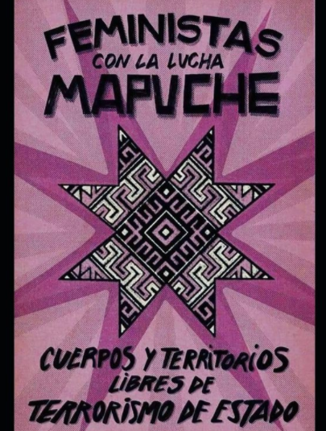
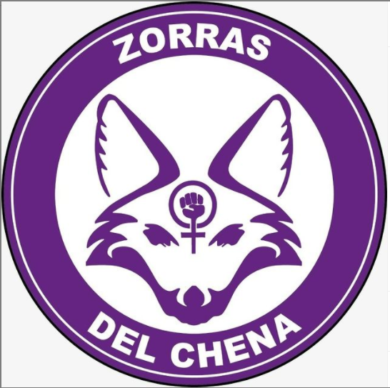
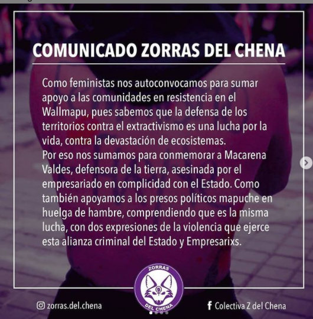

#### FOLIO: SBD06
# Zorras del Chena

[instagram]()
[facebook]()
[twitter]()
<correo@correo.cl>
---

### Representantes
#### (Nombres o emails de voceros o representantes).

---
### Interacciones frecuentes
#### (listar otras organizaciones que habitualmente)
* Asamblea Feminista San Beca 
* Colectiva feminista NewenFem San Bk
* Red Ollas San Beka / Coordinadora Autoconvcoada San Beka 
* Asamblea lesbo feminista RM
* Periferia en resistencia
* San Beca en la calle
* Mujeres Red

### Redes sociales
#### ¿Para qué se utiliza la red social?
| Instagram | Facebook | Twitter | Otra 
|---|---|---|---|
|DIFUSIÓN DE INFO Y ACTIVIDADES|0|0| 0|

### **Instagram**
| seguidores | seguidos | publicaciones | hashtag 
|---|---|---|---|
|632|101|35| 0

---

* **Actividad:**   

* Primera Publicación IG: 23 enero 2020

---
### Frecuencia de publicación.

Publicaciones: semanal hasta marzo, marzo-junio inactiva, reactiva hasta Agosto 2020 

Actividades: semanal (pero sobre todo adhiere a otras, no organiza )

---
### Ubicación
* Sector de la comununa/ciudad: Sector Cerro Chena (pero no se explicita específicamente)

---
### Describir temas de interés y/o trabajo
* feminismo, lucha mapuche, justicia para feminicidos, discidencias y lesbofeministas
---
### Describir la imagen ideal por la cual se trabaja.
#### (El horizonte hacia el cual se quiere avanzar.)
¡Cuerpos y territorios libres del terrorismo de estado! ¡Contra toda violencia patriarcal! 

---
### ¿Que se hace?
#### (Manifestaciones, marchas, intervenciones, actividades culturales, conversatorios, intercambio de saberes, actividades solidarias o de apoyo mutuo, abastecimiento, contra información, emplazamiento a autoridades etc.)
* Adhiera a actividades
* Marchas
* Conversatorios en línea
* Publicación de info 
* Campaña luka pa las legumbres 
* Conmemoraciones (Macarena Valdés, Ambar)
---
### Describir y distinguir demandas más reivindicativas de espacios sin relación con lo contencioso o con lo político mas prefigurativo
#### (lo contencioso; demanda al Estado, a alguna autoridad, privados, etc), (prefigurativo, transformación desde lo cotidiano, etc.).
* Se dirige a todxs lxs feministxs 
---
### Tipo de organización interna.
#### (Vocerías, asambleísmo, horizontalidad, etc.; *se entiende que esta dimensión es más difícil de captar vía análisis de redes sociales, pero quizás se puede vislumbrar a través de roles/cargos*)
horizontalidad, sororidad 
---
### Describir los temas / imágenes- iconos / conceptos mas habitualmente presentes en sus publicaciones. Describir cambios/ transformaciones en los contenidos desde Octubre.

**Iconos:**

**Banderas:**

**Diseño estético:**

> Párrafo tipo cita 

---
### Percepciones que se tiene del Estado
#### (Aparato burocrático)
> resumen de lo encontrado

| Declaraciones | infografía | 
|---|---|
|Anotar los comunicados |  |

---
### Percepciones que se tiene de las Fuerzas de Orden
#### (Aparato represivo)
> resumen de lo encontrado

| Declaraciones | infografía | 
|---|---|
|Anotar los comunicados |  |

---
### Incorporar aca notas, citas textuales, links, etc. extra a los ya incorporados, que sean de interés para comprender tanto la forma como los contenidos asociados a la organización.

* COMUNICADO ZORRAS DEL CHENA - AGOSTO 2020: 
Para leerlo completo:  https://www.instagram.com/p/CEPiFwYJOkt/

 