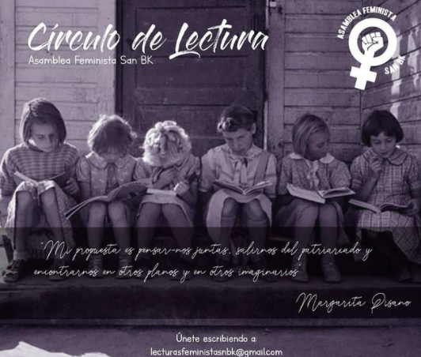
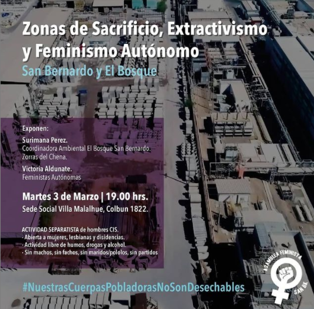
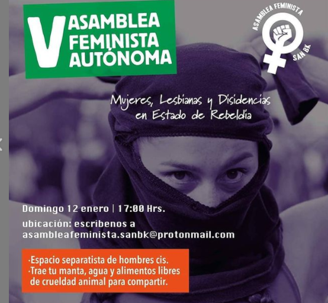
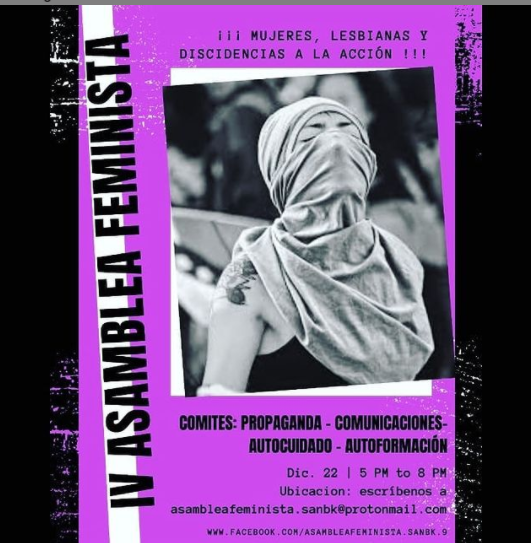

#### FOLIO:SBD07
# Asamblea Feminista San Bk

[instagram](https://www.instagram.com/asamblea.feminista.san.bk/)
[facebook]()
[twitter]()
<correo@correo.cl>
---

### Representantes
#### (Nombres o emails de voceros o representantes).
asambleafeminista.sanbk@protonmail.com 
---
### Interacciones frecuentes
#### (listar otras organizaciones que habitualmente)
* Periferia en resistencia
* Lesbicasvisibles 
* Frente antifascista zona sur 
* Colectiva Newen Fem 
* La cuchara feminista 
* Coordinadora de secundaries San Bk 
* Feminiztas del Sur
* Resistencia Zona SUR
* Feministas Talagante
* Red feministas territoriales 
* Abofem cl 
* Red Ollas San BK

### Redes sociales
#### ¿Para qué se utiliza la red social?
| Instagram | Facebook | Twitter | Otra 
|---|---|---|---|
|DIFUSIÓN DE INFO Y ACTIVIDADES|0|0| 0|

### **Instagram**
| seguidores | seguidos | publicaciones | hashtag 
|---|---|---|---|
|1473|268|119| 0

---

* **Actividad:**   

* Primera Publicación IG: 16 diciembre 2019

---
### Frecuencia de publicación.

Publicaciones: semanal, inactivo abril, 

Actividades: semanal

---
### Ubicación
* Sector de la comununa/ciudad: "Plaza Fabiola Campillay"

---
### Describir temas de interés y/o trabajo
*Feminismo, separatismo, vinculación periferia sur, grupos de acción e intervención en territorios
---
### Describir la imagen ideal por la cual se trabaja.
#### (El horizonte hacia el cual se quiere avanzar.)
* Mujeres en lucha por el BUEN VIVIR, contra la PRECARIZACIÓN DE LA VIDA, Fin al sistema patriarcal y machista, NO + SENAME ¡No a la mega planta de hormigón! ¡Periféricas en resistencia! 
---
### ¿Que se hace?
#### (Manifestaciones, marchas, intervenciones, actividades culturales, conversatorios, intercambio de saberes, actividades solidarias o de apoyo mutuo, abastecimiento, contra información, emplazamiento a autoridades etc.)
* Marchas
* Asambleas separatistas
* Asambleas en línea 
* Intervenciones artísticas
* Círculos de lectura 
* COnversatorios
* Elaboración de propaganda 
* Ayuda difusión y parte red ollas San Bk 

---
### Describir y distinguir demandas más reivindicativas de espacios sin relación con lo contencioso o con lo político mas prefigurativo
#### (lo contencioso; demanda al Estado, a alguna autoridad, privados, etc), (prefigurativo, transformación desde lo cotidiano, etc.).
* Se dirige a feministes, mujeres lesbianas y discidentes, de San Beka y de la periferia sur a unirse en la lucha contra la violencia machista y patriarcal, 
---
### Tipo de organización interna.
#### (Vocerías, asambleísmo, horizontalidad, etc.; *se entiende que esta dimensión es más difícil de captar vía análisis de redes sociales, pero quizás se puede vislumbrar a través de roles/cargos*)
asamblea, horizontalidad, sororidad. Comités 
---
### Describir los temas / imágenes- iconos / conceptos mas habitualmente presentes en sus publicaciones. Describir cambios/ transformaciones en los contenidos desde Octubre.

**Iconos:**

**Banderas:**

**Diseño estético:**

> Párrafo tipo cita 

---
### Percepciones que se tiene del Estado
#### (Aparato burocrático)
> resumen de lo encontrado

| Declaraciones | infografía | 
|---|---|
|Anotar los comunicados |  |

---
### Percepciones que se tiene de las Fuerzas de Orden
#### (Aparato represivo)
> resumen de lo encontrado

| Declaraciones | infografía | 
|---|---|
|Anotar los comunicados |  |

---
### Incorporar aca notas, citas textuales, links, etc. extra a los ya incorporados, que sean de interés para comprender tanto la forma como los contenidos asociados a la organización.
* **Comunicado Asamblea Feminista Autónoma de San Bernardo**, Enero 2020

> A más de 80 días del estallido social ocurrido el 18 de Octubre, nuestro pueblo continúa en la protesta, hemos colmado las calles con demandas claras por una vida digna, levantadas desde todos los sectores sociales y productivos. Sin embargo la única respuesta del Gobierno ha sido la represión, con abusos de Carabineros desde el primer día, poniendo nuevamente a las Fuerzas Armadas en contra del pueblo, imponiendo el toque de queda que solo dio pie a la acción impune de militares y carabineros que a la fecha han asesinado a 33 personas, han mutilado a más de 350 personas, han violado, han torturado, secuestrado, desaparecido y apresado a miles personas.

> En ese contexto es que los distintos sectores políticos, oficialistas y de “oposición” deciden el 15 de Noviembre firmar un “PACTO POR LA PAZ”, donde acuerdan llevar a cabo un proceso constituyente para modificar la actual| constitución, mientras en la calle nos seguían matando, mutilando, violando y torturando.

> Como Feministas Autónomas de San Bernardo, mujeres organizadas de una comuna periférica, segregada y estigmatizada de la RM, no guardaremos un silencio cómplice mientras vemos cómo se le da la espalda a nuestra gente, montando sobre nuestra lucha demandas partidarias que no representan las necesidades de nuestra población, donde este sistema patriarcal manifiesta con más fuerza toda su violencia estructural.

>Proceso constituyente en dictadura
Luego de 30 años de abusos sostenidos y enmarcados en la Constitución construida en la Dictadura de Pinochet, sabemos que esta debe ser derribada pues nos hemos regido por una Carta Fundamental redactada por asesinos.
No podemos aceptar ser regidxs por normas fundadas en la ilegitimidad de una dictadura, por lo tanto elaborar otra Carta Magna en un contexto de dictadura no es una opción, el solo hecho de plantearse bajo estos términos lo hace carecer de legitimidad, de modo que no es posible hablar de un proceso constituyente bajo la dictadura de Sebastián Piñera que se mantiene en total impunidad por los crímenes perpetrados por su gobierno [...] #AsambleaFeministaSanBK

> Sabemos que la Asamblea Constituyente es una demanda que se ha masificado a partir de la consigna levantada desde hace años por partidos de centro izquierda, especialmente por el PC, que se ha montado sobre las movilizaciones populares, omitiendo la voluntad y participación popular en la medida que esta alternativa responde a una esfera de disputa elitizada dentro de la institucionalidad.
El proceso constituyente que se nos está presentando ofrece una modalidad de Convención Constituyente, propuesta construida por una comisión técnica que ni si quiera integró organizaciones sociales. El cambio de Asamblea a Convención solo ha generado mayor confusión debido al lenguaje técnico leguleyo, alejado de la gente, generando una profunda sospecha pues se intenta homologar a lo que sería una Asamblea Constituyente.
Una vez más la tecnocracia de las instituciones nos alejan del trabajo político, profundizando la política delegativa que pone en manos de “expertxs” la construcción de las normas que regirán todo un país, haciéndonos creer que hay personas mejor preparadas que nosotrxs mismxs para definir cómo queremos vivir.

> Además somos enfáticas en rechazar un proceso constitutivo que se rige por los 2/3 (dos tercios), donde para rechazar una transformación basta que un tercio de la Convención se oponga.
La sospecha se reafirma al ver como se ha llevado a cabo el primer paso del proceso constituyente con la Consulta Ciudadana, llena de vicios y prácticas poco transparentes. Respecto a esta última instancia convocada el 15 de diciembre del 2019 creemos que:

*  La consulta no fue más que una encuesta de opinión, al no ser vinculante, nada de lo que se votó se contempla para generar cambios ni políticas públicas que respondan a nuestras necesidades.
* La libertad de las Municipalidades para construir las preguntas no permite generar representatividad, cada comuna incluyó sus prioridades según intereses y conveniencias del municipio.
* Esto da cuenta de que la consulta levantada por el Asociación Chilena de Municipalidades es una estrategia para disputar poder al gobierno central y no una preocupación por recoger las demandas populares.
*  El cómo se llevó a cabo (mecanismo virtual) y el lenguaje técnico alejó a buena parte de la población, excluyendo a amplios sectores, y generó desconfianza sobre la seguridad de las votaciones
* Esto se expresó en nuestra comuna con la obstaculización del proceso como una forma de boicot, con recursos escasos que mantuvieron colapsada la plataforma virtual, hubo desinformación, fue un proceso burocrático que generó largas filas restando gente que quería participar, especialmente para lxs adultxs mayores.
* A final de cuentas este proceso solo genera un antecedente para el gobierno sobre las preferencias y participación, además de descomprimir la protesta con mecanismos que realmente no transforman nada.
* Frente a toda la desconfianza que hay hacia los Partidos Políticos, ellos pueden hacer uso de nuestros datos, al dar nuestros votos a correos que no tenemos cómo verificar a dónde iban.
*  Reiteramos que este proceso se impulsa en la comuna en un contexto donde aún existe impunidad y el Municipio ha sido cómplice de los asesinatos, torturas, violaciones, violencia político sexual, etc.

> Considerando toda la reflexión emergida desde la Asamblea Feminista Autónoma de San Bernardo, hacemos el llamado a mirar este proceso de forma crítica, advirtiendo los intereses de partidos políticos. Creemos que desde el feminismo debemos denunciar cada vez que identifiquemos prácticas propias del patriarcado, y por lo tanto evidenciar como toda la institucionalidad del Estado ejerce su poder violentándonos sistemáticamente, ya sea reprimiéndonos o silenciando nuestra voz con mecanismos burocráticos que intentan mostrarse como “democracia”.
> Si bien creemos que es necesario más que nunca eliminar la actual constitución y toda su herencia, desde el feminismo es necesario mantener el rechazo a los partidos políticos que se monten sobre el estallido social para impulsar sus demandas e intereses.
> La Convención Constituyente que ofrece la institucionalidad no se acerca en nada a un proceso constituyente legítimo en cuanto se funda durante una dictadura y reproduce lógicas de poder donde se pelean cuotas para integrar dicha convención.
Nada nos garantiza que este proceso tenga integrada una perspectiva feminista para que realmente se hagan transformaciones estructurales que permitan construir una sociedad justa y digna para las mujeres.
> Las feministas nos tenemos a nosotras, y solo un posicionamiento antipatriarcal generará transformaciones reales. “Es ley infecunda toda ley encaminada a transformar pueblos y que no toma en cuenta a las mujeres” – Gabriela mistral.
Asamblea Feminista Autónoma de San Bernardo
Enero 2020